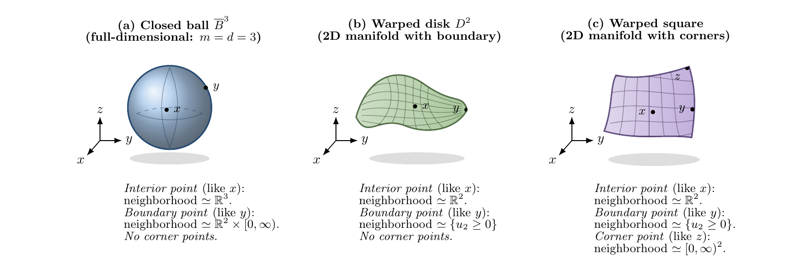

Let $q$ be a probability measure on $\mathbb R^d$ and let

$$
p_\sigma = \phi_\sigma \star q,
\qquad
\phi_\sigma = \text{density of } \mathcal N(0,\sigma^2 I_d).
$$

For every $\sigma>0$ the function $p_\sigma$ is smooth and strictly positive, no matter how singular $q$ is. It can be a point mass, arclength on a curve, or the uniform law on a square; convolution with a Gaussian erases the distinction. And yet the distinction is not really gone. It reappears in the *rate* at which $\log p_\sigma$ and its derivatives degenerate as $\sigma \downarrow 0$.

This post is about a paper written with Arnak Dalalyan, [*Boundary-layer asymptotics for Gaussian-smoothed singular measures*](https://arxiv.org/abs/2607.04514) [@brosse2026boundary], which answers three questions at once: at what rate can the score $\nabla\log p_\sigma$, the log-Hessian $\nabla^2\log p_\sigma$, and the scale derivative $\partial_\sigma\nabla\log p_\sigma$ blow up; what the leading coefficients are; and which features of the geometry of the support they remember.

The short answer is a single sentence. **Zoom in at scale $\sigma$: the support is replaced by its inward tangent cone, its Gaussian mass gives the leading density, and derivatives of its logarithm give the leading singular fields.** In one dimension, at the endpoint of an interval, the Gaussian mass of the inward half-line is $\Phi_{\mathrm N}(a)$ and its logarithmic derivative is the inverse Mills ratio $\lambda = \phi_{\mathrm N}/\Phi_{\mathrm N}$. Everything else in the paper is that computation carried out on a manifold with corners.

@sec-setup fixes notation and recalls why the three fields above are the objects that denoising and transport-based generative models actually learn. @sec-mills works the one-dimensional case completely, including a numerical check of the two-term expansion, and it is the section to read if you read only one. @sec-layer introduces boundary-layer coordinates, and @sec-cone states the main density expansion. @sec-score explains where the negative powers of $\sigma$ come from, and @sec-cases specializes to a smooth density, a closed manifold, a smooth boundary, and a corner. @sec-diffusion collects the consequences for diffusion models, @sec-proof sketches the argument, and @sec-open lists what is left open.

# Setup and the three fields {#sec-setup}

Write $q$ for a Borel probability measure on $\mathbb R^d$ and, for $\sigma>0$,

$$
p_\sigma(y)=\int_{\mathbb R^d}\phi_\sigma(y-x)\,q(\mathrm dx).
$$

Since $\phi_\sigma$ solves the heat equation, $p_\sigma = q_{\sigma^2/2}$ where $\partial_t q_t = \Delta q_t$; the noise level $\sigma$ and the heat time $t$ are two parametrizations of the same path. The three fields of interest are

$$
\boldsymbol s_\sigma(y)=\nabla_y\log p_\sigma(y),
\qquad
\mathbf H_\sigma(y)=\nabla_y^2\log p_\sigma(y),
\qquad
\dot{\boldsymbol s}_\sigma(y)=\partial_\sigma \boldsymbol s_\sigma(y).
$$

They are not three unrelated objects. The heat equation in the $\sigma$ parametrization reads $\partial_\sigma p_\sigma = \sigma\Delta p_\sigma$, hence

$$
\partial_\sigma \log p_\sigma = \sigma\bigl(\operatorname{tr}\mathbf H_\sigma + \|\boldsymbol s_\sigma\|^2\bigr),
\qquad
\dot{\boldsymbol s}_\sigma = \sigma\bigl(\nabla \operatorname{tr}\mathbf H_\sigma + 2\mathbf H_\sigma \boldsymbol s_\sigma\bigr).
$$

So $\dot{\boldsymbol s}_\sigma$ is not an auxiliary technical object: it is the scale variation of the same logarithmic field, coupled exactly to the other two.

Three readings make these fields worth expanding.

**Denoising.** If $X\sim q$, $Z\sim\mathcal N(0,I_d)$ independent, and $Y_\sigma=X+\sigma Z$, then $Y_\sigma$ has density $p_\sigma$ and Tweedie's identities [@robbins1956empirical; @efron2011tweedie; @vincent2011connection] give

$$
\mathbb E[X\mid Y_\sigma=y]=y+\sigma^2\boldsymbol s_\sigma(y),
\qquad
\operatorname{Cov}(X\mid Y_\sigma=y)=\sigma^4\mathbf H_\sigma(y)+\sigma^2 I_d .
$$

The score determines the denoising displacement; the log-Hessian determines the posterior covariance and the local linearization of the denoiser.

**Transport.** The heat path satisfies the continuity equation $\partial_\sigma p_\sigma + \nabla\cdot(\boldsymbol v_\sigma p_\sigma)=0$ with velocity $\boldsymbol v_\sigma = -\sigma\boldsymbol s_\sigma$. Then $\nabla_y\boldsymbol v_\sigma = -\sigma\mathbf H_\sigma$ and $\partial_\sigma\boldsymbol v_\sigma = -\boldsymbol s_\sigma - \sigma\dot{\boldsymbol s}_\sigma$.

**Generative modeling.** For the heat-regularized law, the population target of denoising score matching at noise level $\sigma$ is exactly $\boldsymbol s_\sigma$ [@hyvarinen2005scorematching; @vincent2011connection; @ho2020ddpm; @song2021scorebased; @karras2022edm], and the canonical flow-matching velocity along the heat path is $-\sigma\boldsymbol s_\sigma$ [@lipman2023flowmatching; @lipman2024flowmatchingguide]. High-order samplers are especially sensitive to how this field varies along the path [@lu2022dpmsolver].

The point of the paper is that when $q$ is concentrated on a lower-dimensional set, or when $y$ sits near a boundary or a corner of the support, these population fields are *not* governed at leading order by a smooth Euclidean density expansion.

![Heat regularizations $p_\sigma = \phi_\sigma\star q$ of three measures on $\mathbb R^2$, at six decreasing noise levels $\sigma\in\{0.70-0.09k\}_{k=0}^{5}$, followed by the measure $q$ itself. Top: a standard Gaussian, where nothing happens as $\sigma\downarrow 0$. Middle: the uniform law on $\{\sqrt{|x_1|}+\sqrt{|x_2|}\le 1.5\}$, a full-dimensional support with a boundary and four cusps. Bottom: uniform arclength on the curve $\{\sqrt{|x_1|}+\sqrt{|x_2|}= 1.5\}$, a one-dimensional support in $\mathbb R^2$.](figures/heat-density-grid.jpg){#fig-heat-density width=100% fig-alt="A three-by-seven grid of heatmaps. The top row barely changes across columns. The middle and bottom rows sharpen progressively, developing a visible edge and a thin bright filament respectively as the noise level decreases."}

@fig-heat-density is the phenomenon in one image. In the top row the density is smooth and the picture is essentially static. In the other two rows the spatial variation of $p_\sigma$ concentrates into a layer of thickness $O(\sigma)$ around the boundary of the support. Derivatives taken across such a layer produce inverse powers of $\sigma$. The rest of this post identifies them.

# The one-dimensional picture {#sec-mills}

Take $d=m=1$ and let $q$ have density $\rho$ with respect to Lebesgue measure on $[0,1]$, with $\rho>0$ up to and including the endpoints. The interesting point is the endpoint $x=0$, where the support is one-sided. Because the Gaussian kernel has width $\sigma$, the interesting observation points are those at distance $O(\sigma)$ from that endpoint, so we set

$$
y=\sigma a,
\qquad a \in \mathbb R \text{ bounded},
$$

with $a>0$ pointing inward. Substituting $x=\sigma\zeta$ in the convolution integral,

$$
p_\sigma(\sigma a)
=\int_0^1 \rho(x)\,\phi_\sigma(\sigma a - x)\,\mathrm dx
=\int_0^{1/\sigma} \rho(\sigma\zeta)\,\phi_{\mathrm N}(a-\zeta)\,\mathrm d\zeta ,
$$

where $\phi_{\mathrm N}$ is the standard normal density. Two things happen as $\sigma\downarrow 0$. The upper limit escapes to $+\infty$ — the far endpoint contributes $O(e^{-\kappa/\sigma^2})$ and disappears — and $\rho(\sigma\zeta)$ converges to $\rho(0)$. The interval has been replaced by the half-line $[0,\infty)$, its inward tangent cone at $0$, and

$$
p_\sigma(\sigma a) = \rho(0)\,\Phi_{\mathrm N}(a) + O(\sigma),
\qquad
\Phi_{\mathrm N}(a)=\int_0^\infty \phi_{\mathrm N}(a-\zeta)\,\mathrm d\zeta
= \int_{-\infty}^{a}\phi_{\mathrm N}(t)\,\mathrm dt .
$$

The leading coefficient is the density at the boundary point times the **Gaussian mass of the inward cone seen from the rescaled observation point $a$**. This is the whole paper in one line; the rest is geometry.

Differentiating is where the singular scaling appears. Since $a=y/\sigma$, each $y$-derivative costs a factor $\sigma^{-1}$:

$$
\boldsymbol s_\sigma(\sigma a)=\frac{1}{\sigma}\,\lambda(a)+O(1),
\qquad
\mathbf H_\sigma(\sigma a)=\frac{1}{\sigma^2}\,\lambda'(a)+O(\sigma^{-1}),
\qquad
\lambda=\frac{\phi_{\mathrm N}}{\Phi_{\mathrm N}} = (\log \Phi_{\mathrm N})' .
$$

The function $\lambda$ is the **inverse Mills ratio**. It is positive, decreasing, satisfies $\lambda(a)\sim -a$ as $a\to-\infty$ and $\lambda(a)\to 0$ as $a\to+\infty$, and $\lambda' = -\lambda(a+\lambda)<0$ by log-concavity of $\Phi_{\mathrm N}$. So the score points inward with magnitude $\sigma^{-1}\lambda(a)$: at $a=0$ it is $\sigma^{-1}\sqrt{2/\pi}$, deep inside ($a\gg 1$) it decays to the ordinary interior score, and outside the support ($a \ll -1$) it becomes $-a/\sigma = -y/\sigma^2$, the linear attraction of a Gaussian centered at the endpoint.

## The first correction

Keeping one more term in $\rho(\sigma\zeta)=\rho(0)+\sigma\rho'(0)\zeta+O(\sigma^2)$ gives

$$
p_\sigma(\sigma a)
=\rho(0)\,\Phi_{\mathrm N}(a)
\;+\;\sigma\rho'(0)\bigl(a\,\Phi_{\mathrm N}(a)+\phi_{\mathrm N}(a)\bigr)
\;+\;O(\sigma^2),
$$

using $\int_0^\infty \zeta\,\phi_{\mathrm N}(a-\zeta)\,\mathrm d\zeta = a\Phi_{\mathrm N}(a)+\phi_{\mathrm N}(a)$. Passing to the logarithm and writing $\beta=(\log\rho)'(0)$,

$$
\log p_\sigma(\sigma a) = \log\rho(0)+\log\Phi_{\mathrm N}(a) + \sigma\,\beta\,\bigl(a+\lambda(a)\bigr)+O(\sigma^2),
$$

and differentiating in $y$, that is applying $\sigma^{-1}\partial_a$,

$$
\sigma\,\boldsymbol s_\sigma(\sigma a) = \lambda(a) + \sigma\beta\bigl(1+\lambda'(a)\bigr)+O(\sigma^2),
\qquad
\sigma^2\,\mathbf H_\sigma(\sigma a) = \lambda'(a) + \sigma\beta\,\lambda''(a)+O(\sigma^2).
$$

A sanity check at the level of the profiles: as $a\to+\infty$ the boundary is far away in units of $\sigma$, $\lambda$ and $\lambda'$ vanish, and the first two terms recover $\beta=(\log\rho)'(0)$, the ordinary interior score. The expansion itself is uniform only while $a$ stays in a fixed bounded interval; letting $a$ grow as $\sigma$ shrinks is a different regime.

## A numerical check

Take $\rho(x)=\tfrac23(1+x)$ on $[0,1]$, so $\rho(0)=\tfrac23$ and $\beta=1$. Computing $p_\sigma$, $\boldsymbol s_\sigma$ and $\mathbf H_\sigma$ by quadrature and comparing to the two formulas above over $a\in[-2,3]$ gives the following maximal errors.

| $\sigma$ | $p_\sigma$, 1 term | $p_\sigma$, 2 terms | $\sigma\boldsymbol s_\sigma$, 1 term | $\sigma\boldsymbol s_\sigma$, 2 terms | $\sigma^2\mathbf H_\sigma$, 1 term | $\sigma^2\mathbf H_\sigma$, 2 terms |
|---:|---:|---:|---:|---:|---:|---:|
| $0.1$    | $2.0\cdot 10^{-1}$ | $1.7\cdot 10^{-12}$ | $7.7\cdot 10^{-2}$ | $2.3\cdot 10^{-2}$ | $2.4\cdot 10^{-2}$ | $8.6\cdot 10^{-3}$ |
| $0.05$   | $1.0\cdot 10^{-1}$ | $4.8\cdot 10^{-13}$ | $4.3\cdot 10^{-2}$ | $6.4\cdot 10^{-3}$ | $1.3\cdot 10^{-2}$ | $2.5\cdot 10^{-3}$ |
| $0.025$  | $5.0\cdot 10^{-2}$ | $2.2\cdot 10^{-16}$ | $2.3\cdot 10^{-2}$ | $1.7\cdot 10^{-3}$ | $6.9\cdot 10^{-3}$ | $6.7\cdot 10^{-4}$ |
| $0.0125$ | $2.5\cdot 10^{-2}$ | $2.2\cdot 10^{-16}$ | $1.2\cdot 10^{-2}$ | $4.5\cdot 10^{-4}$ | $3.6\cdot 10^{-3}$ | $1.8\cdot 10^{-4}$ |
| error ratio | $2.00$ | — | $1.93$ | $3.86$ | $1.94$ | $3.83$ |

The last row gives the ratio for the final refinement: about $2$ for the one-term expansions and $4$ for the two-term ones, confirming the $O(\sigma)$ and $O(\sigma^2)$ rates for the rescaled quantities. The density column is more than that: because $\rho$ is affine and the support is flat, all terms beyond the first correction vanish identically and the two-term expansion is exact up to the exponentially small far-endpoint contribution — which is why that column sits at machine precision rather than at $O(\sigma^2)$.

![The boundary layer at the endpoint of $[0,1]$, with $\rho(x)=\frac{2}{3}(1+x)$. Solid black: the leading tangent-cone profiles $\rho(0)\Phi_{\mathrm N}(a)$, $\lambda(a)$, $\lambda'(a)$. Solid colored: the exact quantities at $\sigma=0.2$ and $\sigma=0.05$, evaluated at $y=\sigma a$. Dotted: the two-term predictions, which are visually indistinguishable from the exact curves except at $\sigma=0.2$ and $a\gtrsim 2$, where the far endpoint of the interval is no longer negligible.](figures/mills-boundary-layer.png){#fig-mills width=100% fig-alt="Three side-by-side plots against the rescaled coordinate a from -2.5 to 3. Left: the density, an increasing sigmoid saturating around 0.67. Middle: the rescaled score, decreasing from about 2.8 to near 0. Right: the rescaled log-Hessian, increasing from about -0.9 to 0. In each panel the exact curves at two noise levels track the leading profile closely."}

Everything from here on is the same computation with the half-line replaced by a cone in $\mathbb R^m$.

# Boundary-layer coordinates {#sec-layer}

Now let $q$ be concentrated on an embedded $m$-dimensional manifold with corners $\mathcal M\subset\mathbb R^d$, with $q = \rho\,\mathrm d\mathrm{vol}_{\mathcal M}$. Write

$$
k=d-m \quad(\text{ambient codimension}),
\qquad
\mathbb H^m_c=\mathbb R^{m-c}\times[0,\infty)^c \quad(\text{standard quadrant}).
$$

A manifold with corners is stratified: every point has a neighborhood modeled on $\mathbb H^m_c$ for exactly one $c$, and each smooth piece with a fixed $c$ is a codimension-$c$ **stratum** $\mathcal S$. For a square, $c=0$ is the open face, $c=1$ gives the four open edges, and $c=2$ the four vertices.

{#fig-manifolds width=100% fig-alt="Three labeled 3D sketches: a shaded blue ball, a green warped disk, and a purple warped square, each with marked interior, boundary and corner points and a note giving the local model of each."}

Two kinds of transverse directions have to be distinguished at a point $x$ of the stratum $\mathcal S$:

- $\mathcal C_x = \mathcal T_x\mathcal M \cap (\mathcal T_x\mathcal S)^\perp$, of dimension $c$: tangent to the support but transverse to the stratum. These carry the boundary and corner structure.
- $\mathcal N_x\mathcal M = (\mathcal T_x\mathcal M)^\perp$, of dimension $k$: the ambient normal directions. These carry the lower-dimensionality.

Choose smooth orthonormal frames $\mathbf S(x),\mathbf C(x),\mathbf N(x)$ for $\mathcal T_x\mathcal S,\ \mathcal C_x,\ \mathcal N_x\mathcal M$, so that $\mathbf Q(x)=[\,\mathbf S(x)\ \mathbf C(x)\ \mathbf N(x)\,]\in\mathsf O(d)$. The boundary layer is then parametrized by

$$
y_\sigma(a,x)=x+\sigma\,\mathbf C(x)\,a_{\mathcal C}+\sigma\,\mathbf N(x)\,a_{\mathcal N},
\qquad
a=(a_{\mathcal C},a_{\mathcal N})\in\mathbb R^c\times\mathbb R^k ,
$$

with $x\in\mathcal S$ and $\|a\|\le A$ fixed.

{#fig-coords width=85% fig-alt="A diagram of a shaded parallelogram representing the support, with a thicker blue line along its lower edge representing the stratum. A thin band above the edge is highlighted as the O(sigma) layer. Arrows from a point on the stratum show the tangent direction, the transverse-tangent displacement, and the normal displacement to the observation point."}

Keeping $a$ bounded is exactly the statement that $y$ lies within $O(\sigma)$ of the stratum: the layer is

$$
\mathcal Y_{A,\mathcal K,\sigma_0}=\bigl\{(y,\sigma): \pi(y)\in\mathcal K,\ \|y-\pi(y)\|\le A\sigma,\ 0<\sigma\le\sigma_0\bigr\},
$$

with $\pi$ the orthogonal projection onto $\mathcal S$ and $\mathcal K\subset\mathcal S$ compact. This is the regime studied here. It already contains distances $\ll\sigma$, for which $a\approx0$, and reaches all the way down to the support. For a full-dimensional support, points many noise scales inside the boundary are governed by the usual interior expansion. Points a fixed positive distance outside the support, or at a fixed normal distance from a lower-dimensional support, belong to a different off-support regime.

## Standing assumptions

The results hold under a local hypothesis [@brosse2026boundary, Assumption 1]: $q=\rho\,\mathrm d\mathrm{vol}_{\mathcal M}$; a compact piece $\mathcal K$ of the stratum is covered by a single $C^{r+1}$ corner chart $\Phi:\mathcal V\times[0,\varepsilon)^c\to\mathcal M$ of full rank; $\rho\circ\Phi$ is $C^r$; and $\rho\ge\rho_*>0$ on $\mathcal K$. The chart carries one derivative more than the density because the adapted frames and tubular coordinates are built from its derivatives. Everything is local by design, and globalizing is routine — the coefficients below turn out to be chart-independent, so finitely many charts can be patched by taking maxima of the uniform constants.

# The tangent-cone coefficient {#sec-cone}

Fix $x\in\mathcal K$ and let $\Phi_x$ be the corner chart translated to $x$. Since $[\,\mathbf S(x)\ \mathbf C(x)\,]$ is an orthonormal frame of $\mathcal T_x\mathcal M$, there is $\mathbf L(x)\in\mathsf{GL}(m)$ with

$$
\mathrm D\Phi_x(0)=\mathbf S(x)\mathbf L_{\mathcal S}(x)+\mathbf C(x)\mathbf L_{\mathcal C}(x),
\qquad
\mathbf L=[\,\mathbf L_{\mathcal S};\ \mathbf L_{\mathcal C}\,].
$$

In adapted tangent coordinates the linearized inward cone at $x$ is $\mathbf L(x)\mathbb H^m_c$. Rescaling the integration variable by $\xi=\sigma\zeta$ turns the Gaussian exponent into

$$
\Psi(\zeta;a,x)=\tfrac12\Bigl[\ \|\mathbf L_{\mathcal S}(x)\zeta\|^2+\|a_{\mathcal C}-\mathbf L_{\mathcal C}(x)\zeta\|^2+\|a_{\mathcal N}\|^2\ \Bigr],
$$

the limit as $\sigma\downarrow 0$ of $\|y_\sigma(a,x)-\Phi_x(\sigma\zeta)\|^2/(2\sigma^2)$. It is half the squared rescaled distance from the observation point to the point $\zeta$ of the linearized support: that point has stratum component $\mathbf L_{\mathcal S}\zeta$ and transverse-tangent component $\mathbf L_{\mathcal C}\zeta$, and no ambient-normal component at all, which is why $\|a_{\mathcal N}\|^2$ appears as an additive constant. The leading coefficient is

$$
\mathsf C_0(a,x)=\rho(x)\,\lvert\det\mathbf L(x)\rvert\int_{\mathbb H^m_c} e^{-\Psi(\zeta;a,x)}\,\mathrm d\zeta ,
$$

a product of three factors: the density on the support, the volume Jacobian of the chart, and an unnormalized Gaussian mass of the linearized inward cone seen from $a$. The universal normalization is kept outside, in the factor $(2\pi)^{-d/2}$ below; after the two are combined, this is the $m$-dimensional version of $\rho(0)\Phi_{\mathrm N}(a)$.

::: {#thm-first-order-expansion .boundary-result}
## First-order expansion

Under the standing assumption with $r\ge 1$ [@brosse2026boundary, Thm. 3], there is $\sigma_0>0$ such that, uniformly over the layer $\mathcal Y_{A,\mathcal K,\sigma_0}$, with $x=\pi(y)$ and $a=a(y,\sigma)$,

$$
p_\sigma(y)=\sigma^{-k}(2\pi)^{-d/2}\bigl[\mathsf C_0(a,x)+O(\sigma)\bigr],
$$
$$
\log p_\sigma(y)=-k\log\sigma-\tfrac d2\log(2\pi)+\mathsf L_0(a,x)+O(\sigma),
\qquad \mathsf L_0=\log\mathsf C_0 .
$$
:::

Two remarks on the structure.

The prefactor $\sigma^{-k}$ records the ambient codimension: $q$ puts finite mass on an $m$-dimensional set and smoothing spreads it across a tube of radius $\sim\sigma$ in the $k$ normal directions, so the ambient density there is $\sim\sigma^{-k}$. It carries no information about boundaries. Their geometry is in $\mathsf C_0$, and it enters through two channels which the coordinates keep separate: the dependence on $a_{\mathcal C}$ records the boundary and corner structure, while the dependence on $a_{\mathcal N}$ gives the normal Gaussian profile.

The second-order statement [@brosse2026boundary, Thm. 4] adds a coefficient $\mathsf C_1(a,x)$ with $r\ge 2$, so that $p_\sigma=\sigma^{-k}(2\pi)^{-d/2}[\mathsf C_0+\sigma\mathsf C_1+O(\sigma^2)]$ and $\mathsf L_1=\mathsf C_1/\mathsf C_0$. It collects the two ways in which the true integral departs from its linearized cone model at order $\sigma$: the chart is not its own linearization, and the amplitude $\rho\circ\Phi_x\cdot J_x$ is not constant. In the one-dimensional example of @sec-mills, the first source vanishes (the chart is linear) and the second gives the correction displayed there, once the outside Gaussian normalization is included.

Although $\mathsf C_0$ and $\mathsf C_1$ are written through the chart datum $\mathbf L(x)$ and the frames, both are intrinsic: independent of the corner chart and equivariant under rotation of the frames. This is what makes the local statements patch.

# Where the negative powers come from {#sec-score}

The density expansion has no negative powers of $\sigma$ beyond the harmless prefactor. They appear on differentiation, and for a reason that is entirely visible in the coordinates. The rescaled transverse variable is

$$
a(y,\sigma)=\frac{\nu(y)}{\sigma},
\qquad \nu(y)=[\,\mathbf C(\pi(y))\ \mathbf N(\pi(y))\,]^\top\bigl(y-\pi(y)\bigr),
$$

so writing $F^\sharp(y,\sigma)=F(a(y,\sigma),\pi(y),\sigma)$ and $\theta$ for the stratum coordinate,

$$
\nabla_y F^\sharp = J_\theta(y)^\top\nabla_\theta F+\frac{1}{\sigma}\,J_\nu(y)^\top\nabla_a F,
\qquad
\partial_\sigma a=-\frac{a}{\sigma}.
$$

Derivatives along the stratum are harmless; derivatives across it each cost $\sigma^{-1}$. One $y$-derivative gives $\sigma^{-1}$, two give $\sigma^{-2}$, and a $\sigma$-derivative at fixed $y$ gives $\sigma^{-1}$ as well since it must differentiate $a$.

::: {#thm-score-expansions .boundary-result}
## Expansions of the score and its derivatives

Uniformly over the layer [@brosse2026boundary, Thms. 5 and 6],

$$
\begin{aligned}
&\boldsymbol s_\sigma(y)=\sigma^{-1}\bigl(\mathsf S_0+\sigma \mathsf S_1+O(\sigma^2)\bigr),
\quad
\mathbf H_\sigma(y)=\sigma^{-2}\bigl(\mathsf H_0+\sigma\mathsf H_1+O(\sigma^2)\bigr),
\\
&\dot{\boldsymbol s}_\sigma(y)=\sigma^{-2}\bigl(\dot{\mathsf S}_0+\sigma\dot{\mathsf S}_1+O(\sigma^2)\bigr),
\end{aligned}
$$

with leading coefficients

$$
\mathsf S_0=\mathbf J_\nu^\top\,\nabla_a\mathsf L_0,
\qquad
\mathsf H_0=\mathbf J_\nu^\top\,\mathrm D_a^2\mathsf L_0\,\mathbf J_\nu,
\qquad
\dot{\mathsf S}_0=-\mathsf S_0-(\mathrm D_a\mathsf S_0)[a].
$$
:::

Evaluated on the stratum, $\mathbf J_\nu(a,x,0)^\top=[\,\mathbf C(x)\ \mathbf N(x)\,]$: the Jacobian is just the transverse frame, so the leading coefficients are the first two derivatives of $\log(\text{cone mass})$ in the transverse variable, read back into ambient coordinates. **The most singular parts of the score and of the log-Hessian are determined entirely by the Gaussian mass of the linearized inward tangent cone.** Curvature of the support and variation of the density enter only at the next order, through $\mathsf S_1$ and $\mathsf H_1$.

The formula for $\dot{\mathsf S}_0$ is a two-line consequence of the chain rule and worth writing out, because it shows that the two contributions land at the same order and do not cancel. Differentiating $\boldsymbol s_\sigma(y)=\sigma^{-1}\mathsf S_0(a(y,\sigma),x)$ at fixed $y$:

$$
\partial_\sigma\boldsymbol s_\sigma
=-\frac{1}{\sigma^{2}}\mathsf S_0+\frac{1}{\sigma}(\mathrm D_a\mathsf S_0)\Bigl[-\frac a\sigma\Bigr]
=\frac{1}{\sigma^{2}}\bigl(-\mathsf S_0-(\mathrm D_a\mathsf S_0)[a]\bigr).
$$

Both terms are of order $\sigma^{-2}$: one from the explicit prefactor, one from the fact that holding $y$ fixed while shrinking $\sigma$ moves the rescaled coordinate $a$. There is no cancellation in general.

The smoothness budget is not free. The two-term score expansion needs $r\ge 3$, and the two-term log-Hessian and $\dot{\boldsymbol s}_\sigma$ expansions need $r\ge 4$; the first-order versions need $r\ge2$, $3$, $3$. Each differentiation of the log-expansion consumes a derivative of the remainder, and the remainders have to be controlled *with their derivatives*, uniformly in $a$, which is what makes the statements usable after differentiating.

# Four cases {#sec-cases}

## A smooth positive density on $\mathbb R^d$

Here $m=d$, $c=k=0$: no transverse variable, no cone, no singular prefactor. The expansion degenerates to the classical heat semigroup one,

$$
p_\sigma=\rho+\tfrac{\sigma^2}{2}\Delta\rho+O(\sigma^4),
\qquad
\boldsymbol s_\sigma=\nabla\log\rho+O(\sigma^2),
$$

with $\mathsf C_0(x)=(2\pi)^{d/2}\rho(x)$ and everything regular. The order-$\sigma$ coefficient vanishes by symmetry of the unconstrained Gaussian integral. Nothing happens, as it should: this is the top row of @fig-heat-density.

## A closed embedded manifold

Let $\mathcal M$ be smooth without boundary, so $c=0$, $k=d-m$, $a=a_{\mathcal N}$, and the inward cone is the *full* tangent space $\mathbb R^m$. The Gaussian integral is then unconstrained and its determinant cancels the Jacobian:

$$
\int_{\mathbb R^m}e^{-\frac12\|\mathbf L(x)\zeta\|^2}\mathrm d\zeta=\frac{(2\pi)^{m/2}}{|\det\mathbf L(x)|}
\quad\Longrightarrow\quad
\mathsf C_0(a,x)=(2\pi)^{m/2}\rho(x)\,e^{-\|a\|^2/2}.
$$

So $\nabla_a\mathsf L_0=-a$ and $\mathrm D_a^2\mathsf L_0=-I_k$, giving

$$
\boldsymbol s_\sigma\bigl(x+\sigma\mathbf N(x)a\bigr)=-\frac{\mathbf N(x)a}{\sigma}+\nabla_{\mathcal M}\log\rho(x)+\tfrac12\boldsymbol h_{\mathcal M}(x)+O(\sigma),
$$
$$
\mathbf H_\sigma=-\frac{\mathbf P_{\mathcal N}(x)}{\sigma^2}+\frac{\mathsf B_{a,x}}{\sigma}+O(1),
\qquad
\dot{\boldsymbol s}_\sigma=\frac{2\bigl(y-\pi(y)\bigr)}{\sigma^{3}}+O(1).
$$

The leading score is the normal attraction back to the support, of size $\sigma^{-1}\|a\|$, recovering the behaviour $\boldsymbol s_\sigma(y)\approx -(y-\pi(y))/\sigma^2$ known from the manifold-hypothesis literature [@debortoli2022manifold; @pidstrigach2022manifolds; @chen2023scoremanifold]. What the expansion adds is the $O(1)$ term: the tangential score of the density, *plus* half the mean curvature vector $\boldsymbol h_{\mathcal M}$ — the trace of the second fundamental form. Curvature biases the denoiser because integrating a Gaussian against a curved submanifold is not the same as integrating against its tangent plane. In the log-Hessian, $\mathbf P_{\mathcal N}$ is the projection on the normal space and $\mathsf B_{a,x}$ is the bilinear form $\langle\mathbf N(x)a,\mathrm{II}_x(\cdot,\cdot)\rangle$ on tangent vectors, which vanishes when $a=0$.

Here $\dot{\mathsf S}_0=2\mathbf N(x)a$, so $\dot{\boldsymbol s}_\sigma$ is $O(\sigma^{-2})$ in layer coordinates, where $a$ is bounded. The identity $\mathbf N(x)a=(y-\pi(y))/\sigma$ explains the second form above, but a genuinely fixed off-manifold point has $\|a\|\to\infty$ as the noise shrinks and lies outside this boundary-layer expansion.

## A smooth boundary: the Mills ratio again

Let $\mathbf A$ be symmetric positive definite and let $q$ be uniform on the ellipsoid $\mathcal E_{\mathbf A}=\{z:z^\top\mathbf A z\le 1\}$, with constant density $\rho_{\mathbf A}=1/\operatorname{vol}_d(\mathcal E_{\mathbf A})$, so $m=d$, $c=1$, $k=0$. Parametrizing the layer by $y=x-\sigma a\,\mathbf A x/\|\mathbf A x\|$ with $a>0$ pointing inward,

$$
\begin{aligned}
&\mathsf C_0(a,x)=\rho_{\mathbf A}(2\pi)^{d/2}\Phi_{\mathrm N}(a),
\qquad
\boldsymbol s_\sigma=-\frac{\lambda(a)}{\sigma}\frac{\mathbf A x}{\|\mathbf A x\|}+O(1),
\\
&\mathbf H_\sigma=\frac{\lambda'(a)}{\sigma^2}\frac{(\mathbf A x)(\mathbf A x)^\top}{\|\mathbf A x\|^2}+O(\sigma^{-1}).
\end{aligned}
$$

This is @sec-mills verbatim, with the inward direction supplied by the geometry. Two things are worth noticing. The leading behaviour is *universal*: after zooming, the ellipsoid is its tangent half-space and only the local outward normal survives; curvature is pushed to lower order. And the rank-one log-Hessian is negative semi-definite, since $\lambda'=(\log\Phi_{\mathrm N})''<0$.

The factor $\Phi_{\mathrm N}(a)$ is also an old acquaintance. In kernel density estimation, the bias near the edge of the support is governed by exactly this half-space model on a layer of width comparable to the bandwidth, and boundary kernels are designed to cancel it [@wandjones1995; @jones1993boundary]. What is new is the generalization to ambient codimension $k$ and to corners of arbitrary codimension $c$, together with uniform control of the logarithmic derivatives.

## A corner: one Mills ratio per face

An instructive case follows from $\mathsf C_0$ in two lines. Suppose the corner is right-angled in the chart, meaning $\mathbf L(x)=I_m$. Then $\Psi$ separates and $\mathbb H^m_c=\mathbb R^{m-c}\times[0,\infty)^c$ is a product, so

$$
\int_{\mathbb H^m_c}e^{-\Psi}\,\mathrm d\zeta
=(2\pi)^{m/2}\,e^{-\|a_{\mathcal N}\|^2/2}\prod_{j=1}^{c}\Phi_{\mathrm N}\bigl(a_{\mathcal C,j}\bigr),
$$

using $\int_0^\infty e^{-(a-t)^2/2}\mathrm dt=\sqrt{2\pi}\,\Phi_{\mathrm N}(a)$ on each factor. Hence

$$
\mathsf L_0(a,x)=\log\rho(x)+\tfrac m2\log 2\pi-\tfrac12\|a_{\mathcal N}\|^2+\sum_{j=1}^c\log\Phi_{\mathrm N}(a_{\mathcal C,j}),
$$

and, writing $\mathbf c_1(x),\dots,\mathbf c_c(x)$ for the columns of $\mathbf C(x)$, that is the inward directions of the $c$ faces meeting at the corner,

$$
\boxed{\ \boldsymbol s_\sigma(y)=\frac1\sigma\Bigl[\ \sum_{j=1}^{c}\lambda\bigl(a_{\mathcal C,j}\bigr)\,\mathbf c_j(x)\;-\;\mathbf N(x)\,a_{\mathcal N}\ \Bigr]+O(1),\ }
$$
$$
\mathbf H_\sigma(y)=\frac{1}{\sigma^2}\Bigl[\ \sum_{j=1}^{c}\lambda'\bigl(a_{\mathcal C,j}\bigr)\,\mathbf c_j(x)\mathbf c_j(x)^\top\;-\;\mathbf P_{\mathcal N}(x)\ \Bigr]+O(\sigma^{-1}).
$$

At leading order a right-angled corner behaves as $c$ *independent* boundaries: each face contributes its own inverse Mills ratio along its own inward direction, and the ambient normal directions contribute the usual linear attraction. Both earlier cases are recovered by setting $c=0$ or $c=1,k=0$.

The right-angle hypothesis is not cosmetic. For a general $\mathbf L(x)$ the cone is $\mathbf L(x)\mathbb H^m_c$ and the integral is the orthant probability of a *correlated* Gaussian, which does not factorize and has no elementary closed form once $c\ge 3$. The structural statement — leading coefficient equals log-derivative of the cone mass — survives; the closed form does not.

# What this says about diffusion models {#sec-diffusion}

**The population denoiser.** Combining the expansions with Tweedie, in the boundaryless case,

$$
\begin{aligned}
&\mathbb E[X\mid Y_\sigma=y]=x+\sigma^2\Bigl(\nabla_{\mathcal M}\log\rho(x)+\tfrac12\boldsymbol h_{\mathcal M}(x)\Bigr)+O(\sigma^3),
\\
&\mathrm D_y\mathbb E[X\mid Y_\sigma=y]=\mathbf P_{\mathcal T}(x)+O(\sigma).
\end{aligned}
$$

At small noise the ideal denoiser first collapses normally onto the support, then slides along it following the intrinsic density and the mean curvature. Near a boundary or corner the collapse is no longer a linear projection: it is the conditional mean inside a half-space or a cone, and the two are genuinely different — at $a=0$ the half-space denoiser moves inward by $\sigma\lambda(0)=\sigma\sqrt{2/\pi}$, which a projection would not do.

**Geometry is readable from the Hessian.** In the boundaryless case the leading log-Hessian is $-\sigma^{-2}\mathbf P_{\mathcal N}(x)$, so its strongly negative eigenspace *is* the normal space, and $I_d+\sigma^2\mathbf H_\sigma$ near-annihilates normal directions while preserving tangent ones. This is the mechanism behind estimating intrinsic dimension from a trained score [@stanczuk2024intrinsic]. The corner formula refines the picture: at a codimension-$c$ corner there are $k$ eigenvalues near $-\sigma^{-2}$ from the normal space and $c$ further negative eigenvalues $\sigma^{-2}\lambda'(a_{\mathcal C,j})$ from the faces, along directions *inside* the support. The two families are distinguishable in principle: the $k$ normal eigenvalues sit at $-\sigma^{-2}$ whatever $a$ is, whereas $\lambda'$ takes values in $(-1,0)$, so the $c$ face eigenvalues are strictly above $-\sigma^{-2}$ and decay to $0$ as one moves inward from the face. So the same field carries the information needed to tell an interior point from a boundary point from a corner point. Whether it can be extracted reliably from a *trained* score is a separate question, not addressed here.

**Hessian assumptions in discretization bounds.** Fast Wasserstein bounds for DDPM have been obtained under conditions on the conditional covariance of the smoothed law [@arsenyan2025assessing], which through the second-order Tweedie identity are conditions on $\mathbf H_\sigma$. The expansion supplies a geometric mechanism for them: near a stratum,

$$
\operatorname{Cov}\bigl(X\mid X+\sigma Z=y_\sigma(a,x)\bigr)=\sigma^2\bigl(I_d+\mathsf H_0(a,x,0)\bigr)+O(\sigma^3),
$$

with the leading matrix determined by the tangent cone.

**No uniform Lipschitz constant down to zero noise.** Some DDIM-type analyses control how the score varies with the noise level in order to bound deterministic-sampler discretization error [@chen2023restoration; @yu2025wasserstein]. The expansion of $\dot{\boldsymbol s}_\sigma$ shows that a noise-independent Lipschitz constant cannot hold uniformly throughout the shrinking $O(\sigma)$ layer: wherever the leading coefficient is nonzero, $\partial_\sigma\boldsymbol s_\sigma$ is of order $\sigma^{-2}$. This gives a geometric account of the low-noise Lipschitz singularities reported empirically [@yang2024lipschitz]. It is a statement about the *population* score; it does not say that a particular trained network misbehaves.

**Inverse problems.** Second-order Tweedie methods express posterior covariance through $\mathbf H_\sigma$ [@boys2024tmpd]. Near a singular support that covariance is strongly anisotropic: ambient-normal variance can be much smaller, while cone directions carry a truncated-Gaussian coefficient different from unrestricted tangent directions. This is worth accounting for when a diffusion prior is used on constrained or intrinsically low-dimensional data.

# Sketch of the proof {#sec-proof}

Five steps, in order.

1. **Localize.** Split $p_\sigma=p_{\mathrm{loc},\sigma}+p_{\mathrm{far},\sigma}$ with a cutoff $\chi_x$ transported to $\mathcal M$ through the corner chart at $x=\pi(y)$. Every point surviving $1-\chi_x$ is at distance $\ge 2\delta_0$ from $x$, uniformly in $x\in\mathcal K$, so the far term is exponentially small, $O(e^{-\kappa/\sigma^2})$, together with all its derivatives. Only that $q$ is a probability measure is used here — no regularity.

2. **Rescale.** In the chart, $p_{\mathrm{loc},\sigma}(y)=\int_{\mathbb H^m_c}\bar\chi_R(\xi)\,\phi_\sigma(y-\Phi_x(\xi))\,\mathcal A_x(\xi)\,\mathrm d\xi$ with amplitude $\mathcal A_x=\rho\circ\Phi_x\cdot J_x$. Substituting $\xi=\sigma\zeta$ makes the quadrant scale-invariant — this is where a *cone*, rather than a plane, becomes the limiting model — and produces the factor $\sigma^{-k}$.

3. **Taylor the phase and the amplitude.** With $y=y_\sigma(a,x)$,
$$
\frac{\|y_\sigma(a,x)-\Phi_x(\sigma\zeta)\|^2}{2\sigma^2}=\Psi(\zeta;a,x)+\frac\sigma2\Lambda_x(\zeta;a)+O(\sigma^2),
$$
where $\Lambda_x$ collects the quadratic Taylor terms of the chart, and $\mathcal A_x(\sigma\zeta)=\mathcal A_x(0)+\sigma\langle\nabla\mathcal A_x(0),\zeta\rangle+O(\sigma^2)$.

4. **Integrate over the cone.** The order-$1$ term gives $\mathsf C_0$, the order-$\sigma$ term gives $\mathsf C_1$. Positivity of $\rho$ bounds $\mathsf C_0$ from below uniformly, which is what licenses passing to the logarithm and turning $\mathsf C_1$ into $\mathsf L_1=\mathsf C_1/\mathsf C_0$.

5. **Differentiate the log-expansion.** Apply the chain rule of @sec-score to $\mathsf L_0+\sigma\mathsf L_1$ and collect powers. Each $y$-derivative contributes $\sigma^{-1}J_\nu^\top\nabla_a$; second derivatives also produce the tensors $\mathbf Q_\nu,\mathbf Q_\theta$ of second derivatives of the tubular coordinates, which is why $\mathsf H_1$ has four terms.

The work is not in the five steps but in making them uniform. The remainders have to be bounded together with their mixed derivatives in $(a,x,\sigma)$, over $\|a\|\le A$ and $x\in\mathcal K$ and $\sigma\in(0,\sigma_0]$, because step 5 differentiates them; the corner chart has to be uniform over the stratum piece; and derivatives in $a$ are taken over a *closed* ball while derivatives in $x$ are pullbacks under $\theta\mapsto\Phi(\theta,0)$. That bookkeeping, not the Taylor expansion, is what fills the appendices.

## Relation to heat-kernel asymptotics

The structure is familiar from short-time heat-kernel expansions: locality, geometry seen at scale $\sqrt t$, a boundary-layer variable $r/\sqrt t$ with the half-space as local model, and modified expansions at corners and edges [@McKeanSinger1967; @Varadhan1967; @Seeley1969Trace; @Grieser2004; @vanDenBergSrisatkunarajah1988]. The setting is nonetheless different. This is not the intrinsic heat kernel of a manifold, nor the heat kernel of a domain with boundary conditions; it is the Euclidean Gaussian regularization of a measure that may be singular with respect to Lebesgue measure. Only the locality principle carries over. There is also a link with diffusion maps, where ambient Gaussian kernels recover intrinsic operators after normalization [@CoifmanLafon2006], but that literature is about operator convergence whereas this is about pointwise asymptotics of the density and its logarithmic derivatives.

# Open directions {#sec-open}

Three concrete ones. *Higher orders*, which need a systematic description of higher jets of the support, the density and the volume element. *Transition regimes*, where several strata interact — the results above fix one active stratum and let $y$ approach it at scale $\sigma$, but say nothing when $y$ approaches a corner at a scale different from its distance to an adjacent face. *Weaker geometry*: stratified supports beyond manifolds with corners, nonsmooth densities, mixtures of components of different dimensions.

And one that is more open-ended. The regularized density and its logarithmic derivatives retain the tangent cone, the ambient codimension, the active boundary constraints, the density on the support and the curvature corrections. Whether these can be *reconstructed* — from small-noise samples, or from a learned score field — is the inverse question, and it is the one that would turn this from an asymptotic description into a tool.
