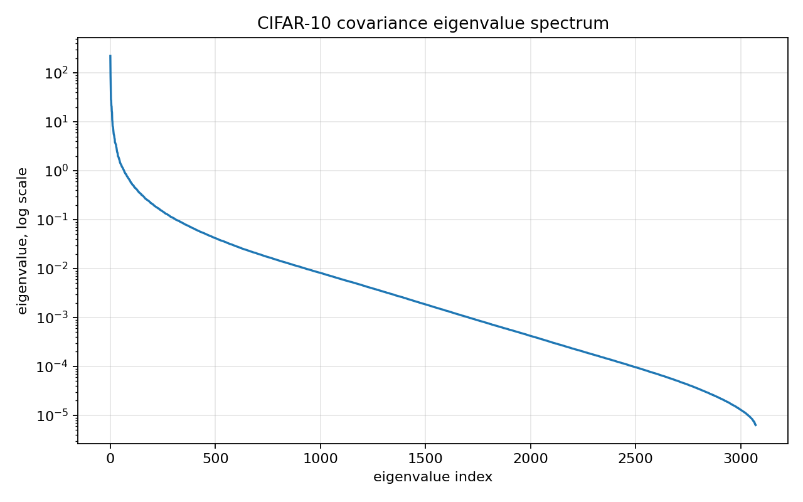

Flow matching learns a time-dependent velocity field that transports a simple source distribution to a target data distribution. When the interpolation is the Gaussian optimal-transport one and the target is replaced by the empirical distribution of a finite training set, the exact marginal velocity field has a closed form: a softmax-weighted average over the training examples.

In high dimension that softmax often becomes almost one-hot very early along the interpolation path, a phenomenon referred to below as **softmax collapse**. Once it occurs along a trajectory generated from a training example, the marginal velocity field is nearly equal to the conditional velocity field attached to that example. The exact empirical field then behaves like a nearest-neighbor decoder, which is part of why the empirical flow memorizes its training set.

The point of this post is that the collapse has a simple mathematical interpretation. Along a trajectory planted at a training point, the closed-form softmax weights are exactly the posterior distribution over the training index in a finite Gaussian codebook model. The interpolant is a noisy observation of the planted image, and the softmax answers the question:

> Which training point most likely generated this interpolant?

Softmax collapse is therefore a **posterior concentration**, or decoding, phenomenon, and its onset can be located by comparing what the interpolant supplies against what identifying a training point costs. In an isotropic Gaussian proxy for CIFAR-10 that comparison reads

$$
\frac{\log n}{d}
=
\frac12 \log\left(1+\sigma^2\left(\frac{t_C}{1-t_C}\right)^2\right),
$$

with the information content of the interpolant on the right and the entropy of the training index on the left. For the CIFAR-10 proxy

$$
d=3072,
\qquad
n=50{,}000,
\qquad
\sigma^2\approx 0.24,
$$

it gives $t_C\approx 0.146$.

This value should not be read as a universal constant for CIFAR-10. It is the prediction of a simplified Gaussian model. But it has the right order of magnitude: it places the onset of posterior concentration around the same early-time regime in which empirical studies observe high correlation between the marginal and conditional velocity fields.

The post is organized as follows. It first recalls the closed-form marginal velocity field for empirical Gaussian-OT flow matching and rewrites its softmax weights as a posterior distribution over the training index. It then reviews the empirical observations that motivate the analysis, before deriving the collapse time in an isotropic Gaussian proxy and its log-determinant generalization for non-isotropic covariance, and checking both against CIFAR-10 in a companion notebook. A last section connects this posterior concentration picture to the observed learning difficulties of neural velocity fields across time.

The [accompanying code](https://github.com/nbrosse/flow-matching-notes) is on GitHub, and the checks reproduced below live in a single [notebook](https://github.com/nbrosse/flow-matching-notes/blob/main/notebooks/posterior_concentration.ipynb). It shares a repository with the notebook behind the companion post [Flow matching as posterior averaging](https://nbrosse.github.io/posts/intro-fm-diffusion/intro-fm-diffusion.html).

# Setup and notation {#sec-setup-and-notation}

The setup is the standard flow matching one [@lipman_flow_2024]. Let the source distribution be

$$
p_0 = \mathcal N(0,I_d),
$$

and let the target distribution be an unknown data distribution $q$ on $\mathbb R^d$. Flow matching defines a probability path $(p_t)_{0\leq t\leq 1}$ connecting $p_0$ to $q$ and learns a time-dependent velocity field

$$
u : [0,1]\times \mathbb R^d \to \mathbb R^d.
$$

The velocity field generates a flow map $\psi_t$ through the ODE

$$
\frac{d}{dt}\psi_t(x)=u_t(\psi_t(x)),
\qquad
\psi_0(x)=x.
$$

If $X_0\sim p_0$, then $X_t=\psi_t(X_0)$ should have law $p_t$. In particular, $X_1$ should have approximately the data distribution.

## Gaussian-OT conditional paths

A common flow matching path is obtained by interpolating linearly between noise and data:

$$
X_t=(1-t)X_0+tX_1,
\qquad
X_0\sim \mathcal N(0,I_d),
\qquad
X_1\sim q.
$$

Conditioned on a fixed endpoint $X_1=x_1$, the conditional distribution of $X_t$ is

$$
p_{t\mid x_1}(x)
=
\mathcal N\bigl(x\mid t x_1,(1-t)^2I_d\bigr).
$$

The associated conditional velocity field is

$$
u_t(x\mid x_1)=\frac{x_1-x}{1-t}.
$$

Evaluated along the interpolant $X_t=(1-t)X_0+tX_1$, this becomes

$$
u_t(X_t\mid X_1)
=
\frac{X_1-X_t}{1-t}
=X_1-X_0.
$$

This is the target used in the usual conditional flow matching objective:

$$
\mathcal L_{\mathrm{CFM}}(\theta)
=
\mathbb E_{t,X_0,X_1}
\left[
\left\|u_t^\theta(X_t)-(X_1-X_0)\right\|^2
\right],
\qquad
X_t=(1-t)X_0+tX_1.
$$

The marginal velocity field is the conditional expectation

$$
u_t(x)=\mathbb E[X_1-X_0\mid X_t=x].
$$

Thus the conditional objective trains against an unbiased target for the marginal velocity field, up to the usual irreducible conditional variance.

::: {.callout-note collapse="true"}
## Bias-variance decomposition

Let

$$
Y=X_1-X_0,
\qquad
\bar Y(X_t)=\mathbb E[Y\mid X_t]=u_t(X_t).
$$

Then

$$
\begin{aligned}
\mathbb E\left[\|u_t^\theta(X_t)-Y\|^2\right]
&=
\mathbb E\left[\|u_t^\theta(X_t)-\bar Y(X_t)\|^2\right]
 +\mathbb E\left[\|Y-\bar Y(X_t)\|^2\right].
\end{aligned}
$$

The second term is independent of $\theta$ and equals the conditional variance of the target. Hence minimizing the conditional flow matching loss has the same minimizers, and the same gradients, as minimizing the marginal flow matching loss.

For a deeper exploration of the bias-variance decomposition in flow matching, see the blog post ["Flow matching as posterior averaging"](https://nbrosse.github.io/posts/intro-fm-diffusion/intro-fm-diffusion.html).
:::

## The closed-form empirical marginal velocity {#sec-closed-form-empirical-marginal-velocity}

In practice only a finite training set is available,

$$
x^{(1)},\dots,x^{(n)}\in\mathbb R^d,
$$

and the target distribution $q$ is replaced by the empirical distribution

$$
\widehat q
=
\frac1n\sum_{i=1}^n\delta_{x^{(i)}}.
$$

For the Gaussian-OT path, the marginal density is then a Gaussian mixture:

$$
p_t(x)
=
\frac1n\sum_{i=1}^n
\mathcal N\bigl(x\mid t x^{(i)},(1-t)^2I_d\bigr).
$$

The exact marginal velocity field is

$$
\boxed{
 u_t(x)
 =
 \sum_{i=1}^n
 \lambda_i(x,t)\frac{x^{(i)}-x}{1-t},
 \qquad
\lambda_i(x,t)
=
\frac{
\exp\left(-\frac{\|x-tx^{(i)}\|^2}{2(1-t)^2}\right)
}{
\sum_{j=1}^n
\exp\left(-\frac{\|x-tx^{(j)}\|^2}{2(1-t)^2}\right)
}.
}
$$

These weights are posterior probabilities under the empirical mixture model. They are also the source of the collapse phenomenon studied in [@bertrand_closed-form_2025].

At $t=0$, all mixture components have the same mean $0$ and covariance $I_d$, so the weights are exactly uniform:

$$
\lambda_i(x,0)=\frac1n.
$$

As $t$ increases, the component means $t x^{(i)}$ separate. In high dimension, this separation can make the posterior over components concentrate very quickly.

## The softmax weights are a posterior {#sec-softmax-as-posterior}

The key change of variables is

$$
r=\frac{t}{1-t},
\qquad
 y=\frac{x}{1-t}.
$$

Then

$$
\frac{\|x-tx^{(i)}\|^2}{2(1-t)^2}
=
\frac12\left\|\frac{x}{1-t}-\frac{t}{1-t}x^{(i)}\right\|^2
=
\frac12\|y-rx^{(i)}\|^2.
$$

Therefore the softmax weights can be written as

$$
\lambda_i(y,r)
=
\frac{
\exp\left(-\frac12\|y-rx^{(i)}\|^2\right)
}{
\sum_{j=1}^n
\exp\left(-\frac12\|y-rx^{(j)}\|^2\right)
}.
$$

Now consider a trajectory generated by a particular training point. Let $i_\star$ denote the planted index and write

$$
x_\star=x^{(i_\star)}.
$$

Let

$$
z\sim \mathcal N(0,I_d),
\qquad
x_t=(1-t)z+t x_\star.
$$

Then

$$
y=\frac{x_t}{1-t}=z+rx_\star.
$$

Thus the softmax weights are exactly the posterior probabilities in the following finite-codebook Gaussian observation model:

$$
I\sim \mathrm{Unif}\{1,\dots,n\},
\qquad
Y=r x^{(I)}+Z,
\qquad
Z\sim \mathcal N(0,I_d).
$$

Conditioned on the codebook $x^{(1)},\dots,x^{(n)}$, Bayes' rule gives

$$
\mathbb P(I=i\mid Y=y,x^{(1:n)})
=
\frac{\exp\left(-\frac12\|y-rx^{(i)}\|^2\right)}
{\sum_{j=1}^n\exp\left(-\frac12\|y-rx^{(j)}\|^2\right)}.
$$

This is precisely $\lambda_i(y,r)$.

The quantity of interest along such a trajectory is the **planted mass**

$$
\lambda_\star(t)=\lambda_{i_\star}(x_t,t),
$$

the posterior mass assigned to the training point that actually generated the trajectory. Collapse along the trajectory means $\lambda_\star(t)\approx 1$.

The parameter $r=t/(1-t)$ is a signal-to-noise parameter. At $t=0$, $r=0$ and the observation is pure noise:

$$
Y=Z.
$$

No information about the training index is available, so the posterior is uniform. As $t$ increases, $Y$ contains a stronger signal $r x_\star$. Collapse occurs when this signal is strong enough to identify $x_\star$ among $n$ possible training points.

This gives a more precise meaning to the phrase "the softmax collapses": along a planted trajectory, collapse is posterior concentration on the planted index.

::: {.callout-note collapse="true"}
## The global mean does not matter

The construction so far uses the raw training points $x^{(i)}$, but nothing changes if the data is not centered. Suppose the points share a common mean,

$$
x^{(i)}=m+\widetilde x^{(i)}.
$$

Because the planted trajectory is generated from one of these points, the shift enters the observation as well:

$$
Y=r x^{(I)}+Z
=
rm+r\widetilde x^{(I)}+Z.
$$

Thus $rm$ is common to $Y$ and to every codeword $rx^{(i)}$, and in the softmax exponent it cancels:

$$
\|y-r x^{(i)}\|^2
=
\bigl\|(y-rm)-r\widetilde x^{(i)}\bigr\|^2,
$$

which is exactly the centered problem with $y$ replaced by $y-rm$. The posterior weights $\lambda_i$ — and hence the planted mass $\lambda_\star$ — are therefore identical whether or not the data is centered. Equivalently, the deterministic shift $rm$ leaves the mutual information $I(X;Y)$ unchanged.

This is an exact identity for the empirical weights, not merely a property of a Gaussian model. Consequently every proxy below may take the data to be centered without loss of generality: the collapse threshold depends on the covariance structure of the data, not on its global mean.
:::

::: {.callout-note collapse="true"}
## Relation to Gibbs measures and the statistical-physics picture

The weights can also be written as a Gibbs measure

$$
\lambda_i(x,t)
=
\frac{e^{-E_i(x,t)}}{\sum_j e^{-E_j(x,t)}},
\qquad
E_i(x,t)=\frac{\|x-tx^{(i)}\|^2}{2(1-t)^2},
$$

whose normalizing constant is a partition function. In this language, softmax collapse is the condensation of a Gibbs measure onto a single training point.

This is the transition studied by [@biroli_dynamical_2024] for diffusion models, under the same exact-empirical-score assumption used here. They analyze it with statistical-physics tools, call it the **collapse** transition, and independently identify $\alpha=\log n/d$ as the control parameter.

The two routes agree quantitatively. Their noising process is Ornstein-Uhlenbeck,

$$
x(s)=e^{-s}x_\star+\sqrt{\Delta_s}\,z,
\qquad
\Delta_s=1-e^{-2s},
$$

with a time $s$ running opposite to ours: $s=0$ is data and $s\to\infty$ is noise. Rescaling by $\sqrt{\Delta_s}$ puts their weights in exactly the form of $\lambda_i(y,r)$ above, so the two models are the same Gaussian codebook posterior, written in different time variables but governed by the same per-coordinate signal-to-noise ratio:

$$
\rho(s)=\frac{\sigma^2e^{-2s}}{1-e^{-2s}}
=
\frac{\sigma^2}{e^{2s}-1}
\qquad
\text{versus}
\qquad
\rho(t)=\sigma^2r^2,
\quad
r=\frac{t}{1-t}.
$$

Their collapse time for the Gaussian model is

$$
s_C=\frac12\log\left(1+\frac{\sigma^2}{n^{2/d}-1}\right),
$$

which sits at signal-to-noise ratio

$$
\rho(s_C)=n^{2/d}-1=e^{2\alpha}-1,
$$

precisely the condition $\frac12\log(1+\rho)=\alpha$ obtained in @sec-random-coding-union-bound. The same threshold is therefore reached twice: there through a decoding argument, here through an excess-entropy computation. Their formula also depends on $\sigma^2$ alone and not on the separation between data clusters, consistent with the nonzero-mean remark in @sec-softmax-as-posterior.
:::

# Empirical motivation {#sec-empirical-motivation}

The empirical observations in [@bertrand_closed-form_2025] motivate this mathematical analysis.

![Histograms of cosine similarities between the closed-form marginal velocity $u_t((1-t)x_0+tx_1)$ and the conditional velocity $u_t((1-t)x_0+tx_1\mid x_1)=x_1-x_0$, for two-moons and CIFAR-10. On CIFAR-10, the marginal field aligns with the conditional field much earlier than in the low-dimensional example. Adapted from [@bertrand_closed-form_2025, Figure 1].](figures/article-fig-1.png){#fig-article-fig-1 fig-alt="Histograms of cosine similarities between marginal and conditional velocity fields for two-moons and CIFAR-10."}

@fig-article-fig-1 shows that, on CIFAR-10, the marginal velocity field becomes highly aligned with the conditional velocity field already for small values of $t$. This suggests that the empirical posterior over training samples becomes concentrated along typical data-generated trajectories.

![Fraction of samples for which the cosine similarity between the marginal and conditional velocity fields exceeds $0.9$, as a function of $t$, for several image resolutions. The transition moves earlier as dimension increases. Adapted from [@bertrand_closed-form_2025, Figure 2].](figures/article-fig-2.png){#fig-article-fig-2 fig-alt="Fraction of samples with cosine similarity above 0.9 as a function of time and resolution."}

@fig-article-fig-2 shows a strong dimension effect: increasing the ambient dimension moves the alignment transition toward earlier times. This is consistent with the formula derived later, where the relevant ratio is

$$
\alpha=\frac{\log n}{d}.
$$

For fixed dataset size $n$, increasing $d$ decreases $\alpha$, and therefore decreases the collapse time.

![Failure to learn the marginal velocity field on CIFAR-10. The left panel shows the average error between the exact empirical marginal velocity field $u_t$ and a learned neural velocity field $u_t^\theta$, for several training-set sizes. The error is low near $t=0$, peaks at intermediate times, decreases, and then rises again near $t=1$. Adapted from [@bertrand_closed-form_2025, Figure 3].](figures/article-fig-3.png){#fig-article-fig-3 fig-alt="Average error between the closed-form marginal velocity field and a learned velocity field as a function of time."}

@fig-article-fig-3 shows a non-monotone learning difficulty profile. The error is low near $t=0$, becomes large at intermediate times, decreases after the posterior starts concentrating, and rises again near $t=1$. The posterior concentration picture explains the intermediate-time difficulty; the final spike near $t=1$ has a different origin, namely nearest-neighbor discontinuities and the prefactor $1/(1-t)$. @sec-error-analysis returns to this profile once the threshold has been derived.

# Isotropic Gaussian proxy {#sec-isotropic-gaussian-proxy}

The identity of @sec-softmax-as-posterior is exact: whatever the training set, the softmax weights are the posterior over the training index in a finite Gaussian codebook model. But an identity says nothing about *when* that posterior concentrates. Answering that requires a distribution for the codebook itself, and the simplest useful choice replaces CIFAR-10 by an i.i.d. Gaussian cloud $x^{(i)}\sim\mathcal N(0,\sigma^2I_d)$ with variance matched to the data.

What this buys is a channel that is memoryless across coordinates, exactly the structure a law-of-large-numbers argument needs. It also turns the question *how much signal is required to identify one of $n$ codewords?* into a classical one with a closed-form answer. The two subsections below locate the threshold, then calibrate $\sigma^2$ against the normalized CIFAR-10 pixel statistics and evaluate it.

## The information-rate threshold {#sec-random-coding-union-bound}

The transition has a one-line information-theoretic reading. Along a planted trajectory the interpolant is a noisy observation of the planted image through a Gaussian channel, and that channel supplies $\frac12\log(1+\mathrm{SNR})$ nats per coordinate about the image. Identifying which of the $n$ training points was planted costs $\log n$ nats, or $\alpha=\log n/d$ nats per coordinate. Collapse occurs when supply exceeds demand.

The rest of this section makes that comparison precise. The training set plays the role of a Gaussian codebook and the softmax weights are exactly the decoding posterior, so the classical random-coding union bound [@lomnitz_simpler_2012] applies verbatim. The main line is deliberately short; two collapsed callouts carry the underlying likelihood-ratio computations in full. The first derives the channel information rate rather than assuming it, and the second upgrades the conclusion from *the planted index is recoverable* to the quantitative statement $\lambda_\star\to 1$.

**The model.** Draw the codebook i.i.d. from the input distribution,

$$
x^{(1)},\dots,x^{(n)}\overset{\mathrm{i.i.d.}}{\sim}P_X,
\qquad
P_X=\mathcal N(0,\sigma^2 I_d),
\qquad
n=e^{\alpha d},
\qquad
\alpha=\frac{\log n}{d},
$$

pick a planted index $I\sim\mathrm{Unif}\{1,\dots,n\}$, and observe

$$
Y=r\,x^{(I)}+Z,
\qquad
Z\sim\mathcal N(0,I_d).
$$

This is the observation model of @sec-softmax-as-posterior, after the change of variables $r=t/(1-t)$, $y=x/(1-t)$, with the isotropic Gaussian proxy substituted for the data. It is an additive Gaussian channel with signal-to-noise ratio

$$
\mathrm{SNR}=\sigma^2r^2.
$$

Let $p(y\mid x)$ be the Gaussian likelihood and let

$$
p_Y(y)=\int p(y\mid x)\,dP_X(x)
$$

be the marginal output density under the random-coding prior. Define the information density

$$
\imath(x;y)
=
\log\frac{p(y\mid x)}{p_Y(y)}.
$$

**Planted codeword.** The channel is memoryless across coordinates, so by the law of large numbers the planted pair concentrates at the mutual information per coordinate:

$$
\frac1d\,\imath\bigl(x^{(I)};Y\bigr)
\longrightarrow
\frac1d\,I(X;Y)
=
\mathcal I_{\mathrm{iso}}(r)
=
\frac12\log(1+\sigma^2 r^2).
$$

Thus, with high probability, the planted information density is $d\,\mathcal I_{\mathrm{iso}}(r)+o(d)$.

::: {.callout-note collapse="true"}
## Why the planted information density concentrates at $\frac12\log(1+\sigma^2r^2)$

Write the likelihood ratio of a codeword $x^{(i)}$ as

$$
L_i(Y)
=
\frac{p(Y\mid x^{(i)})}{p_Y(Y)},
\qquad
p(y\mid x)
=
(2\pi)^{-d/2}
\exp\left(-\frac12\|y-rx\|^2\right),
$$

so that $\log L_i(Y)=\imath(x^{(i)};Y)$. For the planted pair $(X_\star,Y)$, the claim is that $\frac1d\log L_\star$ concentrates.

**Step 1: the marginal output law.** Since $Y=rX+Z$ with $X\sim\mathcal N(0,\sigma^2I_d)$ independent of $Z\sim\mathcal N(0,I_d)$,

$$
Y\sim\mathcal N\bigl(0,(1+\sigma^2r^2)I_d\bigr).
$$

**Step 2: decomposition across coordinates.** The Gaussian channel acts independently on each coordinate, so both $p(y\mid x)$ and $p_Y(y)$ factorize and the information density is a sum of $d$ i.i.d. one-dimensional terms:

$$
\imath(X_\star;Y)
=
\sum_{k=1}^d
\imath(X_{\star,k};Y_k),
\qquad
\mathbb E[\imath(X_{\star,k};Y_k)]
=
I(X_k;Y_k).
$$

By the law of large numbers,

$$
\frac1d\imath(X_\star;Y)
\longrightarrow
I(X_k;Y_k)
\qquad
\text{in probability}.
$$

In words: for a typical planted sample, the log-likelihood ratio is close to its mean.

**Step 3: the scalar mutual information.** For the scalar Gaussian channel

$$
Y_k=rX_k+Z_k,
\qquad
X_k\sim\mathcal N(0,\sigma^2),
\qquad
Z_k\sim\mathcal N(0,1),
$$

the mutual information is $I(X_k;Y_k)=h(Y_k)-h(Y_k\mid X_k)$. Since

$$
Y_k\sim\mathcal N(0,1+\sigma^2r^2),
\qquad
Y_k\mid X_k\sim\mathcal N(rX_k,1),
$$

and a Gaussian of variance $v$ has differential entropy $\frac12\log(2\pi e v)$, the two entropies differ only through the variance ratio:

$$
I(X_k;Y_k)
=
\frac12\log\bigl(2\pi e(1+\sigma^2r^2)\bigr)
-
\frac12\log(2\pi e)
=
\frac12\log(1+\sigma^2r^2).
$$

**Conclusion.** Combining the three steps,

$$
\frac1d\log L_\star
\longrightarrow
\mathcal I_{\mathrm{iso}}(r)
=
\frac12\log(1+\sigma^2r^2),
$$

so for any $\varepsilon>0$, with high probability,

$$
L_\star
\geq
\exp\left\{
d\left(\mathcal I_{\mathrm{iso}}(r)-\varepsilon\right)
\right\}.
$$
:::

**Wrong codewords.** Fix a threshold $\gamma$. A wrong codeword $x^{(j)}$, $j\neq I$, is independent of $Y$. Conditioned on $Y=y$, a change-of-measure (Markov) bound gives

$$
\begin{aligned}
\mathbb P\bigl(\imath(x^{(j)};y)\ge d\gamma\bigr)
&=
P_X\!\left(
x:\frac{p(y\mid x)}{p_Y(y)}\ge e^{d\gamma}
\right) \\
&\le
e^{-d\gamma}
\int\frac{p(y\mid x)}{p_Y(y)}\,dP_X(x)
=
e^{-d\gamma}.
\end{aligned}
$$

A union bound over the $n-1$ wrong codewords yields

$$
\mathbb P\bigl(
\exists\, j\neq I:\imath(x^{(j)};Y)\ge d\gamma
\bigr)
\le
n\,e^{-d\gamma}
=
\exp\{d(\alpha-\gamma)\}.
$$

**Threshold.** Suppose $\gamma$ can be picked with

$$
\alpha<\gamma<\mathcal I_{\mathrm{iso}}(r).
$$

Then, with high probability, the planted codeword has information density above $d\gamma$ while no wrong codeword does, so the planted index is recoverable. Such a $\gamma$ exists exactly when

$$
\alpha<\mathcal I_{\mathrm{iso}}(r).
$$

This is Shannon's random-coding theorem specialized to a Gaussian codebook and an AWGN channel: a wrong codeword has probability at most $e^{-d\gamma}$ of exceeding information density $d\gamma$, the union bound over $n$ candidates contributes $\exp\{d(\alpha-\gamma)\}$, and the planted codeword sits at $d\,\mathcal I_{\mathrm{iso}}(r)+o(d)$. The recovery boundary is therefore

$$
\mathcal I_{\mathrm{iso}}(r_C)=\alpha,
\qquad\text{i.e.}\qquad
\frac12\log(1+\sigma^2 r_C^2)=\frac{\log n}{d}.
$$

::: {.callout-note collapse="true"}
## From recoverability to posterior mass: $\lambda_\star\to1$

The union bound shows that the planted index is *recoverable*. Since the object of interest here is the softmax weight itself, it is worth showing directly that the planted posterior mass tends to $1$. The argument compares the planted likelihood ratio to the total wrong mass.

Multiplying every likelihood by the common factor $1/p_Y(Y)$ leaves the softmax weights unchanged, so with $L_i(Y)=p(Y\mid x^{(i)})/p_Y(Y)$ the planted mass is

$$
\lambda_\star
=
\frac{L_\star}
{L_\star+W},
\qquad
W=\sum_{j\neq \star}L_j(Y).
$$

**The planted term.** By the previous callout, with high probability

$$
L_\star
\geq
\exp\left\{
d\left(\mathcal I_{\mathrm{iso}}(r)-\varepsilon\right)
\right\}.
$$

**The wrong mass.** A wrong codeword $x^{(j)}$, $j\neq\star$, is independent of $Y$ and distributed according to the prior $P_X$. A change of measure gives

$$
\begin{aligned}
\mathbb E[L_j(Y)\mid Y]
&=
\int
\frac{p(Y\mid x)}{p_Y(Y)}
\,dP_X(x) \\
&=
\frac{1}{p_Y(Y)}
\int p(Y\mid x)\,dP_X(x) \\
&=
\frac{p_Y(Y)}{p_Y(Y)}
=
1.
\end{aligned}
$$

Each wrong codeword therefore contributes a likelihood ratio of order $1$ on average, and since there are $n-1$ of them,

$$
\mathbb E[W\mid Y]=n-1.
$$

By Markov's inequality, for any $\varepsilon>0$,

$$
\mathbb P\left(
W\geq e^{d(\alpha+\varepsilon)}
\mid Y
\right)
\leq
\frac{n-1}{e^{d(\alpha+\varepsilon)}}
\leq
e^{-d\varepsilon},
$$

so with high probability $W\leq\exp\{d(\alpha+\varepsilon)\}$.

**Combining.** With high probability both estimates hold, and

$$
\frac{W}{L_\star}
\leq
\exp\left\{
d(\alpha+\varepsilon)
-
d(\mathcal I_{\mathrm{iso}}(r)-\varepsilon)
\right\}
=
\exp\left\{
-d\left(
\mathcal I_{\mathrm{iso}}(r)-\alpha-2\varepsilon
\right)
\right\}.
$$

If $\mathcal I_{\mathrm{iso}}(r)>\alpha$, choose $\varepsilon>0$ small enough that $\mathcal I_{\mathrm{iso}}(r)-\alpha-2\varepsilon>0$. Then $W/L_\star\to0$ exponentially fast in $d$, and since

$$
\lambda_\star
=
\frac{1}{1+W/L_\star},
$$

the planted mass satisfies $\lambda_\star\to1$. Above the threshold, the posterior concentrates on the planted training point, which is exactly softmax collapse along a planted trajectory.
:::

The matching converse is the standard channel-coding converse via Fano's inequality: if the index can be decoded with vanishing error, its entropy rate cannot exceed the channel mutual information [@cover_elements_2006; @polyanskiy_channel_2010]. Achievability and converse together pin the collapse boundary at $\mathcal I_{\mathrm{iso}}(r_C)=\alpha$, which solves to

$$
r_C
=
\sqrt{\frac{e^{2\alpha}-1}{\sigma^2}}.
$$

Since $r=t/(1-t)$ and $t=r/(1+r)$, the predicted collapse time is

$$
\boxed{
 t_C
 =
 \frac{
 \sqrt{(e^{2\alpha}-1)/\sigma^2}
 }{
 1+\sqrt{(e^{2\alpha}-1)/\sigma^2}
 }.
}
$$

This is the supply-exceeds-demand comparison of the opening paragraph, now with both directions established: above the threshold the posterior concentrates on the planted training point, and below it no decoder can identify that point.

## Numerical value for the CIFAR-10 proxy

**Calibration.** The numerical values below use the standard CIFAR-10 normalization often used in flow matching experiments:

```python
dataset = datasets.CIFAR10(
    root="./data",
    train=True,
    download=True,
    transform=transforms.Compose([
        transforms.ToTensor(),
        transforms.Normalize((0.5, 0.5, 0.5), (0.5, 0.5, 0.5)),
    ]),
)
```

The transformation maps pixel values $p\in[0,1]$ to

$$
x=\frac{p-0.5}{0.5}=2p-1\in[-1,1].
$$

CIFAR-10 images have dimension $d=3\times 32\times 32=3072$, and the training set has $n=50{,}000$ images. The usual CIFAR-10 channel standard deviations in $[0,1]$ scale are approximately

$$
0.247,
\qquad
0.243,
\qquad
0.261.
$$

After the normalization $x\mapsto 2x-1$, variances are multiplied by $4$, giving channel variances roughly

$$
0.244,
\qquad
0.236,
\qquad
0.273.
$$

As a simple isotropic proxy, this post uses the round value

$$
\sigma^2\approx 0.24,
$$

slightly below the per-coordinate variance $0.248$ measured on the normalized training set in the notebook below. The difference is immaterial here: using $0.248$ instead would move the threshold derived next from $0.146$ to $0.144$.

This model is deliberately crude. Real CIFAR-10 images are bounded, structured, and highly non-Gaussian, and their covariance is far from isotropic. The isotropic calculation should be read as a first-order scale prediction, not as an exact model of images; @sec-general-covariance gives the natural covariance-corrected formula.

**Evaluation.** With $d=3072$, $n=50{,}000$ and $\sigma^2\approx 0.24$, the training index costs

$$
\alpha
=
\frac{\log(50{,}000)}{3072}
\approx 0.003522
$$

nats per coordinate. Solving $\mathcal I_{\mathrm{iso}}(r_C)=\alpha$ gives

$$
r_C
=
\sqrt{\frac{e^{2\alpha}-1}{0.24}}
\approx 0.1716,
$$

and therefore

$$
\boxed{
 t_C=\frac{r_C}{1+r_C}\approx 0.146.
}
$$

This is the asymptotic point where the exponent changes sign. In finite dimension, one may prefer to define collapse by a target planted mass, for example $\lambda_\star\geq 0.9$ or $\lambda_\star\geq 0.99$. A useful finite-$d$ approximation is

$$
\lambda_\star(t)
\approx
\frac{1}{1+\exp\{d(\alpha-\mathcal I_{\mathrm{iso}}(r))\}},
\qquad
r=\frac{t}{1-t}.
$$

Using this approximation with the CIFAR-10 proxy gives:

| Criterion | Approximate time |
|---|---:|
| exponent changes sign, $\lambda_\star\approx 1/2$ | $0.146$ |
| $\lambda_\star\approx 0.9$ | $0.158$ |
| $\lambda_\star\approx 0.99$ | $0.170$ |
| $\lambda_\star\approx 0.999$ | $0.180$ |

The transition is sharp because $d=3072$ is large.

::: {.callout-note collapse="true"}
## Why the finite-dimensional sigmoid appears

The sigmoid comes from the same two estimates used in @sec-random-coding-union-bound, read as approximations rather than as one-sided bounds.

Recall the likelihood ratios $L_i(Y)=p(Y\mid x^{(i)})/p_Y(Y)$ and the decomposition

$$
\lambda_\star
=
\frac{L_\star}{L_\star+W},
\qquad
W=\sum_{j\neq \star}L_j(Y).
$$

The planted term satisfies $\frac1d\log L_\star\to\mathcal I_{\mathrm{iso}}(r)$, so it sits at the exponential scale $e^{d\mathcal I_{\mathrm{iso}}(r)}$. Each wrong term has $\mathbb E[L_j\mid Y]=1$, so the wrong mass sits at the scale $n=e^{\alpha d}$. Replacing both by their typical exponential scale,

$$
\lambda_\star
\approx
\frac{e^{d\mathcal I_{\mathrm{iso}}(r)}}
{e^{d\mathcal I_{\mathrm{iso}}(r)}+e^{\alpha d}}
=
\frac1{1+e^{d(\alpha-\mathcal I_{\mathrm{iso}}(r))}},
$$

whose exponent changes sign exactly at $\mathcal I_{\mathrm{iso}}(r)=\alpha$, recovering the threshold.

This is a heuristic sharpening, not a theorem. The rigorous argument bounds $W/L_\star$ from one side only, which yields $\lambda_\star\to1$ above the threshold but not the exact sigmoid profile at finite $d$; the fluctuations of $\log L_\star$ and of $W$ around their typical scales are $O(\sqrt d)$ and are what smooth the transition in practice. The table above should be read in that spirit.
:::

# A general-covariance Gaussian proxy {#sec-general-covariance}

The isotropic proxy is mathematically transparent, but real image data is strongly anisotropic.

{#fig-eigenvalues-cifar10 fig-alt="Eigenvalue spectrum of the CIFAR-10 covariance matrix."}

The covariance spectrum in @fig-eigenvalues-cifar10 shows that CIFAR-10 is not close to an i.i.d. Gaussian cloud. The natural Gaussian refinement is

$$
x^{(i)}\sim\mathcal N(0,C),
$$

where $C$ is the empirical covariance matrix of the normalized data. The planted channel is

$$
Y=rX_\star+Z,
\qquad
X_\star\sim\mathcal N(0,C),
\qquad
Z\sim\mathcal N(0,I_d).
$$

The mutual information of this Gaussian channel is

$$
I_C(r)
=
\frac12\log\det(I_d+r^2C).
$$

Per coordinate, define

$$
\mathcal I_C(r)
=
\frac1d I_C(r)
=
\frac1{2d}\log\det(I_d+r^2C).
$$

If $\mu_1,\dots,\mu_d$ are the eigenvalues of $C$, then

$$
\mathcal I_C(r)
=
\frac1{2d}\sum_{k=1}^d\log(1+r^2\mu_k).
$$

The covariance-corrected collapse threshold is therefore

$$
\boxed{
\log n
=
\frac12\log\det(I_d+r_C^2C),
\qquad
 t_C=\frac{r_C}{1+r_C}.
}
$$

Equivalently, in per-coordinate form,

$$
\frac{\log n}{d}
=
\frac1{2d}\sum_{k=1}^d\log(1+r_C^2\mu_k).
$$

This formula is often the most useful one in practice: it uses the empirical covariance spectrum directly.

**Interpretation.** The isotropic model replaces all eigenvalues by their average value $\sigma^2$. The general covariance formula instead sums the contribution of each principal direction:

$$
\frac12\log(1+r^2\mu_k).
$$

Large-variance directions become informative early. Low-variance directions contribute later. Because $\log(1+r^2\mu)$ is concave in $\mu$, the full spectrum matters; the mean variance alone is not enough to determine the threshold.

Given the spiked CIFAR-10 spectrum of @fig-eigenvalues-cifar10, the covariance-corrected prediction is read off the curve

$$
t\mapsto
\frac1{2d}\sum_{k=1}^d
\log\left(1+\left(\frac{t}{1-t}\right)^2\mu_k\right)
$$

at its crossing with the horizontal line $\alpha=\log n/d$.

The notebook that follows does exactly that on the full training set, and then goes one step further: rather than stopping at the Gaussian proxies, it evaluates the *exact* empirical softmax along planted trajectories $x_t=(1-t)z+tx_\star$ and tracks how it concentrates. Five diagnostics are followed together — the planted mass $\lambda_\star$, the largest weight $\lambda_{\max}$, the normalized posterior entropy $H(\lambda)/\log n$, the cosine alignment between the marginal and conditional velocities, and the planted recovery rate $\mathbb P(\arg\max_i\lambda_i=i_\star)$ — with both thresholds overlaid.



# Consequences for learning the velocity field {#sec-error-analysis}

The threshold $t_C$ predicts a single event: the moment the posterior concentrates. Yet the measured error profile in @fig-article-fig-3 is non-monotone, with *two* difficult regions separated by an easy one. The posterior concentration picture resolves this apparent tension by splitting a typical trajectory into four regimes — and, crucially, the two hard regions turn out to have unrelated causes. Only the first is governed by $\log n/d$; the second is a geometric artifact of the empirical field near $t=1$.

## Regime 1: $t\approx 0$ — nearly linear and easy

At $t=0$ the interpolant is pure noise, $X_t=Z$, and the weights are uniform (@sec-closed-form-empirical-marginal-velocity), so the marginal velocity collapses to an affine field:

$$
u_0(x)
=
\bar x-x
\approx
-x,
\qquad
\bar x=\frac1n\sum_{i=1}^n x^{(i)},
$$

the last step assuming approximately centered data. A near-linear target is trivial for a network, which is why the error is small near $t=0$.

## Regime 2: $t\approx t_C$ — posterior transition and peak difficulty

As $t$ increases the rescaled observation $y=z+\tfrac{t}{1-t}x_\star$ begins to reveal the planted image, and the difficult regime is precisely the transition window

$$
\frac12\log\left(1+\sigma^2\left(\frac{t}{1-t}\right)^2\right)
\approx
\frac{\log n}{d}.
$$

Here the posterior is neither uniform nor concentrated: several training points carry comparable weight, and the identity of the dominant one can flip rapidly with small changes in $x_t$. The marginal velocity is then a delicate, fast-varying weighted average

$$
u_t(x_t)
=
\sum_{i=1}^n
\lambda_i(x_t,t)\frac{x^{(i)}-x_t}{1-t},
$$

harder to approximate than either the affine field before it or the near-conditional field after it. This is the first peak in @fig-article-fig-3, and the posterior concentration picture places it exactly where the information-rate threshold predicts.

## Regime 3: $t>t_C$ — concentration and alignment

Past the threshold the posterior concentrates on the planted point, $\lambda_\star(t)\to 1$ (@sec-random-coding-union-bound), so along typical trajectories the marginal field reduces to the conditional one:

$$
u_t(x_t)
\approx
\frac{x_\star-x_t}{1-t}
=
x_\star-z
=
u_t(x_t\mid x_\star).
$$

The network is once again learning a simple, near-conditional target rather than a mixture over many training points, and the error falls.

## Regime 4: $t\uparrow 1$ — nearest-neighbor discontinuities

The second rise near $t=1$ has nothing to do with the posterior threshold. For an *arbitrary* input $x$, as $t\uparrow 1$ the softmax temperature $(1-t)^2$ tends to zero and the weights harden into a nearest-neighbor assignment,

$$
\lambda_i(x,t)
\to
\mathbf 1\left\{i=\arg\min_j\|x-x^{(j)}\|\right\},
$$

so the empirical field approaches a piecewise-affine nearest-neighbor decoder

$$
u_t(x)
\approx
\frac{x^{(i^*(x))}-x}{1-t},
\qquad
 i^*(x)=\arg\min_j\|x-x^{(j)}\|,
$$

with jump discontinuities across Voronoi cell boundaries that the prefactor $1/(1-t)$ amplifies without bound.

This ambient-space singularity must not be confused with the behavior along a planted trajectory. Along $x_t=(1-t)z+t x_\star$ the conditional velocity stays

$$
\frac{x_\star-x_t}{1-t}=x_\star-z,
$$

which is $O(\sqrt d)$, not divergent. The late-time difficulty is therefore about approximating the empirical field as a function of $x$ near Voronoi boundaries — a geometry-driven mechanism, unrelated to the information-theoretic transition of Regimes 2–3. The two hard regions of @fig-article-fig-3 thus have two separate explanations, and only the first is set by $\log n/d$.

# Conclusion {#sec-conclusion}

The empirical Gaussian-OT marginal velocity field in flow matching has a closed form involving a softmax over training examples. In high dimension, this softmax can concentrate very early along the interpolation path.

The central message of this post is that the phenomenon is not mysterious: after the change of variables $r=t/(1-t)$, $y=x/(1-t)$, the softmax weights are exactly posterior probabilities in a Gaussian observation model. Along a trajectory planted at a training example, the interpolant is a noisy observation of that example, and collapse occurs when the observation contains enough information to identify the planted point among $n$ candidates. In the isotropic Gaussian proxy this gives the explicit threshold

$$
\frac{\log n}{d}
=
\frac12\log\left(1+\sigma^2\left(\frac{t_C}{1-t_C}\right)^2\right),
$$

predicting $t_C\approx 0.146$ for CIFAR-10-scale parameters, while the same argument yields the covariance-aware threshold

$$
\log n
=
\frac12\log\det\left(I_d+\left(\frac{t_C}{1-t_C}\right)^2C\right),
$$

which is the natural way to incorporate the empirical covariance spectrum and lands at $t_C\approx 0.179$ on CIFAR-10, against a measured transition at $t\approx 0.181$. This perspective also clarifies the training error profile observed empirically: the field is simple near $t=0$, difficult near the posterior transition, easier again once trajectories are decoded, and difficult near $t=1$ because the empirical field approaches a nearest-neighbor Voronoi field.

The analysis is deliberately simplified, and several limitations are worth restating. CIFAR-10 is not Gaussian: images are bounded in $[-1,1]^d$ after normalization and have strong higher-order structure, so a Gaussian proxy captures only a coarse scale and covariance structure. Even the covariance-corrected log-determinant formula remains a Gaussian approximation, since the empirical covariance does not fully describe the data distribution. Posterior concentration is moreover a property of the exact empirical marginal field, whereas neural network training introduces additional approximation, optimization, and finite-sample effects. Finally, velocity alignment and posterior collapse are related but distinct, and the notebook makes the gap concrete: a high cosine similarity occurs well before the posterior is one-hot, and a nearly one-hot posterior can still select the wrong neighbor.

Despite these caveats, softmax collapse is best understood as a high-dimensional posterior concentration phenomenon, governed by the scale $\log n/d$. It is a structural property of the empirical Gaussian-OT path, not merely an artifact of optimization.
