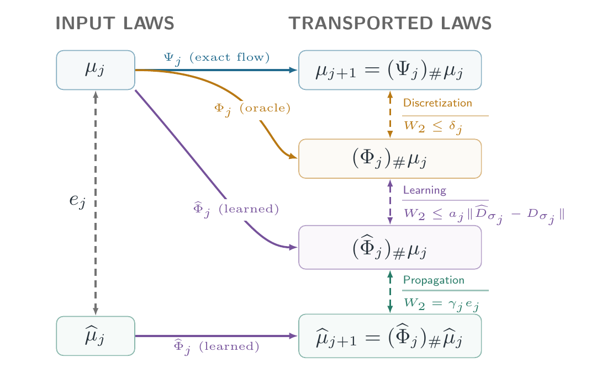

Take a one-dimensional mixture of four narrow Gaussians, give the sampler the *exact* denoiser, start it from the *exact* noisy law, and run the first-order deterministic sampler of @karras_elucidating_2022 on finer and finer grids. The only error left is discretization. Each step is a first-order method, so its local bias is quadratic in the step size, and the sum of these biases over $K$ steps decays like $1/K$. One would expect the final Wasserstein error to do the same.

It does not.

![Four-Gaussian mixture, oracle denoiser, exact initialization. The summed local biases (dashed) reach first-order decay; the final error $e_K$ (black) decays at order 0.58–0.60 over $K\in[17,1088]$. Propagating each local bias through the amplification measured on the later steps (solid blue) recovers the slope of the final error.](figures/teaser.png){#fig-teaser width=70% fig-alt="Log-log plot of error against the number of sampling steps K from 17 to 1088. The dashed line of summed biases has slope 1; the black final-error line and the blue propagated-biases line are parallel to each other with slope about 0.58."}

Over the tested range, the final error decreases at orders 0.58–0.60 (@fig-teaser). Local accuracy is there; global accuracy lags behind. The missing ingredient is what happens to an error *after* it is made: every later step can shrink it or stretch it. Propagating each local bias through the stretching actually measured on the subsequent steps reproduces the observed slope.

This post is about a paper written with Arnak Dalalyan, [*Universal Local Error and Realized Amplification for the First-Order EDM Predictor*](https://arxiv.org/abs/XXXX.XXXXX) [@brosse2026edm], which makes this split precise. It has two halves of very different nature:

- **Error creation is universal.** The one-step discretization bias is $O(h^2)$ in 2-Wasserstein distance, with an explicit constant, *for every data law with finite second moment*. No support, smoothness or log-concavity assumption.
- **Error propagation is not.** It depends on the learned network, and we measure it by the *realized* amplification: how much each step expands the Wasserstein distance between the two laws it actually transports, the exact one and the sampler's. This can be arbitrarily smaller than the worst-case Lipschitz constants that stability analyses usually rely on.

Combined, they give a global bound of order $e^{\Lambda_K}/K$, where $\Lambda_K$ is the accumulated log-amplification at low noise. On the mixture above, $\Lambda_K$ grows like $0.41\log K$, and $1-0.41=0.59$.

@sec-setup sets up the sampler and the one-step error decomposition. @sec-local proves the universal local bound, @sec-contraction shows what EDM's preconditioning buys at high noise, and @sec-amplification defines realized amplification and compares it with its worst-case majorants. @sec-global assembles the global bound and explains the 0.59, @sec-cifar looks at a pretrained CIFAR-10 model, and @sec-open lists the limits. A [previous post](../boundary-layer/boundary-layer.qmd) studied the same smoothed laws from the other end, as $\sigma\to 0$; here the noise stays bounded away from zero and the question is numerical.

# The sampler and its one-step error {#sec-setup}

Let $q$ be the data law on $\mathbb R^d$ with finite second moment. For $X_0\sim q$ and an independent $Z\sim\mathcal N(0,I_d)$, set

$$
X_\sigma = X_0+\sigma Z,\qquad \mu_\sigma=\operatorname{Law}(X_\sigma).
$$

The curve $\sigma\mapsto\mu_\sigma$ goes from the data ($\sigma=0$) to something indistinguishable from $\mathcal N(0,\sigma^2 I_d)$ at large $\sigma$. It is transported by the probability-flow ODE $\mathrm dx/\mathrm d\sigma=v_\sigma(x)$ with velocity

$$
v_\sigma(x)=\frac{x-D_\sigma(x)}{\sigma}=-\sigma\nabla\log p_\sigma(x),
\qquad D_\sigma(x)=\mathbb E[X_0\mid X_\sigma=x],
$$

where $D_\sigma$ is the posterior-mean denoiser (Tweedie). Write $\Psi_{\sigma',\sigma}$ for the flow map from noise level $\sigma$ to $\sigma'$; it pushes $\mu_\sigma$ onto $\mu_{\sigma'}$ exactly. Generative modelling replaces $\Psi_{\underline\sigma,\overline\sigma}$ by a learned approximation and applies it to $\mathcal N(0,\overline\sigma^2 I_d)$. For background, @holderrieth2025 is a good introduction.

Fix a schedule $\overline\sigma=\sigma_0>\sigma_1>\dots>\sigma_K=\underline\sigma>0$ and set $a_j=(\sigma_j-\sigma_{j+1})/\sigma_j$. Freezing the velocity at the start of each step gives the first-order EDM predictor, which in the variance-exploding parametrization is also the DDIM update [@song_denoising_implicit_2021]:

$$
\Phi_j(x)=(1-a_j)\,x+a_j D_{\sigma_j}(x),
\qquad
\widehat\Phi_j(x)=(1-a_j)\,x+a_j \widehat D_{\sigma_j}(x).
$$

The oracle step $\Phi_j$ uses the true denoiser, the learned step $\widehat\Phi_j$ the network. Starting from $\widehat\mu_0=\mathcal N(0,\sigma_0^2I_d)$, the sampler produces $\widehat\mu_{j+1}=(\widehat\Phi_j)_\#\widehat\mu_j$, and we track

$$
e_j=W_2(\widehat\mu_j,\mu_{\sigma_j}).
$$

The final law is within $e_K+\sigma_K\sqrt d$ of $q$, so $e_K$ is what has to be understood.

{#fig-one-step width=75% fig-alt="Diagram with two input laws on the left, mu_j and mu-hat_j, separated by the distance e_j, and four transported laws on the right. The exact flow, the oracle step and the learned step applied to mu_j, and the learned step applied to mu-hat_j. Consecutive laws on the right are linked by dashed arrows labelled discretization, learning and propagation."}

Going down the right-hand column of @fig-one-step, the triangle inequality gives a one-step recursion,

$$
e_{j+1}\;\le\;\underbrace{\gamma_j\,e_j}_{\text{propagation}}
\;+\;\underbrace{\delta_j}_{\text{discretization}}
\;+\;\underbrace{a_j\,\|\widehat D_{\sigma_j}-D_{\sigma_j}\|_{\mathbb L_2(\mu_{\sigma_j})}}_{\text{learning}},
$$ {#eq-recursion}

with the local discretization bias and the realized amplification factor

$$
\delta_j=\bigl\|\Psi_{\sigma_{j+1},\sigma_j}(X_{\sigma_j})-\Phi_j(X_{\sigma_j})\bigr\|_{\mathbb L_2},
\qquad
\gamma_j=\frac{W_2\bigl((\widehat\Phi_j)_\#\mu_{\sigma_j},(\widehat\Phi_j)_\#\widehat\mu_j\bigr)}{W_2(\mu_{\sigma_j},\widehat\mu_j)}.
$$

Nothing has been assumed yet. The three terms are of different nature, and the rest of the paper treats each with the tool it calls for: $\delta_j$ with Gaussian calculus, the learning term with EDM's parametrization, and $\gamma_j$ with optimal transport.

# Error creation: a universal local bound {#sec-local}

A first-order step makes an error governed by the second derivative of the trajectory. So the question is: how large can the *acceleration* of the probability flow be, in $\mathbb L_2$ along the flow?

EDM does not step uniformly in $\sigma$. It steps uniformly in a *clock* $\eta=\sigma^\rho$, with $\rho=1/\rho_{\mathrm{EDM}}$; the default $\rho_{\mathrm{EDM}}=7$ means $\rho=1/7$, which crowds the steps at low noise. In the clock, the flow reads $\mathrm dx/\mathrm d\eta=w_\eta(x)$ and its acceleration along a trajectory is a field $\mathcal A_\rho(\sigma,x)=\partial_\eta w_\eta+\nabla w_\eta\,w_\eta$.

::: {#thm-universal .boundary-result}
## Universal acceleration bound

For every $\rho>0$, every Borel probability measure $q$ on $\mathbb R^d$ and every $\sigma>0$ [@brosse2026edm, Sec. 3],

$$
\bigl\|\mathcal A_\rho(\sigma,X_\sigma)\bigr\|_{\mathbb L_2}\;\le\;B_{d,\rho}\,\sigma^{1-2\rho},
\qquad
B_{d,\rho}=\rho^{-2}\sqrt d\,\bigl[|1-\rho|+4(d+3)\bigr].
$$
:::

The bound does not see $q$ at all, and the reason fits in two lines. Every derivative of $v_\sigma$ in $x$ and $\sigma$ can be written through *conditional moments of the noise* $Z$ given $X_\sigma=x$: the score is $-\mathbb E[Z\mid X_\sigma]/\sigma$, its Jacobian involves $\operatorname{Cov}(Z\mid X_\sigma)$, and so on. Working this out, the acceleration is $\sigma^{1-2\rho}/\rho^2$ times a polynomial combination of such conditional moments. Taking the $\mathbb L_2$ norm along the flow means averaging over $X_\sigma$, and Jensen's inequality bounds the average of a conditional moment by the corresponding moment of $Z$ itself, which is Gaussian and known. The geometry of $q$, however singular, disappears in the averaging.

The exponent $1-2\rho$ cannot be improved uniformly over all target laws: for $\rho\ne1$ a point mass attains it exactly, and for $\rho=1$ a Gaussian of variance $2\sigma^2$ does. Whether the $d^{3/2}$ dimension dependence is sharp is open.

Integrating this acceleration over one step, at $\rho=1$, gives the local bias for *any* schedule:

$$
\delta_j\;\le\;\Delta_j=B_{d,1}\Bigl[(\sigma_j-\sigma_{j+1})-\sigma_{j+1}\log\frac{\sigma_j}{\sigma_{j+1}}\Bigr].
$$

On a grid uniform in the clock, with step $h$, expanding this in $h/\eta_j$ gives

$$
\Delta_j=\frac{B_{d,1}}{2\rho^2}\,h^2\,\sigma_j^{1-2\rho}\bigl[1+O(h/\eta_j)\bigr],
$$

quadratic in the clock step, as it should be, with a noise profile $\sigma_j^{1-2\rho}$. Two remarks.

**The bound singles out $\rho_{\mathrm{EDM}}=2$.** At $\rho=1/2$ the profile is flat: the universal bound is equidistributed across noise levels. At the default $\rho_{\mathrm{EDM}}=7$ it is proportional to $\sigma_j^{5/7}$, so it is largest at *high* noise.

**The measured biases disagree.** On the mixture of @fig-teaser at $K=1088$, the summed measured biases are $0.0164$ for $\rho_{\mathrm{EDM}}=2$, $0.0095$ for $3$ and $0.0065$ for $7$: the reverse order. The universal bound is a worst case over all data laws and overestimates these biases by factors of 280 to 1150. It is the right tool to show that local error is *always* second order; it is not a recipe for choosing the schedule of a particular dataset.

# EDM preconditioning and contraction at high noise {#sec-contraction}

The other two terms of @eq-recursion involve the network. EDM does not train $\widehat D_\sigma$ directly; it trains a network $\widehat F_\sigma$ wrapped in noise-dependent coefficients [@karras_elucidating_2022, Sec. 5]. With $\sigma_{\mathrm{data}}^2=\mathbb E\|X_0\|^2/d$ for a centered target,

$$
\widehat D_\sigma(x)=\alpha(\sigma)\,x+\beta(\sigma)\,\widehat F_\sigma\bigl(c(\sigma)\,x\bigr),
\quad
\alpha=\frac{\sigma_{\mathrm{data}}^2}{\sigma^2+\sigma_{\mathrm{data}}^2},\;
\beta=\frac{\sigma\,\sigma_{\mathrm{data}}}{\sqrt{\sigma^2+\sigma_{\mathrm{data}}^2}},\;
c=\frac{1}{\sqrt{\sigma^2+\sigma_{\mathrm{data}}^2}}.
$$

This parametrization pays off twice.

**The learning term is an excess risk.** The true denoiser has the same form with an ideal residual $F_\sigma$, which is the regression function of a normalized target $\mathcal T_\sigma$ on the normalized input $c(\sigma)X_\sigma$. By orthogonality of conditional expectation, $\|\widehat D_\sigma-D_\sigma\|_{\mathbb L_2(\mu_\sigma)}=\beta(\sigma)\,\mathcal R(\sigma)$, where $\mathcal R(\sigma)^2$ is exactly the *excess population risk* of $\widehat F_\sigma$ on that regression problem. The training loss bounds it from above, but the Bayes risk is unknown, so it cannot be read off a validation curve.

**Contraction has a simple certificate.** Substituting the parametrization into the predictor, if $\widehat F_j$ is $L_j$-Lipschitz in its normalized input,

$$
\operatorname{Lip}(\widehat\Phi_j)\le 1-a_j b_j,
\qquad
b_j=c_j^2\bigl(\sigma_j^2-\sigma_j\,\sigma_{\mathrm{data}}\,L_j\bigr),
$$

so the step is a strict contraction as soon as

$$
L_j<\sigma_j/\sigma_{\mathrm{data}}.
$$

The admissible Lipschitz constant *grows with the noise*. At $\sigma=80$, the top of the default EDM schedule, with $\sigma_{\mathrm{data}}=0.5$, the network may be 160-Lipschitz and the step still contracts. High-noise steps therefore damp the errors made before them, including the initialization mismatch and the biases that the $\rho_{\mathrm{EDM}}=7$ bound puts at high noise. The paper turns this into a *high-noise block*, the steps above a level $\sigma_{\mathrm{hi}}$ where a uniform margin $b_{\mathrm{hi}}>0$ holds. A margin above $1-\rho=6/7$ makes the damped high-noise contribution independent of the starting noise $\sigma_0$.

At low noise, $\sigma_j/\sigma_{\mathrm{data}}$ is small and the certificate is useless: denoisers of concentrated data are steep there by necessity. Something else is needed.

# Error propagation: realized amplification {#sec-amplification}

Below $\sigma_{\mathrm{hi}}$ the paper imposes no contraction at all and keeps $\gamma_j$ as it is. The quantity that enters the global bound is the accumulated low-noise log-amplification

$$
\Lambda_K=\sum_{j\ \text{low noise}}\log\max\{1,\gamma_j\},
$$

so that $e^{\Lambda_K}$ bounds the product of amplification factors over any stretch of the low-noise block.

The point of $\gamma_j$ is in its definition: it compares the *two laws the sampler actually transports*, $\mu_{\sigma_j}$ and $\widehat\mu_j$. A Lipschitz constant compares *all pairs of points*. The difference is between how much a map can stretch in the worst place and in the worst direction, and how much it stretches the discrepancy that is actually there.

The paper gives three upper bounds on $\Lambda_K$, in decreasing order of tightness:

- **Directional.** Take an optimal coupling $(U_j,V_j)$ of $(\mu_{\sigma_j},\widehat\mu_j)$ and write the step as $\widehat\Phi_j(x)=x-\ell_j\widehat v_{\sigma_j}(x)$, with $\ell_j=\sigma_j-\sigma_{j+1}$. Expanding the squared displacement gives
  $$
  \log\max\{1,\gamma_j\}\le\ell_j\,\frac{\bigl(\mathbb E\langle V_j-U_j,\ \widehat v(U_j)-\widehat v(V_j)\rangle\bigr)_+}{e_j^2}+\frac{\ell_j^2}{2}\,\frac{\mathbb E\|\widehat v(U_j)-\widehat v(V_j)\|^2}{e_j^2}.
  $$
  The first term is the expansion rate of the velocity *along the displacement of the coupling*, averaged with the coupling's weights.
- **Map-level.** Replace $\gamma_j$ by $\operatorname{Lip}(\widehat\Phi_j)$.
- **Field-level.** Replace the directional rate by the global one-sided rate $\sup_x\lambda_{\max}(-\operatorname{Sym}\nabla\widehat v_{\sigma_j}(x))$, the most expanding direction anywhere.

For globally Lipschitz fields, $\Lambda_K\le\Lambda_K^{\mathrm{dir}}\le\Lambda_K^{\mathrm{field}}$ and $\Lambda_K\le\Lambda_K^{\mathrm{map}}\le\Lambda_K^{\mathrm{field}}$.

The gap between realized and worst case is not a technicality: it can be infinite.

::: {#thm-separation .boundary-result}
## Separation from worst-case stability

Let $d=1$ and $q=\mathcal N(0,\sigma_{\mathrm{data}}^2)$. For each $\varepsilon\in(0,2\sigma_{\mathrm{data}})$ there are a smooth EDM-parametrized denoiser family and an initialization, both $O(\varepsilon)$-accurate, such that [@brosse2026edm, Sec. 5]

- every realized factor satisfies $\gamma_{j,K}\le 1$, so $\Lambda_K=0$ for every $K$;
- the worst-case majorants converge under refinement to $\Lambda^{\mathrm{map}}=\Lambda^{\mathrm{field}}=(\overline\sigma-\underline\sigma)/\varepsilon+O(1)$.
:::

The construction adds an oscillation of amplitude $O(\varepsilon)$ and slope $O(1/\varepsilon)$ to the denoiser and translates the initial law by $O(\varepsilon)$. The sampler's discrepancy lives where the oscillation does no harm; the worst-case bounds see only the slope. Initialization matters in this example: with the default Gaussian start the gap is a question for the experiments.

# The global bound, and where 0.59 comes from {#sec-global}

Unrolling @eq-recursion with the universal local bound, damping in the high-noise block and $e^{\Lambda_K}$ in the low-noise block gives the main theorem.

::: {#thm-global .boundary-result}
## Global bound

Under well-posedness, uniform residual accuracy $\mathcal R(\sigma)\le\sqrt d\,C_{\mathrm{res}}$ and high-noise contraction, on any sufficiently fine clock-uniform grid [@brosse2026edm, Sec. 6],

$$
W_2(\widehat\mu_K,q)\;\le\;e^{\Lambda_K}\Bigl[\underbrace{\Pi\,e_0}_{\text{init.}}+\underbrace{\mathrm{Disc}_K}_{O(h_K)}+\underbrace{\mathrm{Learn}}_{\propto\sqrt d\,C_{\mathrm{res}}}\Bigr]+\sigma_K\sqrt d,
$$

where $\Pi\le1$ is the high-noise damping factor and the constants in $\mathrm{Disc}_K$ and $\mathrm{Learn}$ are explicit.
:::

Four sources, kept apart: initialization (damped at high noise), discretization, learning (an excess risk, damped at high noise and logarithmic at low noise) and the terminal smoothing $\sigma_K\sqrt d$. Refinement only acts on the second. With fixed endpoints $h_K=O(1/K)$, so the discretization part is $O(e^{\Lambda_K}/K)$, and the rate under refinement is decided by how $\Lambda_K$ grows:

- $\Lambda_K$ bounded: first-order decay;
- $\Lambda_K\le\omega\log K+C$ with $\omega<1$: decay at order $1-\omega$.

Now back to the mixture. Because everything is one-dimensional, each law can be stored as 65,536 quantiles, and matching quantiles *is* the optimal coupling. So $e_K$, every $\gamma_j$ and $\Lambda_K$ can be computed, not estimated, on grids from $K=17$ to $K=1088$.

{#fig-summary width=100% fig-alt="Four panels. (a) Lambda_K grows roughly linearly in log K from 0.3 to 1.9. (b) The summed-bias order rises to 1, the final-error order stays near 0.59, and the amplification-based order decreases from 0.68 to meet it. (c) Ratios of majorants to Lambda_K on a log scale; the directional bound is near 1, the field proxy between 4 and 1000. (d) Absolute expansion rates against the noise level for the worst, displacement and random directions."}

Three observations (@fig-summary a–c).

**The amplification accounts for the rate.** $\Lambda_K$ grows like $0.41\log K$ and reaches $1.91$ at $K=1088$; the realized amplification therefore multiplies the accumulated biases by $e^{1.91}\approx 6.8$. An error proportional to $e^{\Lambda_K}/K$ would have order $1-(\Lambda_K-\Lambda_{K/2})/\log 2$ between successive grids, and this matches the observed order on the two finest pairs of grids (panel b).

**This rate is preasymptotic.** For this oracle, $\Lambda_K$ is in fact bounded under refinement: the mixture's velocity is globally Lipschitz in $x$, since the component centres are bounded. The theorem therefore predicts first-order decay *eventually*, just not at step counts anyone uses. Finite-grid behaviour and asymptotic rate are different questions, and the order observed in practice belongs to the first.

**The recursion is quantitatively tight, the directional bound too.** Unrolling @eq-recursion with the measured biases and measured $\gamma_j$ overestimates the final error by only 35–40%. And over five denoisers (the oracle, three trained EDM-preconditioned MLPs, a misspecified posterior mean), the directional majorant exceeds $\Lambda_K$ by at most 2.2% at $K=1088$. For the oracle, the field-level proxy is 143 times $\Lambda_K$ on the coarsest grid and 11 times on the finest, before exponentiation. The reason is visible in the geometry: the oracle's velocity expands in narrow bands *between* the modes, while the discrepancy between the laws sits mostly where the step contracts. A supremum over space pays for the bands; the coupling weighs them by how much discrepancy they actually carry.

# What a pretrained image model shows {#sec-cifar}

None of these law-level quantities can be computed in dimension 3,072. What can be computed are the local mechanisms behind them, with Jacobian–vector products on the class-conditional CIFAR-10 EDM checkpoint of @karras_elucidating_2022 ($\sigma\in[0.002,80]$, $\rho_{\mathrm{EDM}}=7$, 1,280 latents). These are diagnostics, not certificates: they say which mechanisms are present, not that the assumptions of @thm-global hold.

**High noise.** Replace the global Lipschitz constant in the margin $b_j$ by the 90th percentile of power-iteration estimates of $\|\nabla\widehat F_\sigma\|$ at 128 noised test images. This empirical margin turns positive at $\sigma=8.9$ and exceeds $6/7$, the threshold beyond which the high-noise block no longer depends on $\sigma_0$, above $\sigma=40.8$ (shading in @fig-summary d). The EDM contraction certificate is informative near the top of the schedule, and only there.

**Low noise.** Pair the trajectories of the same latent on a coarse grid and on its refinement, and look at the expansion rate of the learned velocity along the segment between them, in three directions: the displacement $\zeta$ itself, the most expanding direction, and a random one. At $\sigma=0.004$, the random direction *contracts* (rate $-82$), the displacement *expands* (rate $+0.49$), and the worst direction overstates that expansion by a factor of 424 (@fig-summary d). A random probe misses the expansion that matters; a worst-case probe exaggerates it by more than two orders of magnitude. Direction is the whole story, which is what the directional bound of @sec-amplification is built on.

These synchronous pairs are not the optimal coupling between $\mu_{\sigma_j}$ and $\widehat\mu_j$, so this does not estimate $\Lambda_K$. It shows that the gap between realized and worst-case expansion is not a one-dimensional artifact.

# Limits and what is open {#sec-open}

**The propagation bound is a posteriori.** $\Lambda_K$ is measured on the transported laws, not predicted from the network, its training or its architecture. The paper gives a framework in which realized amplification is the right quantity, and evidence that it is much smaller than its worst-case majorants. It does not give a way to bound it before sampling.

**The local constant scales as $d^{3/2}$.** It is universal, but too large to be quantitatively useful in image dimension. Whether a data-independent bound can do better in $d$ is open.

**Only the deterministic first-order predictor is covered.** Heun's correction, which EDM uses by default, and stochastic churn are outside the analysis.

Prior Wasserstein analyses of deterministic samplers [@beyler_convergence_2025; @gao_zhu_probability_flow_2025; @gentiloni_ocello_beyond_2025; @bruno_sabanis_semiconvexity_2025] control local error and propagation under structural assumptions on the data (bounded support, strong log-concavity, weaker convexity conditions) and worst-case stability of the learned map. The split proposed here removes the assumptions from the first half and replaces the worst case by the realized case in the second.

The central open question follows: a *computable* propagation certificate, cheap enough to evaluate on a trained network, that keeps the advantage of measuring expansion where the discrepancy actually is rather than everywhere.

The code and the archived runs behind every number in this post are on [GitHub](https://github.com/nbrosse/edm-error-propagation-code).
