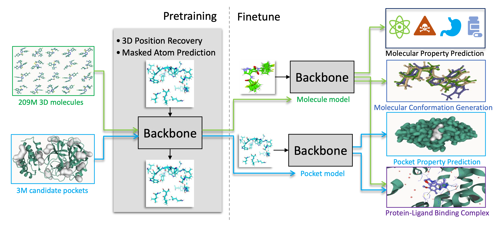

Uni-Mol [@zhou2023unimol] is a 3D foundation model for molecules and protein pockets. Its input is a set of atoms with coordinates, and the geometry enters the transformer through the matrix of interatomic distances, encoded by a Gaussian basis whose scale and offset depend on the type of the atom pair. This post calls that encoding GBFPT.

Pretraining Uni-Mol on a small set of protein pockets shows that the parameters of the Gaussian layer receive gradients of the order of one thousand. Uni-Mol trains on top of [Uni-Core](https://github.com/dptech-corp/Uni-Core), which clips gradients, so training does not diverge; but clipping rescales the whole update, so a single unstable layer distorts the direction taken by every other parameter. That is the motivation for looking at an encoding that does not need the protection.

The alternative studied here discretizes distances into bins and looks up an embedding, in the spirit of the binned distances AlphaFold feeds back into its pair representation [@Jumper2021]. Combined with an embedding of the atom-pair type, it is called DCEPT below. The two halves of the comparison disagree. DCEPT trains without large gradients and reaches slightly better pretraining losses, but the pocket embeddings it produces are worse for retrieval than the ones GBFPT produces. The retrieval evidence rests on a handful of pockets and is discussed with that caveat in @sec-downstream-performance.

A note on names, because three of them designate the same thing. The Uni-Mol paper calls this encoding *Gaussian kernel with pair type*, GKPT; the Uni-Mol code calls the module `gbf`, for Gaussian basis function; this post writes GBFPT throughout. The paper also benchmarks a *discretization categorical embedding*, DCE, which has no notion of pair type. DCEPT is the extension implemented here, which adds one.

# Uni-Mol and distance encoding {#sec-uni-mol-intro}

The code for Uni-Mol is available at <https://github.com/dptech-corp/Uni-Mol>. In brief, Uni-Mol consists of two models sharing what the paper describes as an SE(3) transformer architecture: one pretrained on 209M molecular conformations, the other on 3M candidate protein pockets. Both take 3D positions as input and predict 3D positions as output. Pretraining asks the model to recover masked atom types, and to recover the coordinates and distances of atoms whose positions have been perturbed, which is what forces the representation to carry the geometry. @fig-overview-unimol gives the framework and @fig-pretraining-architecture the pretraining architecture, both reproduced from [@zhou2023unimol].

[{#fig-overview-unimol
fig-alt="Schematic illustration of the Uni-Mol framework"}](https://github.com/dptech-corp/Uni-Mol)

[{#fig-pretraining-architecture
fig-alt="Left: the overall pretraining architecture. Middle: the model inputs, including atom representation and pair representation. Right: details in the model block."}](https://github.com/dptech-corp/Uni-Mol)

Two places in that architecture matter here: the encoding of coordinates into a pair representation, in the middle panel of @fig-pretraining-architecture, and the head that predicts distances back, on the left. Everything in this post changes one or both.

## The encodings benchmarked in the paper {#sec-3d-encodings}

Appendix D.1 of [@zhou2023unimol] compares six ways of encoding 3D positions during molecular pretraining. Summarizing that section:

-   **GK**, a Gaussian kernel applied directly to the pair distances.

-   **GKPT** [@shuaibi2021rotation], the same kernel preceded by an affine transformation of the distance whose slope and intercept are indexed by the pair type.

-   **RBB** [@NEURIPS2021_82489c97], a radial basis built from Bessel functions.

-   **DCE**, which bins the continuous distances and encodes each bin with a learned embedding.

-   **DC** [@9710703], which uses the coordinate differences directly as a pairwise relative positional encoding, following Point Transformer.

-   **GKPTLG**, GKPT restricted to a locally connected graph with a 6 Å cutoff radius.

@fig-val-loss-3D reports the validation loss of each variant during pretraining. The paper reads four conclusions from it: DCE and GK perform about equally and both beat RBB and DC, which is why GK is taken as the basic encoding; GKPT converges faster than GK, so the pair type matters; GKPTLG converges more slowly than GKPT, so the fully connected attention of the transformer is preferable to a distance cutoff; and GKPT, being best overall, is the encoding used in the released models.

The point worth retaining for what follows is that DCE and GK were within noise of each other in that benchmark. What made GKPT the winner was the pair type, not the Gaussian.

[{#fig-val-loss-3D
fig-alt="Validation loss in pretraining for different 3D spatial encodings"}](https://github.com/dptech-corp/Uni-Mol)

## GBFPT in the Uni-Mol code {#sec-gbfpt-code}

The [implementation](https://github.com/dptech-corp/Uni-Mol/blob/37c6ddc4a3f263b8885cd3fba2faebb5d0bef9f7/unimol/unimol/models/unimol.py#L396) is short:

``` python
import torch
import torch.nn as nn

@torch.jit.script
def gaussian(x, mean, std):
    pi = 3.14159
    a = (2 * pi) ** 0.5
    return torch.exp(-0.5 * (((x - mean) / std) ** 2)) / (a * std)


class GaussianLayer(nn.Module):
    def __init__(self, K=128, edge_types=1024):
        super().__init__()
        self.K = K
        self.means = nn.Embedding(1, K)
        self.stds = nn.Embedding(1, K)
        self.mul = nn.Embedding(edge_types, 1)
        self.bias = nn.Embedding(edge_types, 1)
        nn.init.uniform_(self.means.weight, 0, 3)
        nn.init.uniform_(self.stds.weight, 0, 3)
        nn.init.constant_(self.bias.weight, 0)
        nn.init.constant_(self.mul.weight, 1)

    def forward(self, x, edge_type):
        mul = self.mul(edge_type).type_as(x)
        bias = self.bias(edge_type).type_as(x)
        x = mul * x.unsqueeze(-1) + bias
        x = x.expand(-1, -1, -1, self.K)
        mean = self.means.weight.float().view(-1)
        std = self.stds.weight.float().view(-1).abs() + 1e-5
        return gaussian(x.float(), mean, std).type_as(self.means.weight)
```

`K` is the number of Gaussian basis functions, `edge_types` the number of atom-pair types, `x` the distance matrix and `edge_type` the matrix of pair types. Edge types are the ordered pairs of atom types, C–C, C–O, C–N and so on; the model builds them as `len(dictionary) * len(dictionary)`, which is where the default of 1024 comes from. Each pair type owns a scalar slope `mul` and intercept `bias`, applied to the distance before the shared bank of `K` Gaussians reads it. This is the affine transformation that distinguishes GKPT from GK.

The layer returns `K` features per atom pair, not an attention bias. Uni-Mol projects them separately:

``` python
K = 128
n_edge_type = len(dictionary) * len(dictionary)
self.gbf_proj = NonLinearHead(
    K, args.encoder_attention_heads, args.activation_fn
)
self.gbf = GaussianLayer(K, n_edge_type)
```

with `NonLinearHead` a two-layer perceptron, and the result permuted into one bias matrix per attention head. Keeping the projection in view matters for the comparison below, since the DCEPT module includes its own.

# Experimental setup {#sec-experimental-setup}

::: callout-note
All the Uni-Mol experiments reported here run on a small pocket dataset derived from the PDBbind database (<http://www.pdbbind.org.cn/>), a collection of protein-ligand complexes with their binding affinities, split into training and validation sets by pocket similarity. The wandb project is available at <https://wandb.ai/nicolasb/unimol_analysis/>, together with a summary report at <https://api.wandb.ai/links/nicolasb/kdz59bry>.
:::

# A discretized alternative {#sec-dcept}

## Why the Gaussian layer receives large gradients {#sec-gbfpt-gradients}

@fig-gbf-gradients shows gradients on the `GaussianLayer` parameters reaching the order of one thousand during pretraining on the pocket dataset.

{#fig-gbf-gradients
fig-alt="Gradients of GaussianLayer parameters (GBFPT encoding)"}

The mechanism is visible in the listing above. The layer evaluates a normal density, so `std` appears both in the normalization $1/(\sqrt{2\pi}\,\sigma)$ and squared in the exponent, and the derivative with respect to it grows without bound as it approaches zero. The widths are initialized with `nn.init.uniform_(self.stds.weight, 0, 3)`, which draws some of the `K` basis functions arbitrarily close to zero width, and the only guard is the `+ 1e-5` floor added in `forward`. A narrow basis function is thus a legitimate state of the layer, and one in which its gradients are very large. The same holds for the pair-type slope `mul`, which enters the exponent multiplied by the distance.

None of this makes GBFPT unusable, and Uni-Core's gradient clipping is enough to keep pretraining well behaved. It does mean the norm of the update is set by one layer of a few hundred parameters rather than by the model as a whole.

## Implementation {#sec-dcept-implementation}

DCEPT replaces the Gaussian basis with a lookup. Distances are binned into a *distogram*, a discrete version of the distance matrix, and each bin index is mapped to a learned vector; a second table embeds the pair type; the two are concatenated and projected to one bias per attention head.

``` python
import torch
import torch.nn as nn

# Constants
PAD_DIST = 0

class NonLinearModule(nn.Module):
    def __init__(self, input_dim, out_dim, activation_fn):
        super().__init__()
        self.linear = nn.Linear(input_dim, out_dim)
        self.activation = getattr(nn, activation_fn)()

    def forward(self, x):
        return self.activation(self.linear(x))

class DistEncoding(nn.Module):
    def __init__(
        self,
        distogram_nb_bins: int,
        nb_edge_types: int,
        embedding_dim: int,
        edge_type_padding_idx: int,
        encoder_attention_heads: int,
        activation_fn: str,
    ):
        """
        Initializes the DistEncoding module for encoding distances and edge types.

        Args:
            distogram_nb_bins: Number of bins for the distogram (distance discretization).
            nb_edge_types: Number of possible edge types (e.g., different bond types).
            embedding_dim: Dimension of the embeddings for distances and edge types.
            edge_type_padding_idx: Padding index for edge type embeddings.
            encoder_attention_heads: Number of attention heads in the Transformer encoder.
            activation_fn: Activation function to use in the projection layer.
        """
        super(DistEncoding, self).__init__()

        # Embedding layer for the distogram (discretized distances)
        self.dist_embedding = nn.Embedding(
            num_embeddings=distogram_nb_bins,
            embedding_dim=embedding_dim,
            padding_idx=PAD_DIST,  # Use PAD_DIST for padding
        )

        # Embedding layer for edge types
        self.edge_type_embedding = nn.Embedding(
            num_embeddings=nb_edge_types,
            embedding_dim=embedding_dim,
            padding_idx=edge_type_padding_idx,
        )

        # Projection layer to combine distance and edge type embeddings and project
        # to the correct dimension for attention bias.
        self.projection = NonLinearModule(
            input_dim=2 * embedding_dim,  # Concatenate dist and edge embeddings
            out_dim=encoder_attention_heads,  # Output dimension matches attention heads
            activation_fn=activation_fn,
        )

    def forward(
        self, distogram: torch.Tensor, edge_types: torch.Tensor
    ) -> torch.Tensor:
        """
        Forward pass of the DistEncoding module.

        Args:
            distogram: Tensor of discretized distances (batch_size, seq_len, seq_len).
            edge_types: Tensor of edge types (batch_size, seq_len, seq_len).

        Returns:
            attn_bias: Tensor of attention biases (batch_size, num_heads, seq_len, seq_len).
        """
        n_node = distogram.size(-1)  # Sequence length (number of nodes/atoms)

        # Embed the discretized distances
        dist_embeddings = self.dist_embedding(distogram)  # (B, L, L, D)

        # Embed the edge types
        edge_types_embeddings = self.edge_type_embedding(edge_types)  # (B, L, L, D)

        # Concatenate distance and edge type embeddings
        embeddings = torch.cat((dist_embeddings, edge_types_embeddings), dim=-1)  # (B, L, L, 2D)

        # Project the combined embeddings to generate attention bias
        attn_bias = self.projection(embeddings)  # (B, L, L, H) where H = num_heads

        # Reshape the attention bias to the correct format for the Transformer
        attn_bias = attn_bias.permute(0, 3, 1, 2).contiguous()  # (B, H, L, L)
        attn_bias = attn_bias.view(-1, n_node, n_node)  # (B*H, L, L), one bias matrix per head
        return attn_bias
```

Both `distogram_nb_bins` and `embedding_dim` default to 128, so the module sees as many bins as GBFPT has basis functions. `encoder_attention_heads` appears because the encoding is injected directly into the attention matrix, which is also why `DistEncoding` ends with its own projection where `GaussianLayer` relies on the external `gbf_proj`; the projection here is a single linear layer followed by an activation, shallower than Uni-Mol's two-layer head.

One detail of the listing is worth flagging: `padding_idx=PAD_DIST` with `PAD_DIST = 0` makes bin 0 a frozen zero vector, and the diagonal of the distance matrix, where the distance is exactly zero, falls in that bin. Self-distances are therefore encoded as padding rather than as a distance, which is harmless as long as the first bin is reserved for them and no real pair distance is small enough to reach it.

## Training dynamics {#sec-training-dynamics}

The gradients on the `DistEncoding` parameters stay small throughout training, without clipping, as @fig-dcept-gradients shows. The comparison with @fig-gbf-gradients should not be read too literally: the two figures track parameters of different kinds, embedding tables on one side, the widths and offsets of a density on the other, and there is no reason for their gradient magnitudes to be on the same scale a priori. What the figures do show is that only one of the two encodings has a mechanism that drives its gradients to large values, and it is the Gaussian one.

{#fig-dcept-gradients
fig-alt="Gradients of DistEncoding parameters (DCEPT encoding)"}

Following the distogram prediction of [@Jumper2021], the DCEPT runs also replace Uni-Mol's distance prediction head, trained with a mean squared error, by a distogram prediction head trained with a cross entropy. This substitution on the decoding side turned out not to change the behavior of Uni-Mol, in these runs or in several others not shown here.

@fig-gbfpt-dcept-losses-curves compares the pretraining curves of the two encodings on the pocket dataset. The two runs do not optimize the same objective, which limits what the comparison can say. DCEPT carries an extra `masked_distogram_loss`, the cross entropy on binned distances, and keeps the original distance head only with a multiplicative factor of 0.01, so that the model retains some ability to predict distances directly. Total losses are therefore not comparable across the runs, and the slower decrease of `masked_dist_loss` under DCEPT is a consequence of that 0.01 factor rather than a property of the encoding.

The terms that are comparable point mildly in favor of DCEPT. The `masked_coord_loss` is lower in both training and validation. The `masked_token_loss` and `masked_acc`, which measure the recovery of masked atom types, stagnate at first before catching up, plausibly because the distance embeddings start as random vectors carrying no ordering between neighboring bins, whereas the Gaussian basis is a smooth function of the distance from the first step.

Taken together with the gradients, pretraining favors DCEPT, or at least does not favor GBFPT.

{#fig-gbfpt-dcept-losses-curves
fig-alt="Uni-Mol training and validation losses with GBFPT and DCEPT encoding"}

# Downstream performance: pocket retrieval {#sec-downstream-performance}

Uni-Mol is a foundation model pretrained without labels, and its pretraining metrics are not what it is used for. What is expected of it is that the pocket embeddings behave as proxies for the pockets: two similar pockets should have embeddings close in cosine similarity or Euclidean distance.

The retrieval test uses five reference pockets, taken from the `2oax`, `3oxc`, `5kxi`, `5zk3` and `6v7a` proteins, each with a group of similar and a group of dissimilar pockets. Candidates are ranked by cosine similarity to the reference, and the score is the precision at 100: the fraction of the top 100 ranked pockets that belong to the similar group. Two embeddings are compared, the vector of the `[CLS]` token, as defined in Section 2.2 of [@zhou2023unimol], and the mean of the atom vectors of the pocket.

| Encoding and embedding | 6v7a | 2oax | 5kxi | 5zk3 | 3oxc |
|------------------------|------|------|------|------|------|
| GBFPT, `[CLS]`         | 0.46 | 1.00 | 0.32 | 0.30 | 1.00 |
| GBFPT, mean            | 0.79 | 1.00 | 0.38 | 0.29 | 1.00 |
| DCEPT, `[CLS]`         | 0.30 | 1.00 | 0.26 | 0.29 | 1.00 |
| DCEPT, mean            | 0.51 | 1.00 | 0.27 | 0.28 | 1.00 |

: Precision at 100 for pocket retrieval with GBFPT or DCEPT encoding (higher is better)
{#tbl-pockets-retrieval}

@tbl-pockets-retrieval favors GBFPT, but only two of the five references carry the comparison. On `2oax` and `3oxc` every variant scores 1.00, which says that the task is saturated there rather than that the embeddings are perfect: a perfect score at 100 may simply mean that too few dissimilar candidates were available to be confused with. On `5zk3` the four scores span 0.28 to 0.30, which is a tie. The gap is real on `6v7a`, where the mean embedding goes from 0.51 to 0.79, and smaller but consistent on `5kxi`. On the evidence of two pockets, GBFPT retrieves better than DCEPT. The choice of embedding is clearer: the mean of the atom vectors beats the `[CLS]` token on both discriminating references and for both encodings, and is within 0.01 of it everywhere else.

So the ordering reverses between pretraining and use: the encoding with the better losses and the tamer gradients produces the weaker embeddings.

## Sensitivity of the encodings to coordinate noise {#sec-noise-sensitivity}

One candidate explanation is discretization itself. Two nearby pockets have nearby distance matrices, and a binned representation can place two nearby distances on either side of a bin boundary, turning a small geometric difference into two unrelated embedding vectors, where the Gaussian basis varies smoothly.

The following experiment measures that sensitivity directly. The `6v7a` pocket is taken as reference and its coordinates are perturbed with uniform noise on $[0, 1]$ Å, drawn independently per coordinate, which displaces every atom rather than jittering it symmetrically. With a batch size of 16, one batch is filled with the reference pocket and 15 noisy copies. Each distance matrix is encoded by GBFPT or DCEPT, giving a 128-dimensional vector per pair, and each vector is compared by cosine similarity to the corresponding vector of the reference. @tbl-statistics-cos-similarities-6v7a reports the distance to a perfect match, $1 - \cos$, aggregated over all pairs and all noisy copies; a small value means the encoding barely moved.

| Encoding | mean  | median |
|----------|-------|--------|
| GBFPT    | 0.002 | 0.000  |
| DCEPT    | 0.020 | 0.007  |

: Statistics of $1 - \cos$ between the encodings of the noisy pockets and the encoding of the reference `6v7a` pocket (lower is better)
{#tbl-statistics-cos-similarities-6v7a}

DCEPT moves about ten times more than GBFPT under the same perturbation, in a regime where both remain close to the reference in absolute terms.

Two qualifications keep this from being an explanation of the retrieval results. The first is that the outcome is close to being built into the two constructions: a bank of Gaussians is a continuous function of the distance, a table lookup is piecewise constant with jumps at the bin edges, so the second must respond more abruptly. The second is that this experiment measures the input encoding, whereas retrieval compares embeddings produced by the whole transformer, which has been trained to be useful downstream of whichever encoding it was given. The measurement is consistent with the retrieval gap; it does not establish that it causes it.

# Conclusion {#sec-conclusion}

On this pocket dataset, the discretized encoding wins the part of the comparison that is easy to measure and loses the part that matters. Its gradients need no clipping, its coordinate loss is lower, and the fault of GBFPT it was designed to avoid is real and identifiable in the code, a normal density whose derivative diverges as its width goes to zero. But the pocket embeddings it produces retrieve less well, on the two of five reference pockets that discriminate at all, and it responds more sharply to a perturbation of the coordinates than the Gaussian basis does.

The natural next step is on the GBFPT side rather than the DCEPT one: constraining the widths of the Gaussian basis away from zero, through a softplus or a floor larger than `1e-5`, would remove the instability without giving up the smooth response to distance that appears to be what the retrieval task rewards. Two limits of the evidence are worth stating: the dataset is small and custom-built, and the retrieval benchmark has five references, of which two are saturated and one is a tie. Nothing here should be read as a general statement about distance encodings, only as a case where better pretraining behavior did not transfer.
