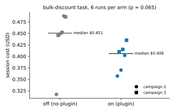

In August 2026 Spotify published `shunt`, a [Claude Code plugin](https://github.com/spotify/portal-ai-plugins/tree/e14bdb1/plugins/shunt) that stops the main model from reading large files and hands them to a cheaper worker model instead. Its README reports "82-94% of tokens" saved on large file reads, and the figure travelled fast: several write-ups turned it into "cutting Claude Code token usage by 90%".

I rebuilt it as [haiku-shunt](https://github.com/nbrosse/haiku-shunt), with a Haiku subagent as the worker, and measured what it saves on a bill. So far: the median cost fell by about 10%, on too few runs to tell an effect from noise, and not for the reason the design assumes. In six runs with the plugin, the model never once delegated to Haiku.

This post is about the gap between the token count and the bill, and what it teaches about evaluating agents.

# The idea {#sec-idea}

A coding agent works in turns: on every turn, the whole conversation so far (system prompt, tool results, the model's own messages) is sent to the model again. A 30,000-token file read on turn 3 of a 40-turn session is therefore not paid once: it rides along on the 37 turns that follow.

The shunt cuts that at the source. A `PreToolUse` hook inspects each `Read`, and each `cat`, `head` or `less` in a shell command. When the file is large, the hook denies the call and tells the model to ask a worker instead. The worker reads the file in its own context and returns a short answer of a few hundred tokens. The file never enters the expensive context, so it is never re-sent.

Spotify's worker runs on their internal AI platform; mine is a Claude Code subagent pinned to Haiku 4.5, which needs no service or API key. Everything else follows Spotify's design.

# What a token count leaves out {#sec-metric}

Spotify's benchmark compares, for one read, the tokens that enter the main context without the shunt (the file) and with it (the worker's answer): 75,990 against 4,148 on a 7,408-line pair of source and test files. It is correct, but it answers a narrower question than "how much cheaper is my session", for three reasons.

**Caching.** Claude Code caches the conversation prefix. A file that stays in context is written to the cache once, at twice the input price, and later turns read it back at a fraction of that price: 10% for most models, 5% for Opus 5.5. The re-sends that make the idea attractive are the cheapest tokens in the session.

**The worker is not free.** A subagent starts with its own system prompt, about 14,600 tokens, written to its cache before it reads anything. That fixed cost is paid on every delegation, on a cheaper model, but paid.

**The counterfactual is unobservable.** A token count assumes that without the shunt the model would have read the whole file, and that with it the model would have delegated. It may do neither.

The first two reasons can be priced. Take a 747-line file, about 4,500 tokens, read on turn 1 of an 18-turn Opus 5.5 session (input at $4 per million tokens). Keeping it out of the main context avoids one cache write and 17 re-sends:

```
cache write   4,500 × $8.00/M (2× input)               ≈ $0.036
re-sends      4,500 × $0.20/M (0.05× input) × 17 turns ≈ $0.015
                                                  total ≈ $0.05
```

That assumes every re-send is a cache hit. A miss costs a new cache write, 2× input instead of 0.05×, so misses raise the figure quickly: with 10% of re-sends missing, the total is about $0.11.

So keeping this file out saves 5 to 11 cents, in a session that costs about $0.40. From that come the worker's fixed cost, about $0.02 of Haiku, and the windows the parent still has to read before it can edit the file. Below some file size, delegating loses money: about 1,100 tokens for an Opus 5.5 parent, 2,100 for Sonnet 5. @sec-appendix-cost gives the general formula and the break-even.

A formula is an argument, not a measurement. The only way to know what the plugin saves is to run the same task with and without it and compare the bills.

# The protocol {#sec-protocol}

The benchmark script, [`bench/ab.sh`](https://github.com/nbrosse/haiku-shunt/blob/main/bench/ab.sh), runs one non-interactive Claude Code session per arm and repetition, and takes the cost Claude Code itself reports (`total_cost_usd`), subagents included. A hand-rolled price table would get cache writes wrong, and leaving out the worker would make the plugin look free. Three other choices:

- **The control loads no plugin at all**, rather than the plugin with its hooks disabled, so the plugin's agents cannot influence the control arm.
- **Arms are interleaved and their order rotates every repetition**, because cache warmth and service load drift during a campaign.
- **Every run is checked.** A cheaper run that did not do the work is not a saving.

The task has to be shaped like the hypothesis: long, multi-turn, with large files read early, so that there are turns left for re-sends. `bulk-discount` builds a throwaway pricing package of about 2,300 lines in three modules, all above the shunt's 350-line threshold, and asks for a feature that touches all three: a bulk discount in the pricing engine, its tests, and a new field in the report. The check runs the package's tests plus a hidden test that compares the new pricing with a pristine copy of the original rules.

The parent was Opus 5.5, in Claude Code 2.1.281. I ran two campaigns of three repetitions per arm. Between them I changed the denial message so that it names the exact subagent call to make, so the plugin arm is not quite the same treatment in both, and pooling them below is exploratory.

# Results {#sec-results}

| Campaign | Arm | Cost of each run | Turns | Checks passed | Reads denied | Calls to Haiku |
|---|---|---|---|---|---|---|
| 1 | without plugin | $0.317, $0.449, $0.488 | 18 | 3/3 | — | — |
| 1 | with plugin | $0.357, $0.370, $0.402 | 18 | 3/3 | 1, 2, 1 | 0 |
| 2 | without plugin | $0.446†, $0.452, $0.486 | 14 | 2/3 | — | — |
| 2 | with plugin | $0.410, $0.415, $0.435 | 17 | 3/3 | 1, 0, 1 | 0 |
| pooled | without plugin | median $0.451 | | 5/6 | | |
| pooled | with plugin | median $0.406 (−10%) | | 6/6 | 6 in total | 0 |

: The bulk-discount A/B. *Cost*: per session, as reported by Claude Code, worker included; † marks the run that failed the check. *Turns*: median number of turns Claude Code reports for the session (`num_turns`). *Checks passed*: runs whose tests and hidden check passed. *Reads denied*: file reads the plugin's hook blocked, per run. *Calls to Haiku*: delegations to the worker subagent. The control arm has no plugin, so it can neither be denied nor delegate (—). {#tbl-ab}

**Is −10% real?** Not established. Runs of the same arm vary by about 11% in cost, as much as the gap between the arms. A standard test for small samples says that a gap like this one would appear about once in fifteen campaigns even if the plugin did nothing ($p \approx 0.07$): suggestive, not conclusive. To detect a 10% effect reliably at this level of noise would take about twenty runs per arm, not six. @sec-appendix-test and @sec-appendix-power explain both numbers.

The one failed run, an expensive control, stays in the comparison: dropping it would mean choosing which runs count after seeing them. One failure in twelve runs says nothing about success rates either.

**Where any saving comes from.** Not from Haiku: in the six runs with the plugin, the model never delegated. The hook did fire, six denials in six runs, and after each one the model took another option from the denial message: a `grep`, then `sed -n` or a windowed `Read` on the lines it needed. The message is a menu of three options, and the second says a window of at most 350 lines is always allowed, "and you need one anyway before editing". On a task whose point is to edit the files, that option dominates delegation. The mechanism itself works: in a separate smoke run the model delegated as instructed and Haiku answered correctly.

If there is an effect, it comes from the plugin's presence: the denials, and the subagent descriptions loaded into every session, which tell the model not to read big files directly. Both push towards targeted reads. The two are hard to separate here, but there is a hint for the descriptions. In campaign 2 every plugin run began by sizing the files (`xargs wc -l`), before any denial, while every control run began by dumping the whole package. And one plugin run was never denied at all, yet cost less than every control run of its campaign.

One limit of the task: the package is generated, with a long catalog and many similar functions. Such files can be understood from a few targeted reads, so the task tests behaviour on large files more than a genuine need to grasp a whole file, which is where a worker would earn its keep.

# What this says about evaluating agents {#sec-lessons}

**Choose the metric that matches the decision.** Tokens kept out of the main context are easy to count and are what the design optimises, which is why they flatter it. Whether to install the plugin depends on the cost of a finished task, worker included, at real cache prices, alongside latency and quality. Spotify's economics may also differ from mine: their worker runs on their own platform, at a price I do not know, and the plugin may serve other goals, such as keeping data on internal infrastructure.

**Size the experiment before running it.** Runs of the same agent on the same task vary by about 11% in cost here, so a 10% effect needs about twenty runs per arm, not six. Without that computation, a −10% median becomes a headline or gets dismissed, when the honest reading is "not enough data".

**Measure behaviour, not only the mechanism.** Every component worked in isolation, and on a real task the model routed around the one that mattered. A hook changes what the model sees; the model decides what to do with it.

**Know what cannot be enforced.** The control runs opened the package with commands like `cat inv/*.py` or `git ls-files | xargs tail -n +1`. Globs, loops and `xargs` hide the file names from the hook, and a hook strict enough to catch them would block ordinary shell work. Much of the plugin's code chases these leaks, to protect a saving this experiment could not establish.

# Recommendation

The cheapest thing to try is no plugin at all: a line in `CLAUDE.md` asking the model to use `grep` and windowed reads on large files. If the plugin's effect really is steering, that line may capture most of it. I have not measured it; it is the third arm of the next A/B. If you work daily with very large files (logs, generated JSON, ten thousand lines and more), the saving per read is larger, and a minimal version is worth having: the `Read` hook with a high threshold and the worker, without the shell parsing.

The code, the benchmark and the cost model are on GitHub at [haiku-shunt](https://github.com/nbrosse/haiku-shunt).

# Appendix: the numbers behind the post {#sec-appendix}

## The cost model {#sec-appendix-cost}

Prices are written as multiples of the parent's input price $P_\text{in}$, in dollars per million tokens. Two of them matter: $w$, the price of writing to the cache, and $r$, the price of reading from it. Claude Code's main session uses the one-hour cache, so $w = 2$; its subagents use the five-minute cache, at 1.25. The read price $r$ is 0.10 for most models and 0.05 for Opus 5.5.

A file of $T$ tokens that enters the parent's context is written to the cache once, then sent again on each of the $R$ turns that follow. Each re-send is either a cache hit, paid $r$, or a miss, which Claude Code turns into a new cache write, paid $w$. With a hit rate $h$, one re-send costs on average

$$
\mu = r\,h + w\,(1-h),
$$

and keeping the file out of the parent avoids

$$
C_\text{avoided} = \frac{T \, P_\text{in} \, (w + \mu R)}{10^6}.
$$

The worked example in @sec-metric is this formula with $T = 4{,}500$, $P_\text{in} = 4$, $w = 2$, $r = 0.05$, $R = 17$. With $h = 1$, $\mu = r = 0.05$ and $C_\text{avoided} \approx \$0.05$; with $h = 0.9$, $\mu = 0.245$ and $C_\text{avoided} \approx \$0.11$. Misses weigh heavily because a miss costs 40 times a hit.

The worker has its own cost. Before it reads anything it writes its system prompt, $F \approx 14{,}600$ tokens, to its cache at $w_H = 1.25$ times Haiku's input price $H_\text{in} = \$1$; then it writes the file the same way, and answers in about $A = 500$ tokens at Haiku's output price $H_\text{out} = \$5$:

$$
C_\text{worker} = \frac{(F + T)\, w_H H_\text{in} + A\, H_\text{out}}{10^6}.
$$

The fixed part, $(F\,w_H H_\text{in} + A\,H_\text{out})/10^6$, is the $0.02 per delegation quoted above. Delegation pays when $C_\text{avoided} > C_\text{worker}$, that is for files larger than

$$
T^* = \frac{F\, w_H H_\text{in} + A\, H_\text{out}}{P_\text{in}\,(w + \mu R) - w_H H_\text{in}}.
$$

With $R = 12$ and $h = 0.9$, this gives about 1,100 tokens for Opus 5.5 ($P_\text{in} = 4$, $r = 0.05$) and 2,100 for Sonnet 5 ($P_\text{in} = 2$, $r = 0.10$). `haiku-shunt doctor` prints these values.

The model covers input cost only, everything else held fixed. A parent that sees less may also write, call tools and make mistakes differently. The break-even also leaves out the worker's answer, which in turn rides in the parent's context on later turns, so it is slightly optimistic.

## Is −10% distinguishable from noise? {#sec-appendix-test}

{#fig-ab}

The question a test answers is: if the plugin had no effect at all, how surprising would these twelve costs be? Without an effect, the labels "with plugin" and "without plugin" carry no information. The cost of a run would be the same whichever arm it ran in, and any split of the twelve costs into two groups of six would have been as likely as the one observed. There are $\binom{12}{6} = 924$ such splits.

To measure how lopsided a split is, pair each run of one group with each run of the other, 36 pairs, and count the pairs in which the "with plugin" run is cheaper. Call that count $U$. It ranges from 0 to 36, and an arm with no effect gives about 18. In the actual data $U = 30$: only the $0.317 control run beats any plugin run (@fig-ab).

Going through all 924 splits, 30 give $U \geq 30$, and by symmetry 30 give $U \leq 6$, a gap as large in the other direction. So $60 / 924 \approx 0.065$ of the splits are at least as lopsided as the data. That fraction is the $p$-value of the exact two-sided Mann–Whitney test. It is not the probability that the plugin has no effect. It is the probability of data this lopsided *if* it had none. The usual convention calls a result significant below 0.05; 0.065 is close, on a handful of runs.

The test uses only the order of the costs, not their values. With six runs per arm that is a strength: it makes no assumption about the shape of the noise, and the $0.317 run counts as "the cheapest", however far below the others it is.

Pooling the two campaigns mixes two versions of the plugin. The same test can be run within each campaign: there are $\binom{6}{3} = 20$ splits per campaign, so $20 \times 20 = 400$ combinations, and the statistic is the sum of the two $U$s, from 0 to 18. The data give $6 + 9 = 15$: three runs out of nine pairs reversed in campaign 1, none in campaign 2. A sum at least as far from 9 occurs in 36 of the 400 combinations, so $p = 0.09$. Respecting the change of treatment makes the evidence slightly weaker, not stronger.

## How many runs would be needed {#sec-appendix-power}

Before running a campaign, one can ask how many runs it takes to detect an effect of a given size. The answer depends on two numbers: the effect $\delta$ one hopes to see, here 10% of the control cost, and the noise $\sigma$, the standard deviation of the cost between runs of the same arm.

**The noise.** In the data, $\sigma$ is 14% of the control mean without the plugin and 7% with it; combined, $\sqrt{(14^2 + 7^2)/2} \approx 11\%$. Twelve runs give only a rough estimate: without the $0.317 run, the control spread would be much smaller.

**The formula.** Compare the mean cost of $n$ runs per arm. Each mean has a standard deviation of $\sigma / \sqrt{n}$, so their difference has a standard deviation of $\sigma \sqrt{2/n}$. A test at the 5% level declares an effect when the observed difference exceeds $1.96$ of these standard deviations. For a true effect $\delta$ to be declared at least 80% of the time, $\delta$ must sit another $0.84$ standard deviations above that threshold, since 80% of a normal distribution lies above $-0.84$. Hence

$$
\delta = (1.96 + 0.84)\,\sigma\sqrt{2/n}
\quad\Longrightarrow\quad
n = 2\,(1.96 + 0.84)^2 \left(\frac{\sigma}{\delta}\right)^2 \approx 15.7 \left(\frac{\sigma}{\delta}\right)^2 .
$$

**The numbers.** With $\sigma / \delta = 11\% / 10\%$, $n \approx 15.7 \times 1.21 \approx 20$ runs per arm. Read the other way, six runs per arm detect reliably only an effect of $2.80 \times 11\% \times \sqrt{2/6} \approx 18\%$. A 10% effect may still show up in six runs, as it may have here, but more often it would not. The estimate is sensitive to the noise: with $\sigma = 14\%$, the control arm's value, it becomes about 31 runs per arm.

The formula assumes normally distributed costs and a comparison of means. The rank test above is slightly less efficient when the noise is normal, by about 5%, so it needs a run or two more. That is an order of magnitude, which is all a plan needs.
