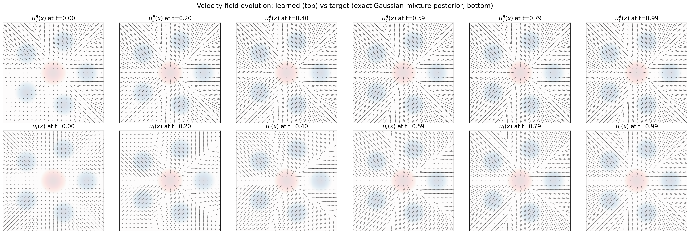
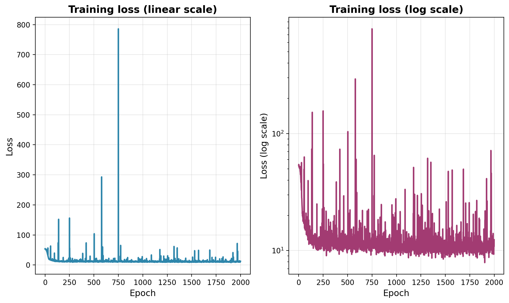
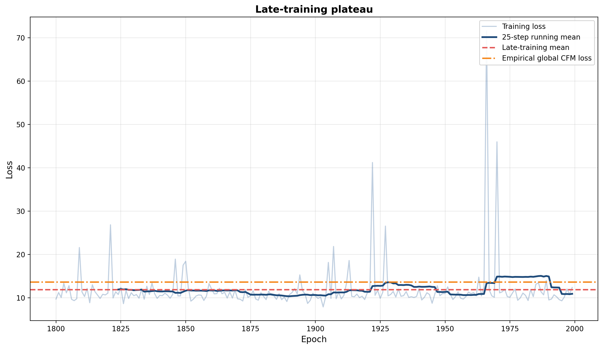
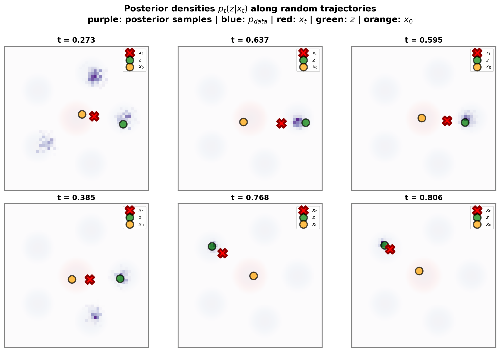

This post follows and extends the perspective of [@holderrieth_introduction_2025; @lipman_flow_2024], and builds on the lab code of the accompanying course [@flowsanddiffusions2026], whose flow-matching setup is the starting point for the experiment below.

The central object in flow matching is the **marginal velocity field**. Conditional flow matching supplies a convenient training target, but the vector field the model should learn is not the conditional target itself. It is a posterior average of conditional targets, and the difference between the two is what the training loss cannot remove.

The aim here is to make that statement concrete in an example small enough to compute exactly. The data distribution is a five-component Gaussian mixture in dimension two, the source distribution is standard Gaussian, and the conditional probability path is Gaussian,
$$
X_t = \alpha_t Z + \beta_t \varepsilon,
\qquad
Z \sim p_{\mathrm{data}},
\qquad
\varepsilon \sim \mathcal{N}(0,I_d).
$$
The setting is simple enough to visualize, and still rich enough to show the main difficulty: at intermediate times, the posterior distribution of the endpoint $Z$ given the current state $X_t=x$ is genuinely multimodal.

@sec-setup fixes notation and derives the posterior-averaging identity from the continuity equation. @sec-gaussian-paths specializes it to Gaussian probability paths, where the marginal velocity reduces to a posterior mean and therefore carries exactly the same information as the marginal score. @sec-exact-posterior gives the posterior in closed form for a Gaussian-mixture data distribution. @sec-irreducible-variance identifies the gap between the conditional and marginal losses as a posterior-variance term $V(t)$, computes it for this example, and shows that the schedule used here makes its time average infinite. @sec-experiment checks all of this numerically, and @sec-appendix collects the importance-sampling and MCMC machinery needed when the posterior is not available in closed form.

A companion post, [Closed-form flow matching](../closed-form-flow-matching/closed-form-fm.html), pushes the same posterior reading in a different direction: it replaces $p_{\mathrm{data}}$ by the empirical distribution of a finite training set, where the posterior becomes a softmax over training examples that collapses onto a single one in high dimension.

The [accompanying code](https://github.com/nbrosse/flow-matching-notes) is on GitHub, and the experiment lives in a single [notebook](https://github.com/nbrosse/flow-matching-notes/blob/main/notebooks/posterior_averaging.ipynb).

# Setup and notation {#sec-setup}

We work in $\mathbb{R}^d$, with $d=2$ in the experiment. Let $Z\sim p_{\mathrm{data}}$ denote a data point, and let the source distribution be
$$
p_{\mathrm{simple}} = \mathcal{N}(0,I_d).
$$

A flow model is a time-dependent vector field $u_\theta(x,t)$ defining the ODE
$$
\frac{dY_t}{dt}=u_\theta(Y_t,t),
\qquad
Y_0\sim p_{\mathrm{simple}},
$$
and the goal is to learn $u_\theta$ so that the terminal law of the ODE is the data distribution, $Y_1 \sim p_{\mathrm{data}}$.

Flow matching constructs a probability path $(p_t)_{t\in[0,1]}$ connecting $p_{\mathrm{simple}}$ to $p_{\mathrm{data}}$. A convenient way to define such a path is through a conditional path $p_t(x\mid z)$ satisfying
$$
p_0(\cdot\mid z)=p_{\mathrm{simple}},
\qquad
p_1(\cdot\mid z)=\delta_z.
$$
If $Z\sim p_{\mathrm{data}}$ and $X_t\sim p_t(\cdot\mid Z)$, the marginal law of $X_t$ is
$$
p_t(x)=\int p_t(x\mid z)p_{\mathrm{data}}(z)\,dz,
$$
so that $p_0=p_{\mathrm{simple}}$ and $p_1=p_{\mathrm{data}}$ as required.

The conditional path comes with an explicit conditional velocity field $u_t(x\mid z)$, which transports $p_t(\cdot\mid z)$ for fixed $z$. The field that transports the marginal $p_t$, however, is not $u_t(x\mid z)$. It is
$$
u_t(x)
=
\mathbb{E}\left[u_t(x\mid Z)\mid X_t=x\right]
=
\int u_t(x\mid z)p_t(z\mid x)\,dz,
$$ {#eq-marginalization}
where
$$
p_t(z\mid x)
=
\frac{p_t(x\mid z)p_{\mathrm{data}}(z)}{p_t(x)}
$$
is the posterior distribution of the endpoint $Z$ given the intermediate state $X_t=x$.

@eq-marginalization is the marginalization trick of [@lipman_flow_2024], and it is worth seeing why it holds, since everything below rests on it. By construction the conditional field satisfies the continuity equation
$$
\partial_t p_t(x\mid z)+\nabla_x\cdot\left(p_t(x\mid z)u_t(x\mid z)\right)=0 .
$$
Integrating against $p_{\mathrm{data}}(z)\,dz$ and exchanging derivatives and integrals gives
$$
\partial_t p_t(x)
=
-\nabla_x\cdot\int u_t(x\mid z)p_t(x\mid z)p_{\mathrm{data}}(z)\,dz
=
-\nabla_x\cdot\left(p_t(x)\int u_t(x\mid z)p_t(z\mid x)\,dz\right),
$$
where the second equality is Bayes' rule, $p_t(x\mid z)p_{\mathrm{data}}(z)=p_t(x)p_t(z\mid x)$. So the posterior average, and not the conditional field, is the one satisfying the continuity equation for $p_t$.

This is the organizing principle of the post: flow matching learns a posterior average, and conditional flow matching provides noisy labels whose conditional expectation is that average.

# Gaussian probability paths {#sec-gaussian-paths}

Consider Gaussian conditional paths
$$
p_t(x\mid z)=\mathcal{N}(x;\alpha_t z,\beta_t^2 I_d),
$$
where $\alpha_t$ and $\beta_t$ are continuously differentiable schedules with
$$
\alpha_0=0,
\qquad
\alpha_1=1,
\qquad
\beta_0=1,
\qquad
\beta_1=0,
$$
and $\beta_t>0$ for $t<1$. Equivalently, for $t<1$,
$$
X_t=\alpha_t Z+\beta_t\varepsilon,
\qquad
\varepsilon\sim\mathcal{N}(0,I_d).
$$
At $t=1$ the density formula degenerates because $\beta_1=0$; the endpoint condition is understood in the weak sense, $p_1(\cdot\mid z)=\delta_z$.

The conditional velocity follows by differentiating the path at fixed $z$ and fixed noise, $\dot X_t=\dot\alpha_t z+\dot\beta_t\varepsilon$, and substituting $\varepsilon=(x-\alpha_t z)/\beta_t$:
$$
u_t(x\mid z)
=
\dot\alpha_t z+\frac{\dot\beta_t}{\beta_t}\left(x-\alpha_t z\right)
=
c_t z+b_t x,
\qquad
c_t
=
\dot\alpha_t-\frac{\dot\beta_t\alpha_t}{\beta_t},
\qquad
b_t
=
\frac{\dot\beta_t}{\beta_t}.
$$
Since the conditional field is affine in $z$, posterior averaging passes through it, and the marginal velocity is
$$
u_t(x)
=
c_t\,\mathbb{E}[Z\mid X_t=x]+b_tx.
$$ {#eq-marginal-velocity}

For Gaussian paths, then, computing the marginal velocity is exactly computing the posterior mean $\mathbb{E}[Z\mid X_t=x]$.

That same posterior mean also determines the marginal score. Fisher's identity gives
$$
\nabla_x\log p_t(x)
=
\mathbb{E}\left[\nabla_x\log p_t(x\mid Z)\mid X_t=x\right]
=
\frac{\alpha_t\mathbb{E}[Z\mid X_t=x]-x}{\beta_t^2},
$$
and rearranging yields Tweedie's formula: whenever $\alpha_t>0$,
$$
\mathbb{E}[Z\mid X_t=x]
=
\frac{x+\beta_t^2\nabla_x\log p_t(x)}{\alpha_t}.
$$
Velocity and score are therefore two encodings of one quantity, which is why flow matching and score-based modeling are interchangeable for these paths.

## The schedule used here

The experiment uses
$$
\alpha_t=t,
\qquad
\beta_t=\sqrt{1-t},
$$
so that $\dot\alpha_t=1$, $\dot\beta_t=-1/(2\sqrt{1-t})$, and
$$
b_t=-\frac{1}{2(1-t)},
\qquad
c_t=\frac{2-t}{2(1-t)},
\qquad
u_t(x\mid z)=\frac{(2-t)z-x}{2(1-t)}.
$$

This schedule is convenient to visualize, but it is singular at $t=1$. Evaluating the conditional target along the path itself, with $X_t=tZ+\sqrt{1-t}\,\varepsilon$, the two contributions in $Z$ combine into a single unit coefficient and
$$
u_t(X_t\mid Z)
=
Z-\frac{\varepsilon}{2\sqrt{1-t}} .
$$ {#eq-conditional-target-along-path}
The training label is thus the endpoint $Z$ corrupted by noise of standard deviation $(1-t)^{-1/2}/2$, which is unbounded as $t\to1$. The code samples times uniformly, `t = torch.rand(batch_size, 1)`, with no truncation or clipping, so this tail is sampled. @sec-terminal-time quantifies what it costs.

# Exact posterior for a Gaussian-mixture data distribution {#sec-exact-posterior}

For a general data distribution, evaluating @eq-marginal-velocity requires posterior inference in $z$. The Gaussian mixture is the exception that makes everything explicit: the posterior stays a Gaussian mixture.

Assume
$$
p_{\mathrm{data}}(z)
=
\sum_{m=1}^M \pi_m\,\mathcal{N}(z;\mu_m,\Sigma_m),
\qquad
\sum_{m=1}^M \pi_m=1.
$$
Convolving with the Gaussian kernel $p_t(x\mid z)=\mathcal{N}(x;\alpha_tz,\beta_t^2I_d)$ keeps the mixture form,
$$
p_t(x)
=
\sum_{m=1}^M
\pi_m\,
\mathcal{N}\left(
 x;
 \alpha_t\mu_m,
 \alpha_t^2\Sigma_m+\beta_t^2I_d
\right),
$$
and Bayes' rule gives the posterior mixture
$$
p_t(z\mid x)
=
\sum_{m=1}^M
\omega_m(x,t)\,
\mathcal{N}\left(z;m_{m,t}(x),S_{m,t}\right),
$$
with Gaussian-conjugate covariances and means
$$
S_{m,t}^{-1}
=
\Sigma_m^{-1}+\frac{\alpha_t^2}{\beta_t^2}I_d,
\qquad
m_{m,t}(x)
=
S_{m,t}
\left(
\Sigma_m^{-1}\mu_m
+
\frac{\alpha_t}{\beta_t^2}x
\right),
$$
and with posterior weights equal to the responsibilities
$$
\omega_m(x,t)
=
\frac{
\pi_m\,
\mathcal{N}\left(
 x;
 \alpha_t\mu_m,
 \alpha_t^2\Sigma_m+\beta_t^2I_d
\right)
}{
\sum_{\ell=1}^M
\pi_\ell\,
\mathcal{N}\left(
 x;
 \alpha_t\mu_\ell,
 \alpha_t^2\Sigma_\ell+\beta_t^2I_d
\right)
} .
$$

The posterior mean, and with it the exact marginal velocity, follow immediately:
$$
\bar z_t(x)
:=
\mathbb{E}[Z\mid X_t=x]
=
\sum_{m=1}^M
\omega_m(x,t)m_{m,t}(x),
\qquad
u_t(x)=c_t\bar z_t(x)+b_tx .
$$

The same formulas give the posterior covariance, which decomposes into a within-component and a between-component part,
$$
\operatorname{Cov}(Z\mid X_t=x)
=
\underbrace{\sum_{m=1}^M
\omega_m(x,t)S_{m,t}}_{\text{within}}
+
\underbrace{\sum_{m=1}^M
\omega_m(x,t)
\left(m_{m,t}(x)-\bar z_t(x)\right)
\left(m_{m,t}(x)-\bar z_t(x)\right)^\top}_{\text{between}} .
$$ {#eq-posterior-covariance}
The first term is the spread inside a component and never vanishes for $t<1$; the second is the spread between components, and it is large exactly when the responsibilities are ambiguous, that is, when several mixture components remain plausible endpoints for the same $x$. @sec-irreducible-variance shows that this covariance is precisely what separates the two flow-matching losses.

In the isotropic case used in the experiment, $\Sigma_m=\sigma^2I_d$, the within-component term simplifies to a scalar,
$$
S_{m,t}
=
\frac{\sigma^2\beta_t^2}{\beta_t^2+\alpha_t^2\sigma^2}\,I_d ,
$$ {#eq-within-isotropic}
which will make the terminal-time asymptotics explicit.

# The FM/CFM gap is an irreducible variance {#sec-irreducible-variance}

It pays to separate fixed-time losses from their time averages; the distinction is what makes the loss-decomposition figure readable.

For fixed $t$, with $X_t\sim p_t$, define the coordinate-wise losses
$$
\ell_{\mathrm{FM}}(t;\theta)
=
\frac1d
\mathbb{E}\left[
\left\|u_\theta(X_t,t)-u_t(X_t)\right\|^2
\right],
\qquad
\ell_{\mathrm{CFM}}(t;\theta)
=
\frac1d
\mathbb{E}\left[
\left\|u_\theta(X_t,t)-u_t(X_t\mid Z)\right\|^2
\right],
$$
the factor $1/d$ matching the coordinate-wise MSE normalization used in the code and in the figures.

Because $u_t(X_t)=\mathbb{E}[u_t(X_t\mid Z)\mid X_t]$, the conditional bias-variance decomposition applies pointwise in $t$ and gives
$$
\ell_{\mathrm{CFM}}(t;\theta)
=
\ell_{\mathrm{FM}}(t;\theta)+V(t),
\qquad
V(t)
=
\frac1d
\mathbb{E}\left[
\operatorname{Tr}
\operatorname{Cov}(u_t(X_t\mid Z)\mid X_t)
\right] .
$$ {#eq-decomposition}
The cross term vanishes because the model output is $X_t$-measurable. For Gaussian paths, $u_t(x\mid z)=c_tz+b_tx$ is affine in $z$, so the conditional covariance is that of the endpoint itself:
$$
V(t)
=
\frac{c_t^2}{d}
\mathbb{E}\left[
 \operatorname{Tr}
 \operatorname{Cov}(Z\mid X_t)
\right] .
$$ {#eq-V-gaussian}

Two consequences follow. First, $V(t)$ does not depend on $\theta$, so at every $t$ the two losses have the same minimizer, namely the marginal velocity field $u_t$: conditional flow matching does not change the target. Second, the labels it uses are noisier by exactly $V(t)$, and no model can do anything about it, because $V(t)$ measures posterior uncertainty about $Z$ once $X_t$ is known. It is a property of the probability path, not of the network.

If $T$ is drawn from a time distribution $\rho$, the global losses are the time averages $\mathcal{L}_{\mathrm{FM}}(\theta)=\mathbb{E}_{T\sim\rho}[\ell_{\mathrm{FM}}(T;\theta)]$ and $\mathcal{L}_{\mathrm{CFM}}(\theta)=\mathbb{E}_{T\sim\rho}[\ell_{\mathrm{CFM}}(T;\theta)]$, and averaging @eq-decomposition gives
$$
\mathcal{L}_{\mathrm{CFM}}(\theta)
=
\mathcal{L}_{\mathrm{FM}}(\theta)
+
\mathbb{E}_{T\sim\rho}[V(T)] .
$$
Whether the time average exists at all is a separate question, and for the schedule used here the answer is no.

## The terminal time {#sec-terminal-time}

Take the isotropic mixture of the experiment, $\Sigma_m=I_d$, and let $t\to1$. The responsibilities concentrate on the component nearest to $x$ at an exponential rate, so the between-component term of @eq-posterior-covariance dies out and the within-component term @eq-within-isotropic dominates. With $\alpha_t=t$ and $\beta_t^2=1-t$,
$$
\frac1d\operatorname{Tr}\operatorname{Cov}(Z\mid X_t=x)
\;\longrightarrow\;
\frac{1-t}{1-t+t^2},
\qquad
c_t^2=\frac{(2-t)^2}{4(1-t)^2},
$$
so the two factors in @eq-V-gaussian pull in opposite directions and
$$
V(t)
\;\sim\;
\frac{1}{4(1-t)}
\qquad (t\to1).
$$ {#eq-V-asymptotics}
Posterior uncertainty does shrink near the terminal time, but only like $1-t$, while the coefficient $c_t^2$ grows like $(1-t)^{-2}$. The product diverges.

The consequence is concrete. Each fixed-time quantity is finite, and so is the time-averaged FM loss: the marginal field, unlike the conditional one, stays bounded along the path, with $\mathbb{E}\|u_t(X_t)\|^2/d$ hovering around $50$ at every $t$ up to $1-10^{-4}$ in this example. But $\int_0^1 V(t)\,dt$ diverges logarithmically, so with the uniform time sampler that the code actually uses, the population CFM objective is infinite. Every empirical CFM loss reported below is a finite-sample average of a quantity with no finite mean, dominated by the rare draws with $t$ close to $1$. That single fact explains the spikes in the training curve, the disagreement between two estimates of the same "global CFM loss", and the choice to stop the decomposition figure at $t=0.95$.

Three remedies are standard, and this post uses none of them, in order to show the raw behavior: truncating the time sampler away from $t=1$, reweighting the loss by $c_t^{-2}$, or switching to the linear optimal-transport schedule $\beta_t=1-t$. The last one is the cleanest, because its conditional target along the path is $u_t(X_t\mid Z)=Z-\varepsilon$, with no $t$-dependence at all, and its irreducible variance tends to a constant instead of diverging.

# Numerical experiment {#sec-experiment}

The [notebook](https://github.com/nbrosse/flow-matching-notes/blob/main/notebooks/posterior_averaging.ipynb) fixes the following setup:

- $p_{\mathrm{data}}$ is an equal-weight mixture of five isotropic Gaussians of unit covariance, with means equally spaced on the circle of radius $10$ in $\mathbb{R}^2$;
- $p_{\mathrm{simple}}=\mathcal{N}(0,I_2)$ and $X_t=tZ+\sqrt{1-t}\,\varepsilon$;
- $u_\theta$ is an MLP with four hidden layers of width $64$ and SiLU activations, trained for $2000$ steps of Adam at learning rate $10^{-3}$, batch size $1000$, seed $42$, with $t\sim\mathcal{U}[0,1)$;
- all plotted losses use the coordinate-wise MSE normalization of @sec-irreducible-variance.

The radius-$10$ geometry is worth keeping in mind, because it fixes the scale of every figure: the modes are $11.8$ apart while each component has unit width, so the mixture is well separated, and
$$
V(0)=c_0^2\,\frac{\operatorname{Tr}\operatorname{Cov}(p_{\mathrm{data}})}{d}=\frac{10^2+2}{2}=51 .
$$
At $t=0$ the state carries no information about $Z$, so the posterior is the prior and the irreducible variance is simply the variance of the data.

The point of the experiment is not to train a good sampler. It is to compare the learned field against the exact marginal field, and to check @eq-decomposition term by term.

## Learned versus exact marginal velocity fields

{#fig-velocity-fields width=100% fig-alt="Two rows of six quiver plots showing the learned and exact velocity fields at times 0, 0.2, 0.4, 0.59, 0.79 and 0.99."}

@fig-velocity-fields compares $u_\theta(x,t)$ with the exact $u_t(x)$. This is the comparison that matters: the model is trained on conditional labels, but the field it should reproduce is the posterior average.

At $t=0$ the state is independent of $Z$, so $\mathbb{E}[Z\mid X_0=x]=\mathbb{E}[Z]=0$ and @eq-marginal-velocity collapses to
$$
u_0(x)=-\tfrac12 x ,
$$
a contraction toward the origin. That is what the bottom-left panel shows, arrows pointing inward everywhere. It is also a useful reminder that the marginal field starts out knowing nothing about the five modes.

The top-left panel disagrees with it, pointing outward over much of the plane, and the disagreement is expected rather than alarming: the panels span $[-15,15]^2$ while $p_0=\mathcal{N}(0,I_2)$ puts essentially all of its mass within radius $3$ of the origin. Almost the whole $t=0$ panel is extrapolation, in a region the training objective never visits. The losses below, which average against $X_t\sim p_t$, see none of it.

As $t$ increases the posterior sharpens, different regions of the plane become associated with different components, and the marginal field splits toward the five modes, with visible separatrices between their basins by $t=0.4$. At late times the posterior is concentrated on the nearest component and the field is governed by local assignment. The learned field follows this transition closely wherever $p_t$ has mass.

## Loss decomposition along time

![The coordinate-wise fixed-time identity $\ell_{\mathrm{CFM}}(t;\theta)=\ell_{\mathrm{FM}}(t;\theta)+V(t)$, checked on twenty time bins spanning $[0,0.95]$. The FM and CFM curves are averages over each bin; $V(t)$ is evaluated at the bin centers.](figures/loss_decomposition.png){#fig-loss-decomposition width=90% fig-alt="Four curves against time: CFM loss in red, FM loss in blue near zero, irreducible variance in green, and their sum in orange overlapping the red curve."}

@fig-loss-decomposition confirms @eq-decomposition: the orange sum tracks the red CFM curve across the whole range, while the blue FM error stays close to zero. Averaged over the plotted range, the CFM loss is $9.74$ and the FM error is $0.10$, so about $99\%$ of what the training objective reports is irreducible label variance rather than model error.

The shape of the green curve is the two terms of @eq-posterior-covariance taking turns. Near $t=0$ it starts at the prior variance $V(0)=51$ derived above. It then falls steeply, because the between-component term collapses as $X_t$ starts identifying which mode generated it: this is the regime where the posterior is genuinely multimodal, and it is over by $t\approx0.4$. From there the within-component floor takes over, and the curve turns around and climbs again under the $c_t^2$ weighting of @eq-V-gaussian. The within-component prediction is already tight over the second half of the range: $c_t^2(1-t)/(1-t+t^2)$ evaluates to $1.50$ at $t=0.5$ and $4.19$ at $t=0.93$, against measured values of $1.53$ and $4.19$.

## Training loss

{#fig-training-loss width=100% fig-alt="Training loss over 2000 epochs, shown on linear and logarithmic scales, with a plateau around 12 and intermittent spikes."}

@fig-training-loss shows the coarse transport geometry being learned in the first two hundred steps, after which the loss settles around $12$ and stops improving. What it does instead is spike: one minibatch near epoch $750$ reports a loss of $790$, some sixty-five times the plateau.

The spikes are @eq-conditional-target-along-path in action. A single draw at $1-t=10^{-6}$ carries a label of norm about $700$, and its square alone contributes some $250$ to the batch mean, swamping the thousand well-behaved terms it is averaged with. The log-scale panel is the honest diagnostic for the late phase, since it shows the plateau and the intermittent spikes on the same axes.

{#fig-training-loss-plateau width=100% fig-alt="Late training loss between epochs 1800 and 2000 with a running mean, a late-training mean line and a global CFM loss line."}

@fig-training-loss-plateau zooms into the last two hundred steps. The mean training loss there is $11.9$, with a standard deviation of $5.9$ across minibatches, and the empirical global CFM loss estimated with the same uniform sampler is $13.6$.

These two numbers estimate the same thing and do not agree, which is the expected outcome given @sec-terminal-time. Restricting the same estimator to $t\le0.95$ gives $9.78$, in agreement with the $9.74$ measured bin by bin in @fig-loss-decomposition; the remaining $5\%$ of the time axis therefore accounts for roughly a third of the reported loss, and it is the part that never settles. The plateau is not a sign that optimization has stalled. It is @eq-decomposition asserting itself: the objective bottoms out at $\mathbb{E}[V(T)]$, not at zero.

## Posterior samples along random trajectories

{#fig-posterior-mcmc width=100% fig-alt="Six panels showing MCMC samples from the posterior over endpoints, multimodal at early times and concentrated on one mode at late times."}

@fig-posterior-mcmc makes the multimodality geometric. At $t=0.27$ the sampler puts mass on three different mixture components, and at $t=0.39$ on two: several endpoints remain plausible for the same observed $x_t$, and the marginal velocity there is a genuine average over incompatible directions, which is exactly when a conditional label is a poor proxy for its own expectation. By $t\approx0.6$ the ambiguity is gone and the posterior sits on the component containing $z$.

Endpoint ambiguity is therefore an early- and intermediate-time phenomenon, and it accounts for the left half of the green curve in @fig-loss-decomposition. The right half has a different origin, the $c_t^2$ weighting, which is why the terminal region stays delicate even though the posterior there is as concentrated as it ever gets.

One caveat on method: because the posterior is multimodal, MCMC is used here as a visualization tool, not as the estimator of record. The chains are initialized from $p_{\mathrm{data}}$ itself, which is what lets them cover several modes at all; a chain started at a single point and left to diffuse would likely have found only one. In this example the exact formulas of @sec-exact-posterior are the benchmark, and importance sampling from $p_{\mathrm{data}}$ is also effective, because the proposal already covers every component.

# Conclusion {#sec-conclusion}

The marginal velocity field is a posterior average, and for Gaussian paths it is a posterior mean dressed up with two scalar coefficients. Everything else in this post follows from that: the equivalence with the score through Tweedie's formula, the closed-form field for a Gaussian mixture, and the exact gap $V(t)$ between the conditional and marginal losses.

The practical lesson is about how to read a CFM training curve. The number the optimizer reports is not an approximation error. It is a model error plus a variance floor set by the probability path, and in this example the floor accounts for about $99\%$ of it. A plateau at $12$ is compatible with an essentially exact velocity field, which is what @fig-velocity-fields and the blue curve of @fig-loss-decomposition show. Comparing training losses across schedules, or reading progress off their absolute value, compares floors as much as models.

The floor also has structure worth exploiting. It is large early because the posterior over endpoints is multimodal, and large late because of the $c_t^2$ weighting of the schedule, with a minimum in between. The first effect is intrinsic to the data distribution; the second is an artifact of a schedule choice, and is the one that makes the time-averaged objective infinite here.

Both effects survive in high dimension, where the posterior is no longer available in closed form. The companion post [Closed-form flow matching](../closed-form-flow-matching/closed-form-fm.html) takes up the case where $p_{\mathrm{data}}$ is an empirical distribution over a training set, and where the same posterior collapses onto a single training example early along the path.

# Appendix: posterior inference methods {#sec-appendix}

The Gaussian-mixture formulas above make the marginal velocity exactly computable in this example. The methods collected here are the fallbacks when $p_t(z\mid x)$ is not analytically tractable, and the notebook implements both.

## Importance sampling for posterior averages

Fix $(x,t)$ and write $\pi_t(z;x)=p_t(z\mid x)\propto p_t(x\mid z)p_{\mathrm{data}}(z)$. For an integrable $f_t(x,\cdot)$, the target is the posterior expectation $I_t(x)=\mathbb{E}_{\pi_t(\cdot;x)}[f_t(x,Z)]$, with $f_t(x,z)=u_t(x\mid z)$ for the marginal velocity.

Let $q$ be a proposal density whose support contains the posterior support, and draw $z^{(1)},\ldots,z^{(K)}$ i.i.d. from $q$. The self-normalized weights and the estimator are
$$
\tilde w_k(x,t)
=
\frac{p_t(x\mid z^{(k)})p_{\mathrm{data}}(z^{(k)})}{q(z^{(k)})},
\qquad
w_k=\frac{\tilde w_k}{\sum_{\ell}\tilde w_\ell},
\qquad
\widehat I_t(x)
=
\sum_{k=1}^K w_k(x,t)f_t(x,z^{(k)}) .
$$
It is consistent as $K\to\infty$, though biased at finite $K$ because of the random normalization.

The natural proposal here is the prior, $q=p_{\mathrm{data}}$, which cancels the prior terms and leaves $\tilde w_k(x,t)=p_t(x\mid z^{(k)})$. For Gaussian paths,
$$
\log \tilde w_k(x,t)
=
-\frac{1}{2\beta_t^2}\|x-\alpha_tz^{(k)}\|^2+C(x,t),
$$
with $C(x,t)$ independent of $k$, so the weights should be formed in log-space and normalized with a softmax. This is what the code does, and it is why sampling from $p_{\mathrm{data}}$ works well in this example: the proposal already allocates mass to every mode. The usual diagnostic is the effective sample size
$$
\operatorname{ESS}(x,t)
=
\frac{1}{\sum_{k=1}^K w_k(x,t)^2},
$$
which drops toward $1$ when a few weights dominate. Note that the prior proposal degrades as $t\to1$: the likelihood becomes sharp on the scale $\beta_t$, and the ESS falls with it.

## Markov chain Monte Carlo

The alternative is to sample $\pi_t(z;x)\propto p_t(x\mid z)p_{\mathrm{data}}(z)$ with a Markov chain and average the conditional field over the samples,
$$
\widehat u_t^{\mathrm{MCMC}}(x)
=
\frac1K\sum_{k=1}^K u_t(x\mid z^{(k)}) .
$$

The simplest option is random-walk Metropolis: propose $z'\sim\mathcal{N}(z,\sigma_{\mathrm{prop}}^2I_d)$ and accept with probability $\min\{1,\pi_t(z';x)/\pi_t(z;x)\}$. It needs no gradients but mixes slowly when the posterior is multimodal, which is precisely the regime of interest here.

When gradients are available, MALA is more efficient locally. The posterior score splits into likelihood and prior terms,
$$
\nabla_z\log \pi_t(z;x)
=
\nabla_z\log p_t(x\mid z)+\nabla_z\log p_{\mathrm{data}}(z),
\qquad
\nabla_z\log p_t(x\mid z)
=
\frac{\alpha_t}{\beta_t^2}(x-\alpha_tz),
$$
and MALA proposes
$$
z'
=
z+\frac{h^2}{2}\nabla_z\log \pi_t(z;x)+h\,\xi,
\qquad
\xi\sim\mathcal{N}(0,I_d),
$$
with the resulting asymmetric proposal corrected by a Metropolis-Hastings accept-reject step.

MCMC only needs the posterior up to a normalizing constant, which is its appeal; mixing is its limitation. In multimodal problems a chain can stay in one mode indefinitely, so the notebook runs several chains, initializes them from $p_{\mathrm{data}}$ rather than from a single point, and compares against the exact formulas.

For an approximately Gaussian posterior, the scale is set by
$$
\sigma_{\mathrm{post}}(t)
\approx
\frac{1}{\sqrt{1+(\alpha_t/\beta_t)^2}},
$$
which shrinks as $t\to1$ and suggests the starting values used in the code,
$$
h\approx 0.3\,\sigma_{\mathrm{post}}(t),
\qquad
\sigma_{\mathrm{prop}}\approx\frac{2.4}{\sqrt d}\,\sigma_{\mathrm{post}}(t) .
$$
These are starting points only. The code adapts them during burn-in toward an acceptance rate in $[0.45,0.65]$ for MALA and $[0.20,0.40]$ for random-walk Metropolis, and the final rates, along with trace plots and comparisons against exact formulas or importance sampling, are what should be checked in practice.
