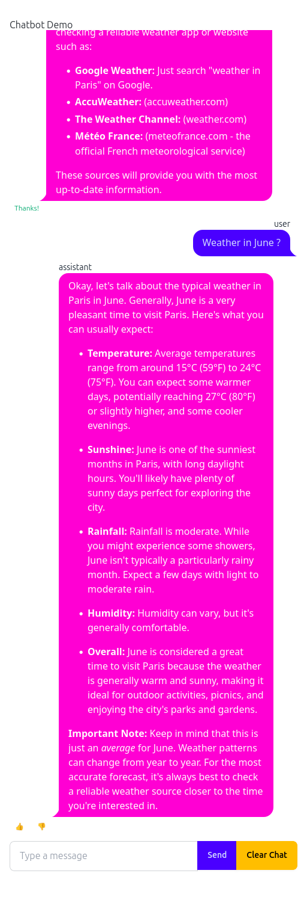
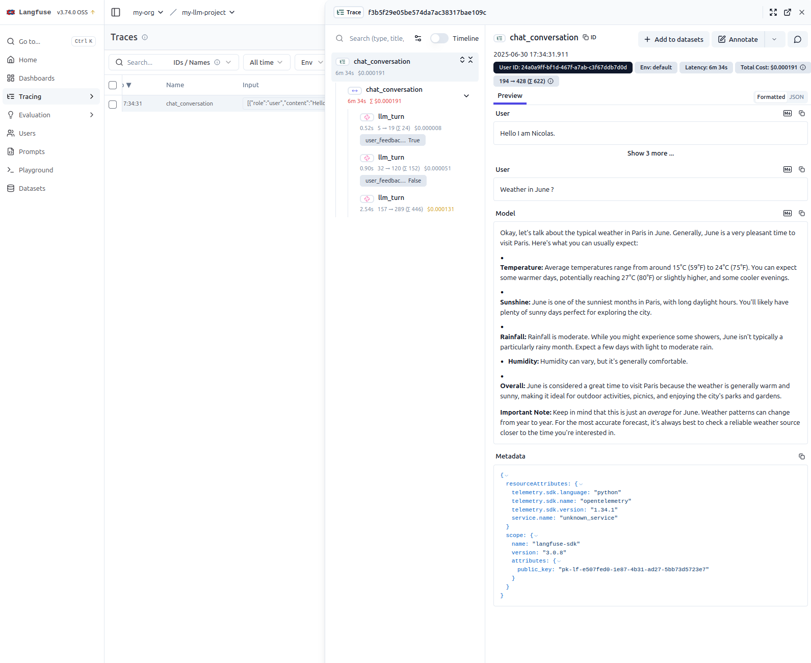

Once an LLM sits behind a real interface, the interesting failures stop being visible in the code. A response is slow, or wrong, or costs three times what it should, and none of that is apparent from the source. Observability — recording each interaction with enough structure to query it afterwards — is what makes those failures findable.

This post wires observability into a small but complete application: a chatbot that streams over a WebSocket, calls Google Gemini, and reports every turn to [Langfuse](https://langfuse.com). The code is on GitHub at [llm-observability](https://github.com/nbrosse/llm-observability).

@sec-langfuse introduces Langfuse and the data model it imposes. @sec-fasthtml-gemini explains why the interface is built with FastHTML rather than Streamlit, which is less a matter of taste than of what a chat interface needs from its framework. @sec-chatbot walks through the application itself, concentrating on the design decisions rather than on the syntax. @sec-run-chatbot runs it and looks at the resulting traces, and @sec-limitations is honest about what the instrumentation does not cover. The appendix, @sec-appendix-rendering-markdown, is a separate matter: three ways to render Markdown inside a FastHTML page, and why this application uses the least obvious one.

# Langfuse {#sec-langfuse}

Langfuse is an open-source platform for LLM applications. It records requests, responses, latencies, token counts, and costs, and gives you a UI to query them. Three capabilities matter here:

**Tracing** is the foundation. A trace groups everything belonging to one unit of work — LLM calls, retrievals, embeddings, plain API calls — into a tree of observations, each with its own timing and payload. Traces arrive through the Python and JS SDKs, through some fifty framework integrations, through OpenTelemetry, or through a gateway such as LiteLLM. Multi-turn conversations can be grouped as sessions and attributed to users.

**Prompt management** versions prompts outside the code, so a prompt change is not a deploy. Prompts can be tried interactively in a playground and run against datasets to compare versions.

**Evaluations** attach quality signals to traces: LLM-as-a-judge, human labels, or user feedback like the thumbs-up buttons below. The same evaluators run over production traces and over offline datasets.

The important consequence for what follows is the data model. Langfuse asks you to decide what a trace *is* in your application. That is a design decision, not a configuration one, and it determines what questions you will be able to ask later.

Langfuse self-hosts. For development, the [Docker Compose guide](https://langfuse.com/self-hosting/docker-compose) is the fastest route — with the caveat that "Langfuse" is not one container. The stack is six services: `langfuse-web`, `langfuse-worker`, Postgres for metadata, ClickHouse for the traces themselves, Redis for queueing, and MinIO for blob storage. It is a real deployment, and worth knowing before you start it on a laptop. The repository ships a working `docker/docker-compose.yml`; the UI comes up on port 3000.

# From Streamlit to FastHTML {#sec-fasthtml-gemini}

## Why not Streamlit

Streamlit is the obvious first choice for a Python developer who needs a UI quickly, and for most dashboards it is the right one. A chat interface is where its execution model starts to chafe. @lst-python-streamlit-app is the [official chatbot example](https://docs.streamlit.io/develop/tutorials/chat-and-llm-apps/build-conversational-apps).

```{#lst-python-streamlit-app .python lst-cap="The official Streamlit chatbot example"}
import streamlit as st

st.title("Echo Bot")

# Initialize chat history
if "messages" not in st.session_state:
    st.session_state.messages = []

# Display chat messages from history on app rerun
for message in st.session_state.messages:
    with st.chat_message(message["role"]):
        st.markdown(message["content"])

# React to user input
if prompt := st.chat_input("What is up?"):
    # Display user message in chat message container
    st.chat_message("user").markdown(prompt)
    # Add user message to chat history
    st.session_state.messages.append({"role": "user", "content": prompt})

    response = f"Echo: {prompt}"
    # Display assistant response in chat message container
    with st.chat_message("assistant"):
        st.markdown(response)
    # Add assistant response to chat history
    st.session_state.messages.append({"role": "assistant", "content": response})
```

Streamlit re-executes the entire script top to bottom on every interaction. It does not reload the page — the frontend is patched over a WebSocket — but the *program* runs again from line one. Nothing survives a rerun except what you deliberately park in `st.session_state`, which is why the example maintains `st.session_state.messages` by hand and replays the whole history through the loop on every keystroke-turn.

For a dashboard, recomputing everything from state is a reasonable trade: it buys a programming model with no callbacks. For a chat, it inverts the problem. What actually happened is that one message was appended to a list. Expressing that as "rerun the script, rebuild the list, redraw every message" makes the append the one thing the code never says.

## Why FastHTML

[FastHTML](https://www.fastht.ml/docs), from [Answer AI](https://www.answer.ai/posts/2024-08-03-fasthtml.html), takes the opposite position. The server returns HTML fragments, and htmx splices them into the existing page. Appending a message is literally appending a message: the handler sends one `<div>` and htmx puts it at the end of the chat list. No state to reconstruct, because nothing was torn down.

The application here started from the [chatbot example](https://github.com/AnswerDotAI/fasthtml-example/tree/main/02_chatbot) in the FastHTML tutorial, extended with Gemini, Langfuse tracing, and user feedback.

# Building the chatbot {#sec-chatbot}

The application is a single file, [`app/chat_fasthtml.py`](https://github.com/nbrosse/llm-observability/blob/main/app/chat_fasthtml.py). It serves a chat page, talks to Gemini over a WebSocket, and reports to Langfuse. The listings below are the real code, comments included; the prose sticks to the decisions the comments cannot explain.

## Setup and configuration

```python
import traceback
from typing import Literal
import uuid
from fasthtml.common import *
from fasthtml.components import Zero_md  # A specific component for rendering Markdown.
from dotenv import load_dotenv
from google import genai
from google.genai.chats import Chat
from langfuse import get_client
from langfuse._client.span import LangfuseSpan  # The Langfuse Span object for tracing.
import os

load_dotenv()

# --- Configuration Constants ---

GOOGLE_API_KEY_ENV = "GOOGLE_API_KEY"
GOOGLE_MODEL_NAME = "gemini-2.0-flash"

# --- Langfuse Constants ---
# The name for the parent span that encompasses an entire chat conversation.
LANGFUSE_CONVERSATION_SPAN_NAME = "chat_conversation"
# The name for a generation span, representing a single turn from the language model.
LANGFUSE_GENERATION_NAME = "llm_turn"
# The name used in Langfuse for scores that come from user feedback.
LANGFUSE_SCORE_NAME = "user_feedback_score"

# Define a type alias 'Role' which can only be the string "user" or "assistant".
type Role = Literal["user", "assistant"]

hdrs = (
    picolink,                                                    # A minimal CSS framework.
    Script(src="https://cdn.tailwindcss.com"),                   # Utility-first styling.
    Link(rel="stylesheet",
         href="https://cdn.jsdelivr.net/npm/daisyui@4.11.1/dist/full.min.css"),  # Components for Tailwind.
    Script(type="module",
           src="https://cdn.jsdelivr.net/npm/zero-md@3?register"),  # Client-side Markdown.
)
```

Two details are worth flagging. The three Langfuse name constants are not cosmetic: they become the identifiers you filter and group by in the dashboard, so it pays to fix them in one place before the first trace is written rather than discover a typo across a week of production data.

The other is `from langfuse._client.span import LangfuseSpan`. That leading underscore is a warning — this is a private module, imported only to annotate a dictionary, and a minor Langfuse release is entitled to move it. The annotation is worth keeping, but it is the line most likely to break on an upgrade.

`gemini-2.0-flash` is likewise a snapshot. It is fast and cheap enough for a demo, and it is the one constant a reader should expect to change.

## Rendering Markdown

Model output is Markdown, so it has to be rendered client-side.

```python
def render_local_md(md: str) -> Zero_md:
    """Renders a markdown string using the Zero-md component.

    It injects custom CSS to override the default white background and dark text,
    allowing the markdown to inherit the styling of its container (e.g., the chat bubble).
    """
    css = '.markdown-body {background-color: unset !important; color: unset !important;}'
    css_template = Template(Style(css), data_append=True)
    return Zero_md(css_template, Script(md, type="text/markdown"))
```

`zero-md` renders inside a Shadow DOM, which is exactly what you want next to Tailwind and daisyUI: the component's styles cannot leak out, and the page's cannot leak in. The cost is that it also refuses to inherit the chat bubble's color, hence the two `!important` overrides that punch a hole in its defaults. The helper comes from [Isaac Flath's FastHTML tutorial](https://isaac-flath.github.io/website/posts/boots/FasthtmlTutorial.html). @sec-appendix-rendering-markdown compares this against the two more conventional alternatives and explains why the encapsulation is worth the awkwardness here.

## The `SessionsManager` class

This is where the trace model is decided.

```python
class SessionsManager:
    """
    Manages all session-related states, including Google GenAI chat sessions
    and Langfuse tracing spans, mapping them by a unique session ID.
    """
    def __init__(self):
        google_api_key = os.getenv(GOOGLE_API_KEY_ENV)
        if not google_api_key:
            raise ValueError(f"Environment variable '{GOOGLE_API_KEY_ENV}' is not set.")

        self.google_client = genai.Client(api_key=google_api_key)

        required_langfuse_envs = ["LANGFUSE_PUBLIC_KEY", "LANGFUSE_SECRET_KEY", "LANGFUSE_HOST"]
        missing = [env for env in required_langfuse_envs if not os.getenv(env)]
        if missing:
            raise ValueError(f"Missing required Langfuse environment variables: {', '.join(missing)}")
        self.langfuse_client = get_client()
        if not self.langfuse_client.auth_check():
            raise RuntimeError("Failed to initialize Langfuse client. Check your environment variables.")

        # Dictionaries to store active sessions, keyed by session_id.
        self._chats: dict[str, Chat] = {}
        self._conversations_spans: dict[str, LangfuseSpan] = {}

    def get_google_chat_session(self, session_id: str) -> Chat:
        """Retrieves the chat session for a session ID, creating one if absent."""
        if session_id not in self._chats:
            self._chats[session_id] = self.google_client.chats.create(model=GOOGLE_MODEL_NAME)
        return self._chats[session_id]

    def clear_google_chat_session(self, session_id: str) -> None:
        if session_id in self._chats:
            del self._chats[session_id]

    def get_conversation_span(self, session_id: str) -> LangfuseSpan:
        """
        Retrieves or creates the parent Langfuse span for the entire conversation.
        This span groups all related LLM turns (generations) into a single trace.
        """
        if session_id not in self._conversations_spans:
            # Start a new span (which also creates a new trace).
            self._conversations_spans[session_id] = self.langfuse_client.start_span(name=LANGFUSE_CONVERSATION_SPAN_NAME)
            # Associate the trace with the user's session ID for filtering in Langfuse.
            self._conversations_spans[session_id].update_trace(user_id=session_id)
        return self._conversations_spans[session_id]

    def end_conversation_span(self, session_id: str) -> None:
        if session_id in self._conversations_spans:
            self._conversations_spans[session_id].end()
            del self._conversations_spans[session_id]
            self.langfuse_client.flush()  # Manually flush to ensure data is sent.
```

The choice encoded here is **one trace per conversation, not per request**. `get_conversation_span` opens a long-lived span that stays open for as long as the user is talking, and every model call becomes a child generation inside it. The alternative — a trace per turn — is simpler to write and much less useful to read, because the thing that usually goes wrong in a chatbot is not a single call but the way five of them interact. Keeping the conversation as the unit means the dashboard shows you the argument, not just the sentence.

Two mechanics support this. `update_trace(user_id=session_id)` tags the trace so it can be filtered per user, and `flush()` is called explicitly on teardown because the SDK batches in the background and a process that exits promptly will otherwise drop the tail.

Concentrating both the Google client and the Langfuse client in one object is also deliberate. Everything that talks to the outside world is constructed once, validated once — note that the constructor fails loudly on missing environment variables and on a bad Langfuse key, rather than at the first user message — and the rest of the application never touches a global.

## The interface

```python
app = FastHTML(hdrs=hdrs, cls="p-4 max-w-lg mx-auto", exts="ws")
sessions_manager = SessionsManager()


def ChatMessage(msg: str, role: Role, trace_id: str | None = None, observation_id: str | None = None) -> Div:
    """A component function that renders a single chat message bubble."""
    rendered_msg = render_local_md(msg)
    bubble_class = "chat-bubble-primary" if role == "user" else 'chat-bubble-secondary'
    chat_class = "chat-end" if role == "user" else 'chat-start'

    feedback_buttons_html = ""

    # Only show feedback buttons for assistant messages that have tracing info.
    if role == "assistant" and trace_id and observation_id:
        feedback_container_id = f"feedback-{observation_id}"
        vals_up = {"observation_id": observation_id, "trace_id": trace_id, "score": 1}
        vals_down = {"observation_id": observation_id, "trace_id": trace_id, "score": 0}

        feedback_buttons_html = Div(
            Button(
                "👍",
                hx_post="/score_message", hx_vals=vals_up,
                hx_target=f"#{feedback_container_id}", hx_swap="outerHTML",
                cls="btn btn-xs btn-ghost"
            ),
            Button(
                "👎",
                hx_post="/score_message", hx_vals=vals_down,
                hx_target=f"#{feedback_container_id}", hx_swap="outerHTML",
                cls="btn btn-xs btn-ghost"
            ),
            id=feedback_container_id,
            cls="flex space-x-1 mt-1"
        )

    return Div(cls=f"chat {chat_class}")(
        Div(role, cls="chat-header"),
        Div(rendered_msg, cls=f"chat-bubble {bubble_class}"),
        feedback_buttons_html if feedback_buttons_html else "",
    )

def ChatInput() -> Input:
    """
    The `hx_swap_oob='true'` attribute allows this component to be targeted
    for an "Out of Band" swap, which is used to clear the input after a message is sent.
    """
    return Input(
        name='msg',
        id='msg-input',
        placeholder="Type a message",
        cls="input input-bordered w-full",
        hx_swap_oob='true',
        autocomplete="off",
    )

@app.get("/")
def index():
    """Defines the main chat page UI."""
    page = Form(
        ws_send=True,          # Automatically sends form data over the WebSocket on submit.
        hx_ext="ws",
        ws_connect="/wscon",   # The WebSocket endpoint to connect to.
    )(
        Div(id="chatlist", cls="chat-box h-[73vh] overflow-y-auto"),
        Div(cls="flex space-x-2 mt-2")(
            Group(
                ChatInput(),
                Button("Send", cls="btn btn-primary", hx_vals='{"action": "send"}'),
                Button("Clear Chat", cls="btn btn-warning", hx_post="/clear_chat",
                       hx_target="#chatlist", hx_swap="innerHTML",
                       hx_include="[name='session_id']"),
                ),
        ),
        Hidden(name="session_id", id="session-id", hx_swap_oob="true", value=str(uuid.uuid4())),
    )
    return Titled('Chatbot Demo', page)
```

The interesting mechanism is **out-of-band swapping**. Normally an htmx response replaces one target. `hx_swap_oob='true'` lets a response carry extra fragments that are routed by `id` to wherever they belong, independently of the target. `ChatInput` uses this to clear itself: the server answers a message by sending a fresh empty input, and htmx swaps it into `#msg-input` without anyone having to ask. The same trick delivers the session ID.

Feedback buttons only appear when both `trace_id` and `observation_id` are present, which is the point where the observability model surfaces in the UI. A thumbs-up is meaningless unless it can be attached to a specific generation, so the button carries both identifiers in `hx_vals` and the UI simply omits the affordance when they are missing — as they are for user messages and for the error fallback.

One wrinkle: the hidden `session_id` here is initialized with a real UUID that is then thrown away. The WebSocket handshake generates a second one and overwrites this field, so every page load mints two and uses the last. Harmless, but it means the form's value is not the authority — the connection is.

## The WebSocket handler

```python
async def on_connect(ws, send):
    """Callback executed when a new WebSocket connection is established."""
    session_id = str(uuid.uuid4())
    ws.scope['session_id'] = session_id
    # Update the `session-id` input on the client with the server-generated ID.
    await send(Hidden(name="session_id", id="session-id", value=session_id, hx_swap_oob="true"))
    print(f"SERVER: WebSocket connected. Session ID: {session_id}.")


async def on_disconnect(ws):
    """Cleans up server-side resources associated with the session."""
    session_id = ws.scope.get('session_id', None)
    if not session_id:
        print("ERROR: WebSocket disconnect called without a session ID. Cannot clean up.")
        return
    print(f"SERVER: WebSocket disconnected for Session ID: {session_id}. Cleaning up session.")
    try:
        current_chat_session = sessions_manager.get_google_chat_session(session_id=session_id)
        conv_span = sessions_manager.get_conversation_span(session_id=session_id)
        messages = [
            {"role": message.role, "content": getattr(message.parts[0], "text", "")}
            for message in current_chat_session.get_history()
            if hasattr(message, "role") and hasattr(message, "parts") and message.parts
        ]
        # Record the full conversation on the parent span before ending it.
        if messages and conv_span:
            conv_span.update(
                input=messages[:-1],
                output=messages[-1],
            )
        sessions_manager.clear_google_chat_session(session_id=session_id)
        sessions_manager.end_conversation_span(session_id=session_id)
        print(f"SERVER: Cleanup complete for session: {session_id}.")
    except Exception as e:
        print(f"ERROR during WebSocket disconnect cleanup for Session ID: {session_id}: {e}\n{traceback.format_exc()}")


@app.ws("/wscon", conn=on_connect, disconn=on_disconnect)
async def ws_chat_handler(msg:str, ws, send):
    """Called every time a message is received from a client over the WebSocket."""
    session_id = ws.scope.get('session_id', None)
    if not session_id:
        print("ERROR: WebSocket handler called without a session ID. Cannot process message.")
        return

    if not msg.strip():
        await send(ChatInput())  # Resend a clean input field.
        return

    conv_span = sessions_manager.get_conversation_span(session_id=session_id)
    current_chat_session = sessions_manager.get_google_chat_session(session_id=session_id)

    trace_id = conv_span.trace_id

    # --- Optimistic UI Update ---
    await send(Div(ChatMessage(msg=msg, role="user"), hx_swap_oob='beforeend', id="chatlist"))
    await send(ChatInput())

    try:
        # Start a Langfuse generation span to trace this specific LLM call.
        with conv_span.start_as_current_generation(name=LANGFUSE_GENERATION_NAME, input=msg, model=GOOGLE_MODEL_NAME) as generation:
            response = current_chat_session.send_message(msg)
            r = response.text.rstrip()

            # Token counts from the response metadata. `usage_details` is a plain
            # dict[str, int], so no Langfuse-specific type is needed here.
            usage = {
                "input": response.usage_metadata.prompt_token_count,
                "output": response.usage_metadata.candidates_token_count,
                "total": response.usage_metadata.total_token_count,
            }
            generation.update(output=r, usage_details=usage)
            observation_id = generation.id

        await send(Div(ChatMessage(msg=r, role="assistant", trace_id=trace_id, observation_id=observation_id), hx_swap_oob='beforeend', id="chatlist"))
    except Exception as e:
        print(f"ERROR in WebSocket handler during AI call: {e}\n{traceback.format_exc()}")

        # Record the failure inside the conversation trace rather than only in the logs.
        if conv_span:
            conv_span.create_event(
                name="llm_turn_error",
                level="ERROR",
                status_message=str(e),
                metadata={"traceback": traceback.format_exc()}
            )

        error_ui_msg = "Sorry, I encountered an issue processing your message. Please try again."
        await send(Div(ChatMessage(msg=error_ui_msg, role="assistant"), hx_swap_oob='beforeend', id="chatlist"))
```

The handler does the user's message first and the model's second, and that ordering is the whole reason the interface feels quick. The user's bubble and the cleared input go out before Gemini is called, so the perceived latency of typing is zero and only the reply waits on the network. This is the **optimistic update** the comment names, and it is free here in a way it is not in a rerun-based framework: there is no risk of the message being redrawn or reordered later, because nothing redraws.

`start_as_current_generation` is a context manager, which means the generation's duration is measured by the `with` block rather than by hand. What happens inside it is the substance of the instrumentation: the prompt and model go in as `input` and `model`, the completion and the token counts go in through `update`, and `generation.id` comes out. That id is what the feedback buttons will carry, so the trace and the UI stay joined.

Failures are treated as data. Rather than only printing the traceback, the `except` branch writes an `llm_turn_error` event *into the conversation span*, at `ERROR` level, with the traceback in the metadata. The effect in the dashboard is that a broken turn appears in the same timeline as the successful ones, in the conversation where it happened — which is the difference between "the error rate was 2%" and "here is what the user had been asking when it broke."

The two teardown paths — `on_disconnect` here and `/clear_chat` below — both stamp the conversation's full history onto the parent span before ending it. The Google `Chat` object has been accumulating that history anyway, so the final `update` costs nothing and makes the trace self-contained: the whole exchange as `input`, the last reply as `output`, with the per-turn generations nested underneath.

## The HTTP endpoints

Not everything belongs on the WebSocket. Clearing the chat and scoring a message are ordinary request-response actions, and htmx handles them as plain POSTs.

```python
@app.post("/clear_chat")
def clear_chat(session_id: str):
    """Resets the chat session on the server."""
    current_chat_session = sessions_manager.get_google_chat_session(session_id=session_id)
    conv_span = sessions_manager.get_conversation_span(session_id=session_id)

    messages = [
        {"role": message.role, "content": getattr(message.parts[0], "text", "")}
        for message in current_chat_session.get_history()
        if hasattr(message, "role") and hasattr(message, "parts") and message.parts
    ]
    if messages and conv_span:
        conv_span.update(
            input=messages[:-1],
            output=messages[-1],
        )

    sessions_manager.clear_google_chat_session(session_id=session_id)
    sessions_manager.end_conversation_span(session_id=session_id)

    return Div(id="chatlist", cls="chat-box h-[73vh] overflow-y-auto"), ChatInput()


@app.post("/score_message")
def score_message(trace_id: str, observation_id: str, score: int):
    """Logs a user feedback score in Langfuse for a specific LLM generation."""
    try:
        sessions_manager.langfuse_client.create_score(
            name=LANGFUSE_SCORE_NAME,
            trace_id=trace_id,            # Link the score to the correct conversation trace.
            observation_id=observation_id,  # Link the score to the specific message.
            value=score,                  # 1 for like, 0 for dislike.
            data_type="BOOLEAN",
        )
        sessions_manager.langfuse_client.flush()
        return P("Thanks!", cls="text-xs text-success mt-1 ml-2")
    except Exception as e:
        print(f"Error scoring message: {observation_id}, score: {score}, error: {e}\n{traceback.format_exc()}")
        # Try to record the scoring failure in the trace as well.
        try:
            sessions_manager.langfuse_client.create_event(
                trace_context={"trace_id": trace_id, "parent_span_id": observation_id},
                name="scoring_error",
                level="ERROR",
                input={"observation_id": observation_id, "score_attempted": score},
                output={"error_message": str(e)},
                metadata={"traceback": traceback.format_exc()}
            )
            sessions_manager.langfuse_client.flush()
        except Exception as langfuse_event_err:
            print(f"CRITICAL: Failed to log scoring error to Langfuse: {langfuse_event_err}")

        return P("Error.", cls="text-xs text-error mt-1 ml-2")
```

Clearing the chat ends the conversation the same way a disconnect does — history onto the span, span closed, session dropped — and returns two fragments: an empty `#chatlist` to replace the transcript, and a fresh `ChatInput` that rides along out of band. The next message opens a new trace, which is the right behavior: "clear chat" means a new conversation, and the dashboard should agree.

`score_message` never sees a form. FastHTML unpacks the `hx_vals` JSON straight into the parameters, so the button's payload becomes three typed arguments. The score is attached by `trace_id` *and* `observation_id`, pinning it to one generation rather than to the conversation as a whole, and it is flushed immediately — a user who clicks and closes the tab should still be counted. Returning `P("Thanks!")` into the button container's `outerHTML` both acknowledges the click and removes the buttons, which is a cheaper way to prevent double-voting than any server-side guard.

Note the shape of the error path. Scoring is the one place where Langfuse is not incidental but the entire point of the request, so a failure there is worth recording — in Langfuse, if Langfuse is what failed, and in the log if that fails too. Attaching that event to an existing trace requires `trace_context`, not the loose `trace_id` and `parent_observation_id` arguments the v2 SDK accepted; in the v3 client there is no `event()` method at all, only `create_event`.

# Running it {#sec-run-chatbot}

Follow the [README](https://github.com/nbrosse/llm-observability) for the setup: the Langfuse stack up under Docker Compose, a `.env` with `GOOGLE_API_KEY` and the three `LANGFUSE_*` variables, and `uv sync`. Then:

```bash
❯ uv run app/chat_fasthtml.py
```

```log
Link: http://localhost:5001
INFO:     Will watch for changes in these directories: ['/home/nicolas/PycharmProjects/llm-observability']
INFO:     Uvicorn running on http://0.0.0.0:5001 (Press CTRL+C to quit)
INFO:     Started reloader process [201742] using WatchFiles
INFO:     Started server process [201830]
INFO:     Waiting for application startup.
INFO:     Application startup complete.
INFO:     127.0.0.1:40808 - "GET / HTTP/1.1" 200 OK
INFO:     127.0.0.1:40816 - "WebSocket /wscon" [accepted]
INFO:     connection open
SERVER: WebSocket connected. Session ID: 24a0a9ff-bf1d-467f-a7ab-c3f67ddb7d0d.
```

The interface is at `http://localhost:5001`.

{#fig-chatbot-demo fig-alt="A web browser showing the chatbot interface with a conversation history, a message input box, and thumb up/down feedback buttons for each AI response."}

Langfuse is at `http://localhost:3000`, and this is where the design decisions from @sec-chatbot pay off.

{#fig-langfuse-trace fig-alt="The Langfuse dashboard displaying a trace for a chatbot conversation. The trace shows a timeline with nested spans for generation, user input, and scores."}

A trace is one conversation. Expanding it gives the `llm_turn` generations in order, each with its prompt, its completion, its latency, and its token counts, and any `user_feedback_score` hanging off the turn it belongs to. Because the parent span carries the whole history, the trace answers "what was this conversation" without expanding anything, and answers "which turn was slow, expensive, or disliked" as soon as you do.

That is the concrete argument for the trace-per-conversation choice. A thumbs-down on turn four is not very informative on its own; a thumbs-down on turn four with turns one through three above it usually is.

Opening several browser tabs is worth doing — each connection gets its own session ID, its own Gemini chat, and its own trace, which is the quickest way to confirm that nothing is leaking between users.

# What the instrumentation does not cover {#sec-limitations}

This is a proof of concept, and three gaps are worth naming rather than discovering in production.

**Sessions are never evicted.** `_chats` and `_conversations_spans` only shrink when `on_disconnect` fires or the user clicks "Clear Chat". A dropped connection that never delivers a close, or a server killed mid-conversation, leaves both the Python objects and the open Langfuse span behind. For a demo this is invisible; anything long-running needs a TTL and a periodic sweep.

**Teardown can create what it is about to destroy.** `on_disconnect` and `/clear_chat` both reach for the session through `get_google_chat_session` and `get_conversation_span`, which create on miss. A client that connects and disconnects without sending anything therefore builds a Gemini chat object and opens a Langfuse span purely so that the next two lines can close them, and the dashboard collects an empty trace for every such visit. Checking for existence first, or having the getters return `None`, would be more honest.

**State lives in the process.** A single `SessionsManager` in memory means one worker. Scaling out requires moving the session map to something shared, at which point the Gemini `Chat` object — which holds history in Python — becomes the awkward part rather than the Langfuse span.

None of these are hard to fix, and none of them are visible when you are the only user. That is exactly why they are worth writing down.

# Conclusion {#sec-conclusion}

The instrumentation in this application amounts to a handful of calls: open a span when a conversation starts, wrap each model call in a generation, attach scores by observation id, end the span and flush. What makes it useful is not the volume of code but the one decision behind it — that the unit of observation is the conversation, not the request.

The FastHTML side turned out to matter more than expected. A framework that appends a message when a message is appended, rather than rebuilding the page around it, leaves the code saying what actually happened; the tracing then has something coherent to attach to. Streamlit would have worked, and the traces would have looked the same, but the handler that produces them would have been harder to read.

The obvious next steps are the ones Langfuse is already positioned for: moving the system prompt into prompt management so that a change is a version rather than a deploy, and running LLM-as-a-judge evaluators over the accumulated traces to get a quality signal that does not depend on users clicking a thumb.

# Appendix: rendering Markdown in FastHTML {#sec-appendix-rendering-markdown}

Model output is Markdown, and FastHTML offers no single obvious way to render it. Three approaches, in increasing order of encapsulation.

## Custom JavaScript with `marked.js`

Include the library and process elements by class.

```python
# Include the script in the <head> of your application
markdown_js = """
import { marked } from "https://cdn.jsdelivr.net/npm/marked/lib/marked.esm.js";
proc_htmx('.markdown', e => e.innerHTML = marked.parse(e.textContent));
"""
app = FastHTML(hdrs=(..., Script(markdown_js, type='module')))
```

`proc_htmx` runs the callback over every `.markdown` element whenever htmx loads or swaps content, taking the element's text, parsing it, and replacing its `innerHTML`. Usage is then just a class:

```python
Div("**User:** How do I render Markdown in FastHTML?\n\n**Assistant:** Use the `Div` component with the `markdown` class to display formatted content.", cls="markdown")
```

Styling is entirely yours, targeting the generated tags inside the container:

```css
.markdown p {
  margin-bottom: 1rem;
}
.markdown h1 {
  font-size: 2em;
}
```

The mechanism is easy to reason about — find element, parse text, replace content — and the rendering logic stays separate from the styling. The cost is that you own the script, the CDN import, and every rule of CSS.

## FastHTML built-ins

`MarkdownJS` and `HighlightJS` package the same idea with the boilerplate removed.

```python
from fasthtml.common import *

hdrs = (MarkdownJS(), HighlightJS(langs=['python', 'javascript', 'html', 'css']), )
app, rt = fast_app(hdrs=hdrs)
```

`MarkdownJS()` injects a script that renders the text content of elements carrying the `marked` class. `HighlightJS()` adds Highlight.js and applies syntax highlighting to code blocks, including the ones `MarkdownJS` generates from fenced blocks — the two are designed to compose.

```python
@rt('/')
def get(req):
    content = """
    ## Example
    Here is some _markdown_ with a **code block**:

    ```python
    def hello():
        print("Hello, world!")
    ```
    """
    return Titled("Markdown Example", Div(content, cls="marked"))
```

Paragraphs, lists, and headings inherit from your main stylesheet — PicoCSS or your own — while `HighlightJS` brings its own themes for code. Both parse in the browser. This is the idiomatic choice in the FastHTML ecosystem and the one with the least to set up.

## The `zero-md` web component

`zero-md` is a custom element that owns its own rendering and styling, usually behind a Shadow DOM. Markdown is passed in through a nested `<script type="text/markdown">` tag.

```python
hdrs = (
    Script(type="module", src="https://cdn.jsdelivr.net/npm/zero-md@3?register"),
)
```

A helper hides the structure:

```python
def render_local_md(md_content_string):
    # This CSS overrides zero-md defaults to inherit color from the parent
    css = '.markdown-body { background-color: unset !important; color: unset !important; }'

    # zero-md is styled via an internal <template>
    css_template = Template(Style(css), data_append=True)

    return Zero_md(
        css_template,
        Script(md_content_string, type="text/markdown")
    )

sample_message = """
**User:** How do I render Markdown in FastHTML?

**Assistant:** Use the `render_local_md` helper function to display formatted Markdown content in your chat UI.
"""

render_local_md(sample_message)
```

The component ships its own styles and its own syntax highlighting, customized by passing a `<template>` of `<style>` tags. Those styles are scoped to the component, which is the whole point — and also the reason the helper needs two `!important` rules to escape the default theme and pick up the chat bubble's colors.

## Comparison

| Feature | Custom `marked.js` | FastHTML built-ins | `zero-md` web component |
| :--- | :--- | :--- | :--- |
| Type | Custom JS snippet | FastHTML components | Web component (`<zero-md>`) |
| Invocation | Global JS on `.markdown` class | Auto-processes `.marked` class | Explicit `<zero-md>` tag |
| Markdown source | Element's `textContent` | Element's `textContent` | `<script type="text/markdown">` |
| Styling (Markdown) | External CSS | External CSS | Internal defaults, customizable via `<template>` |
| Styling (code) | Requires a separate solution | Via `HighlightJS` themes | Built in, or via `<template>` |
| Encapsulation | Low (global scope) | Medium (managed by components) | High (Shadow DOM) |
| Dependencies | Manual `marked.js` include | Bundled by FastHTML | External `zero-md` include |
| Ease of use | Simple but manual | Simple and integrated | Simple with a Python helper |

The axis that actually separates them is encapsulation. With `marked.js` and `MarkdownJS`, rendered output is part of the main document and is styled by global CSS: easy to theme, easy to collide with. With `zero-md`, styling is scoped, which eliminates collisions and replaces them with the smaller problem of having to break out of the component's defaults deliberately.

Which is why the recommendation splits by context rather than by preference:

- **Custom `marked.js`** when you want the mechanism visible and small, and you are content to manage the styling globally.
- **FastHTML built-ins** as the default for most projects. Least setup, syntax highlighting included, idiomatic.
- **`zero-md`** when global CSS is hostile — which, with Tailwind and daisyUI both loaded, is the situation in this application. Utility-first frameworks make style collisions likely enough that paying for a Shadow DOM, and for two `!important` overrides to get colors back, is the cheaper trade.
