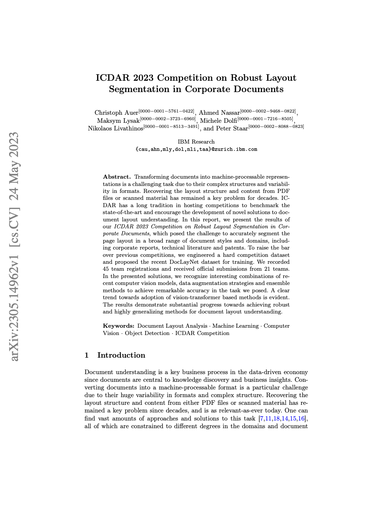
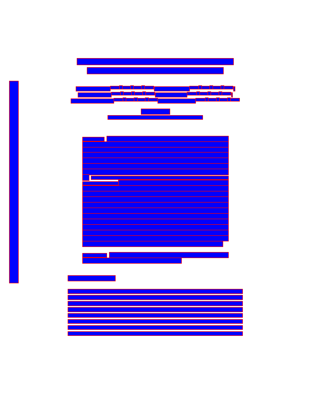
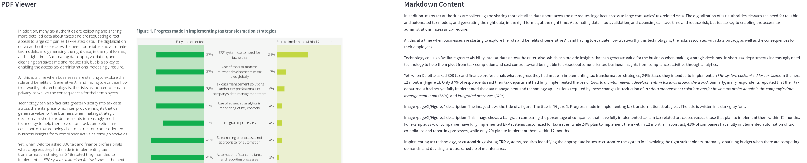
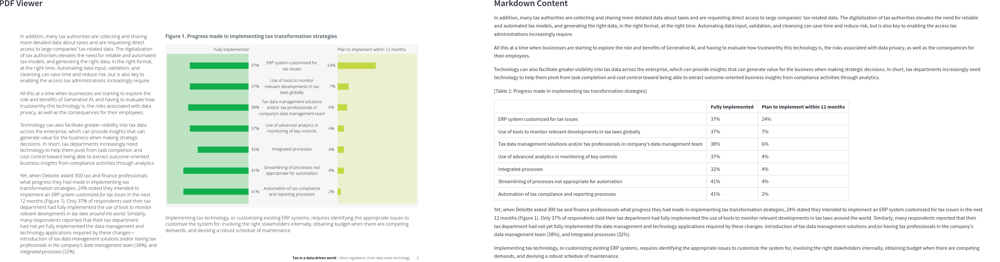
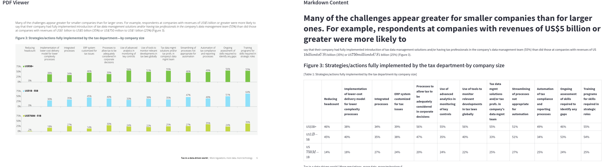
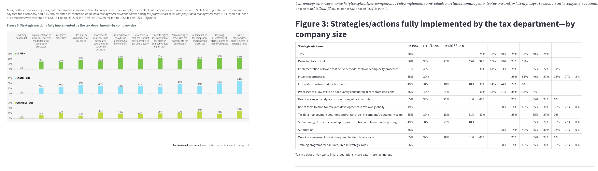
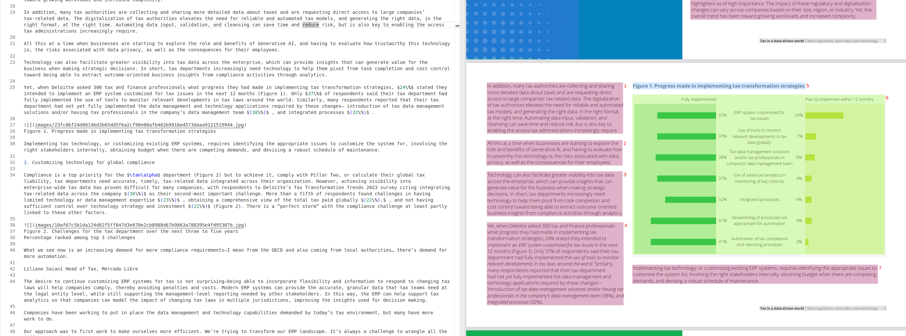
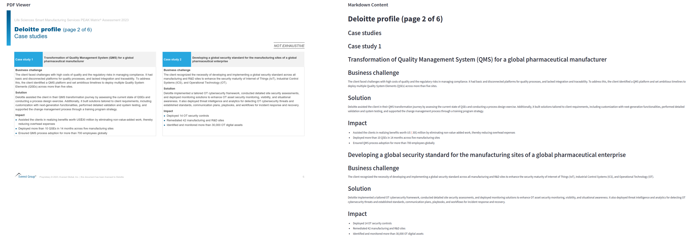

A PDF says where ink goes on a page. It does not say which glyphs form a paragraph, which paragraph comes first, or which of the numbers scattered across a page belong to the same table row. Feeding a PDF to a language model means reconstructing all of that, and the interesting question is not whether a parser succeeds — none of them fully does — but what its failures look like when it does not.

@sec-detailed-presentation takes three open-source pipelines apart: Docling in @sec-docling, Marker in @sec-marker-pdf, and MinerU in @sec-mineru. They solve the same problem with the same three ingredients — layout analysis, table structure recognition, and OCR — and differ mostly in which model fills each slot. Docling gets the most space because its technical report [@auer2024doclingtechnicalreport; @livathinos2025doclingefficientopensourcetoolkit] documents the pipeline stage by stage, which makes it a good map of the whole problem.

@sec-comparing-libraries runs seven tools over the same six PDFs and compares the Markdown they produce: the three above plus `pymupdf4llm`, LlamaParse, Gemini, and Mistral OCR. The code is in the [pdf-parsing repository](https://github.com/nbrosse/pdf-parsing), and the outputs can be browsed page by page against the source PDF in the [pdf-parsing-demo](https://huggingface.co/spaces/nicolasb92/pdf-parsing-demo) Hugging Face Space.

::: callout-note
**Summary**

- Every pipeline here is layout analysis, table structure recognition, and OCR wired together. What distinguishes them is which models occupy those slots and how the pieces are stitched back into a reading order.
- One of the six test documents, a ConocoPhillips investor deck, has no embedded fonts at all: it is seven page images. `pymupdf4llm` returns 49 bytes for it. Anything without an OCR stage returns nothing.
- Tables separate the open-source tools. MinerU's HTML output is the only one that reproduces the nested header of a two-page Deloitte brief with the right `rowspan` and `colspan`. Docling's collapses into a grid of fragments with stranded single letters below it.
- Charts defeat all seven, and Gemini fails most dangerously. On a twelve-category grouped bar chart it returns a clean, plausible Markdown table in which 23 of 36 cells are wrong, including every zero-height bar. On a simpler chart two pages earlier, the same prompt is exact.
- Small type breaks the OCR-first pipelines. Surya (Marker) and PaddleOCR (MinerU) both return paragraphs of invented text on a 4 pt legal disclaimer that LlamaParse and Gemini read correctly.
- Choose on constraints, not on quality: Docling or MinerU when the pipeline must stay open-source and on your own hardware, Gemini or Mistral OCR when it need not. In every case, treat any number that came from a chart as unverified.
:::

::: callout-note
This post is a snapshot of February–March 2025, and the exact versions used are listed in @sec-how-run. The field moves quickly; the failure modes have proved more durable than the rankings.
:::

# How a modern PDF parser works {#sec-detailed-presentation}

## Docling {#sec-docling}

Docling is a modular pipeline that ingests PDFs — and DOCX, HTML, and others — and converts them into a single structured representation, the `DoclingDocument`. It is open-source, under active development, and documented in two technical reports [@auer2024doclingtechnicalreport; @livathinos2025doclingefficientopensourcetoolkit].

![Docling's default processing pipeline. Source: [@auer2024doclingtechnicalreport]](figures/docling-pipeline.png){#fig-docling-pipeline fig-alt="Docling's default processing pipeline."}

As @fig-docling-pipeline shows, the pipeline has three stages: a PDF backend that recovers raw content, a set of AI models that infer structure from the page image, and an assembly stage that puts the results back together.

### The PDF backend

The backend does two things: it retrieves every piece of text with its geometric coordinates on the page, and it renders the page as an image the way a viewer would.

Docling ships several backends. The default is a custom parser built on the low-level qpdf library, open-sourced separately as [`docling-parse`](https://github.com/docling-project/docling-parse). @fig-docling-parse shows what it recovers: not words or lines, but individual glyph cells with bounding boxes.

::: {#fig-docling-parse layout-ncol="2"}
{width="400"}

{width="400"}

Illustration of `docling-parse`, from the [project README](https://github.com/docling-project/docling-parse?tab=readme-ov-file).
:::

The package exposes this through a Python interface and serializes it to JSON, as in @lst-json-docling-parse. Each entry in `cells.data` is one character: a bounding box repeated in several coordinate conventions, the glyph itself, a font size, an encoding, and the font it was drawn with. The word "Pushing" is seven such rows. Everything downstream exists to group these back into paragraphs.

``` {#lst-json-docling-parse .json lst-cap="Abridged docling-parse JSON output"}
{'annotations': [{'/A': {'/IsMap': False,
    '/S': '/URI',
    '/URI': 'https://www.deloitte.com/global/en/Industries/financial-services/...'},
   '/Rect': [474.409, 580.322, 512.947, 569.083],
   '/Subtype': '/Link',
   '/Type': '/Annot'}],
 'original': {'cells': {'data': [[36.142, 711.041, 54.862, 739.753,
     36.142, 711.041, 54.862, 711.041, 54.862, 739.753, 36.142, 739.753,
     'P', -1, 8.32, '/WinAnsiEncoding', 'WINANSI',
     '/TT0', '/FSUTKX+OpenSans-Light', False, True],
    [54.542, 711.041, 73.422, 739.753,
     54.542, 711.041, 73.422, 711.041, 73.422, 739.753, 54.542, 739.753,
     'u', -1, 8.32, '/WinAnsiEncoding', 'WINANSI',
     '/TT0', '/FSUTKX+OpenSans-Light', False, True],
    ...
```

### Layout analysis

The layout model detects and classifies elements on the page image by predicting bounding boxes. It is based on RT-DETR, a real-time detection transformer that uses a hybrid encoder over image features and IoU-aware query selection, and is retrained on DocLayNet [@Pfitzmann_2022] together with proprietary data. Docling feeds it page images at 72 dpi.

The raw proposals overlap, so they are post-processed: overlaps are resolved by confidence and size, and the surviving boxes are intersected with the text cells from the backend to group them into paragraphs, section titles, tables, and so on. This intersection is what keeps the text exact — the model decides the grouping, the backend supplies the characters.

### Table structure recognition

](figures/tbm04.png){#fig-tableformer fig-alt="TableFormer architecture."}

Tables get their own model, TableFormer [@nassar2022tableformertablestructureunderstanding], a vision transformer sketched in @fig-tableformer. From an image of a table it predicts the logical row and column structure, deciding which cells are column headers, row headers, or body — including tables with partial or absent borderlines, empty cells, and row or column spans.

Docling feeds each table region found by the layout model to TableFormer, then matches the predicted structure back onto the PDF text cells rather than transcribing the image. Pre-trained weights live on Hugging Face and the inference code is packaged as `docling-ibm-models`.

### OCR

OCR is optional and off the critical path for born-digital PDFs; it exists for scanned pages and text locked inside embedded bitmaps. Several engines are supported — EasyOCR, Tesseract, RapidOCR, OcrMac — and the page image handed to them is rendered at 216 dpi rather than 72, to keep small print legible.

### Assembly and post-processing

The final stage assembles every prediction into a `DoclingDocument`, defined in `docling-core`. A post-processing model then augments it: detecting the document language, correcting the reading order, matching figures to their captions, and labelling metadata such as title, authors, and references. Further enrichments can classify figures, identify code blocks and formulas, or [describe pictures with a vision model](https://docling-project.github.io/docling/usage/enrichments/).

](figures/docling_doc_hierarchy_1.png){#fig-docling-document fig-alt="DoclingDocument hierarchy."}

The `DoclingDocument` itself is a Pydantic model covering text, tables, and pictures, shown in @fig-docling-document. It separates content items from content structure, distinguishes the main body from auxiliary "furniture" such as headers and footers, and retains bounding boxes and provenance throughout. It serializes to JSON, or exports to Markdown.

## Marker {#sec-marker-pdf}

[Marker](https://github.com/datalab-to/marker) splits the same job across two projects. Raw extraction is handled by [pdftext](https://github.com/datalab-to/pdftext), built on pypdfium2; structure comes from [Surya](https://github.com/datalab-to/surya), a document OCR toolkit that does line-level text detection in any language, OCR in more than 90, layout analysis, reading order detection, table recognition, and LaTeX OCR.

@lst-json-surya shows the shape of Surya's output. The unit here is the span rather than the glyph — a run of text with one bounding box, one font, and character offsets into the page — which is one level of grouping already done compared with `docling-parse`.

``` {#lst-json-surya .json lst-cap="Abridged Surya JSON output"}
[
  {
    "page": 0,
    "bbox": [0, 0, 595.276, 841.890],
    "width": 596,
    "height": 842,
    "rotation": 0,
    "blocks": [
      {
        "lines": [
          {
            "spans": [
              {
                "bbox": [36.142, 99.631, 481.230, 131.631],
                "text": "Pushing through undercurrents",
                "rotation": 0,
                "font": {
                  "name": "OpenSans-Light",
                  "flags": 524320,
                  "size": 1,
                  "weight": 240
                },
                "char_start_idx": 0,
                "char_end_idx": 28,
                "url": ""
              },
...
```

On top of this, Marker converts to Markdown, JSON, or HTML; formats tables, forms, equations, links, references, and code blocks; extracts images alongside the text; strips headers, footers, and other artifacts; and runs on GPU, CPU, or MPS. It also has an optional `--use_llm` mode that calls a vision model to improve accuracy and to describe figures, which is the mode used in @sec-comparing-libraries.

## MinerU {#sec-mineru}

![The MinerU processing workflow. Source: [@wang2024mineruopensourcesolutionprecise]](figures/minerU_pipeline.png){#fig-mineru-pipeline fig-alt="Overview of the MinerU framework processing workflow."}

[MinerU](https://github.com/opendatalab/MinerU) [@wang2024mineruopensourcesolutionprecise] is organised as four sequential stages, shown in @fig-mineru-pipeline.

**Preprocessing** reads the PDF with PyMuPDF and decides whether it can be handled at all: it identifies the language (Chinese and English at the time of writing), detects text-based PDFs whose text layer is garbled, distinguishes text-based from scanned documents, and extracts page count and dimensions.

**Content parsing** applies the PDF-Extract-Kit model library region by region. Layout analysis identifies element types and their extents; formula detection finds inline and displayed formulas, which UniMERNet converts back to LaTeX; table regions go to TableMaster or StructEqTable; everything else goes to PaddleOCR.

**Post-processing** resolves the geometry. Formulas and text blocks contained inside image or table regions are removed, partially overlapping boxes are shrunk so that text overlapping a table or image stays intact, and a segmentation algorithm divides the page into regions ordered the way a person reads: top to bottom, left to right.

**Format conversion** emits the result, in practice as Markdown with tables in HTML.

| Task | Description | Models |
|:-----------------|:----------------------------|:------------------------|
| Layout detection | Locate images, tables, text, titles, formulas | DocLayout-YOLO_ft, YOLO-v10_ft, LayoutLMv3_ft |
| Formula detection | Locate inline and block formulas | YOLOv8_ft |
| Formula recognition | Convert formula images to LaTeX | UniMERNet |
| OCR | Detect and recognize text in images | PaddleOCR |
| Table recognition | Convert table images to LaTeX, HTML, or Markdown | PaddleOCR + TableMaster, StructEqTable |

: The models behind each MinerU stage {#tbl-mineru-models}

# Comparing the tools {#sec-comparing-libraries}

::: callout-important
What follows is a qualitative comparison on six documents. It is enough to expose failure modes and not nearly enough to rank the tools; read it as a set of worked examples, not as a benchmark.
:::

All the code, the source PDFs, and every Markdown file quoted below are in the [pdf-parsing repository](https://github.com/nbrosse/pdf-parsing). The [pdf-parsing-demo](https://huggingface.co/spaces/nicolasb92/pdf-parsing-demo) Space shows each PDF page beside the Markdown each tool produced for it, which is the fastest way to check any of these claims.

## The test documents {#sec-dataset}

Six PDFs, chosen to break parsers in different ways. They are in the [`pdfs` directory](https://github.com/nbrosse/pdf-parsing/tree/main/pdfs) of the repository.

| Document | Pages | What makes it hard |
|:---------|------:|:-------------------|
| `2023-conocophillips-aim-presentation-1-7.pdf` | 7 | **No embedded fonts.** Every page is a single 4000 × 2250 image, including a page of 4 pt legal text |
| `deloitte-tech-risk-sector-banking.pdf` | 2 | Nested table headers spanning rows and columns, bulleted cells, icon fonts |
| `dttl-tax-technology-report-2023.pdf` | 17 | Bar charts carrying data that appears nowhere in the text |
| `gx-iif-open-data.pdf` | 32 | Long report, multi-column layout, sidebars |
| `life-sciences-...-peak-matrix-assessment-2023.pdf` | 15 | Side-by-side boxes, a quadrant scatter plot |
| `XC9500_CPLD_Family-1-4.pdf` | 4 | Datasheet: dense tables, block diagrams, tiny footnotes |

The first two came from public sources — [DigiKey](https://media.digikey.com/pdf/Data%20Sheets/AMD/XC9500_CPLD_Family.pdf) for the datasheet and [ConocoPhillips](https://static.conocophillips.com/files/2023-conocophillips-aim-presentation.pdf) for the deck. The remaining four are from the [RAG benchmark](https://www.eyelevel.ai/post/most-accurate-rag) published by EyeLevel and its associated [Google Drive folder](https://drive.google.com/drive/u/0/folders/1l45ljrGfOKsiNFh8QPji2eBAd2hOB51c).

The ConocoPhillips deck deserves a note of its own, because it changes how every result below should be read. `pdffonts` reports zero fonts for it and `pdfimages` reports seven full-page bitmaps. There is no text layer. Every character any tool produces for that file was invented by an OCR model or a vision model, and a tool with neither returns nothing at all.

## How each tool was run {#sec-how-run}

Defaults everywhere, except where a flag was needed to get Markdown out at all. This matters for reading the results: several tools have premium or multimodal modes that were not used.

| Tool | Version | Invocation |
|:-----|:--------|:-----------|
| [Docling](https://github.com/docling-project/docling) | `docling` 2.21 | `DocumentConverter()` with default options, exported per page with `image_mode=PLACEHOLDER` |
| [Marker](https://github.com/datalab-to/marker) | `marker-pdf` 1.4 | CLI with `--use_llm` (Gemini), `--paginate_output`, `--disable_image_extraction` |
| [MinerU](https://github.com/opendatalab/MinerU) | `magic-pdf` 1.1 | `magic-pdf -p ../pdfs/ -o md/` |
| [PyMuPDF](https://pymupdf.readthedocs.io/en/latest/pymupdf4llm/) | `pymupdf4llm` 0.0.17 | `pymupdf4llm.to_markdown(path)` |
| [LlamaParse](https://developers.llamaindex.ai/llamaparse/) | `llama-parse` 0.6.1 | Default mode, `result_type=MD`, `split_by_page=False` |
| [Gemini](https://ai.google.dev/gemini-api/docs) | `google-genai` 1.2, `gemini-2.0-flash` | One request per page with a custom transcription prompt, four workers |
| [Mistral OCR](https://docs.mistral.ai/studio/document-processing/basic_ocr) | `mistralai` 1.5.1, `mistral-ocr-latest` | `client.ocr.process` with `include_image_base64=True` |

Two of these are worth spelling out. Marker was the only tool given a vision model for figures, through `--use_llm`; Docling's picture-description enrichment exists but was left off, so its output has placeholders where Marker has prose. And Gemini is not an off-the-shelf parser here at all — it is a page of PDF plus a [prompt](https://github.com/nbrosse/pdf-parsing/blob/main/gemini-folder/gemini_parser.py) that instructs the model to preserve the source language, use proper Markdown, transcribe every table cell, and turn charts into tables of data points. Its results are as much a property of that prompt as of the model.

One artifact belongs to the demo rather than to any tool: Streamlit renders `$...$` as LaTeX, so a passage like "US\$1 billion to US\$5 billion" appears as mathematics in several screenshots below. That is the viewer, not the parser. Where a tool genuinely emits LaTeX — and one does — it is called out explicitly.

## Text and reading order {#sec-text}

The ConocoPhillips deck sorts the tools immediately. `pymupdf4llm` produces a 49-byte file: seven page separators and nothing between them. There is no text layer to read and no OCR stage to fall back on, so the correct output is empty, and that is what it returns.

```
-----

-----

-----
```

The rest of the field OCRs the pages, with results that diverge sharply on the deck's third page, a wall of 4 pt legal disclaimer. Gemini and LlamaParse transcribe it accurately. Docling, using EasyOCR by default, gets the text but shuffles the bullet order — the Brent price bullet moves above the WTI one, and a trailing "price" is orphaned at the end of its line. Marker and MinerU do something worse. Surya returns:

``` markdown
The presention provides naragements corrent of the next beach the new contribution
is subject on while assumptions, including, incultive, and estably rodet
```

and PaddleOCR, through MinerU, returns:

``` markdown
hipreseiatraerttatiodistiial an oil price of \$60/BL West Texas Intermediate in 2022
dollars, escalating at $2.25\%$ annualy; a gas price of $\$3.75$ /MBTUHenry Hub in
22dolas,escalaingat $2.25\%$ annualyia
```

Both continue for several hundred words in that register. The failure is not that the text is missing but that it is confidently present and entirely fabricated — nothing downstream can tell this apart from a legitimately obscure passage.

Reading order fails more quietly on born-digital pages. On the first page of the Deloitte banking brief, `pymupdf4llm` hoists the "How can the industry mitigate it?" table above the heading it belongs under, and renders every bullet as bold body text. Mistral OCR truncates the paragraph that ends in a hyperlink mid-sentence, at "You can learn more in the full report" — it keeps "You " and drops the rest.

Hyperlinks show the difference between reading a PDF and looking at one. The same Deloitte paragraph ends in two links whose target — `deloitte.com/global/en/Industries/financial-services/perspectives/pushing-through-undercurrents.html` — is stored in the page's annotation objects and appears nowhere on the page. Marker and `pymupdf4llm` read it from the annotations and get it exactly right. Docling, MinerU, and LlamaParse return the link text as plain text; Mistral OCR, as noted above, drops the sentence altogether.

Gemini, which never sees the annotations, supplies two URLs anyway:

``` markdown
[full report from the Forum](https://www.weforum.org/reports/pushing-through-
undercurrents-technology-driven-systemic-risk-in-financial-services)
[executive summary from Deloitte](https://www2.deloitte.com/us/en/pages/
financial-services/articles/pushing-through-undercurrents.html)
```

Neither exists: they return 403 and 404. They are well-formed guesses at what those URLs ought to look like, in the correct Markdown link syntax, and they are the kind of error that survives every downstream check short of fetching them.

## Tables {#sec-tables}

The first page of the Deloitte brief has one table with a two-level header: a left column spanning both header rows, and a "How can the industry mitigate it?" cell spanning two columns above "Goal" and "Mitigation opportunities". Reproducing it requires expressing spans, which Markdown cannot do.

MinerU sidesteps the problem by emitting HTML, and is the only tool that gets the structure right:

``` html
<table><tr>
  <td rowspan="2">What sectoral and regional forces could amplify the risk?</td>
  <td colspan="2">How can the industry mitigate it?</td></tr>
<tr><td>Goal</td><td>Mitigation opportunities</td></tr>
...
```

Marker produces the best Markdown approximation, flattening the header into two rows and grouping the left-hand bullets into a single cell with `<br>` separators. On the second page it shifts a row and lands "Investor and customer protection" in the wrong column.

Docling's attempt collapses. The header cell is duplicated across two columns with its first character shaved off ("ow can the industry mitigate it?"), text is dropped inside cells ("Apl y network segmentation", "Properly vetted BaS rtners"), and the missing characters reappear below the table as a column of stranded single letters:

``` markdown
S

B

a

S

p
```

Those letters are not random. Read in order they are `H`, `S`, `B`, `a`, `S`, `p`, `a`, `p`, `I` — exactly the characters shaved off "How can", "Strong security", "BaaS partners", "Apply", "access control", "providers", "Institutional". The text is all there; the matching between TableFormer's predicted cells and the backend's text cells broke, so the orphaned characters were emitted after the table instead of inside it. This page uses an embedded icon font, `deloitte-special-use-icon-font`, and Docling leaks one of its glyph names, `/public_building_pos`, into the body text on the same page.

LlamaParse restructures rather than reproduces. It promotes the header cells to Markdown headings and emits a clean two-column table underneath — readable, and no longer the same table. `pymupdf4llm` flattens all three body rows into one.

For tables specifically, [Camelot](https://github.com/camelot-dev/camelot) remains worth knowing about. It handles lattice and stream tables, it is well documented, and on the tabular pages of the datasheet it did as well as anything here. It does one thing, which is why it does it well.

## Charts {#sec-charts}

Charts are where every tool in this comparison fails, and where the failures are hardest to detect.

Page 3 of the Deloitte tax report carries Figure 1, a paired bar chart: seven categories, two series, values printed next to every bar. Nothing in the surrounding text repeats those numbers, so a parser that drops the figure loses them permanently.

Docling drops it. The chart becomes `<!-- image -->` — the placeholder mode this run used — and the fourteen values are gone.

{#fig-docling-streamlit fig-alt="Docling output beside the source PDF page, showing an image placeholder where the chart was."}

Marker, with `--use_llm`, describes it in prose, and the numbers it quotes are right: "41% of companies have fully implemented automation of tax compliance and reporting processes, while only 2% plan to implement them within 12 months" matches the chart exactly, as does its ERP figure of 37% against 24%.

{#fig-marker-streamlit fig-alt="Marker output beside the source PDF page, showing an LLM-generated description of the bar chart."}

Gemini, asked by its prompt to tabulate chart data, returns a seven-row table. All fourteen values are correct.

{#fig-gemini-streamlit-2 fig-alt="Gemini output beside the source PDF page, showing a correctly transcribed table of chart values."}

Three pages later the same model meets Figure 3: twelve categories, three series, thirty-six printed values. It returns an equally clean 3 × 12 table — correct headers, correct row labels, plausible percentages throughout.

Thirteen of the thirty-six cells are right.

| Series | Correct cells |
|:-------|:--------------|
| US\$5B+ | 5 of 12 |
| US\$1B–\$5B | 1 of 12 |
| US\$750M–\$1B | 7 of 12 |

The errors are not noise. The first category, "Reducing headcount", has bars at 0%, 0%, and 2%; Gemini reports 46%, 45%, and 14%. Every zero-height bar becomes a double-digit number, because a table cell has to contain something and an absent bar looks like a missing reading rather than a measured zero. The rest are largely the right numbers attached to the wrong categories: 46% belongs to "ERP system customized for tax issues" but is reported against "Reducing headcount", and further along the row the values drift out of alignment with their labels. That is what reading a wide chart by association rather than by geometry looks like.

{#fig-gemini-streamlit fig-alt="Gemini output beside the source PDF page, showing a plausible but largely incorrect table of chart values."}

Nothing in the output marks the difference between this table and the correct one two pages earlier. Both are well-formed Markdown, both look transcribed. That is the argument for treating chart-derived numbers as unverified regardless of how confident the formatting looks.

LlamaParse attempts the same chart and fails visibly instead, which is at least honest. It emits a fifteen-column table whose first data row is the y-axis tick labels — `|75%|50%| | |25%|75%|50%|25%|...` — and scatters the values across columns that do not correspond to anything. The row for "Reducing headcount" reads 56%, 38%, 27% against true values of 0%, 0%, 2%.

{#fig-llamaparse-streamlit fig-alt="LlamaParse output beside the source PDF page, showing a malformed wide table."}

`pymupdf4llm` drops the figure entirely, keeping only its bold caption.

{#fig-pymupdf-streamlit fig-alt="pymupdf4llm output beside the source PDF page, showing only the figure caption."}

Counted across all six documents, the tools' relationship to figures is: Marker emits 60 vision-model descriptions, Gemini 13 figure or graph captions, Docling 125 `<!-- image -->` placeholders, MinerU and Mistral OCR image references with no description, and LlamaParse in default mode nothing at all — the strings matching "Figure" in its output are captions belonging to the documents themselves.

## Two more tools worth seeing {#sec-mineru-mistral-results}

MinerU is not in the demo app, for a practical reason: its Markdown has no page separators, so it cannot be aligned page-by-page against the PDF the way the others can, and its tables are HTML rather than Markdown. Its layout reconstruction is nonetheless the strongest here — the ordering of regions on complex pages is consistently right, and the nested table above is proof of what HTML output buys.

Its formula detector is a liability on prose. On the tax report it wraps percentages in maths mode, turning `24%` into `$24\%$`, and in one paragraph it converts the word "tax" into `$\tan\alpha$`:

``` markdown
Compliance is a top priority for the $\tan\alpha$ department (Figure 2)
```

{#fig-mineru-streamlit fig-alt="MinerU markdown output beside the layout-annotated PDF page."}

Mistral OCR is the tidiest output of the closed-source group. On a page of the PEAK Matrix report with two side-by-side case-study boxes it linearizes them in the right order, keeps the internal heading structure, and produces Markdown that needs no cleanup.

{#fig-mistral-streamlit fig-alt="Mistral OCR output beside the source PDF page, showing two side-by-side case study boxes converted to sequential sections."}

It has one specific and damaging habit: it emits LaTeX for text that resembles mathematics, and currency triggers it. On the ConocoPhillips deck, `$60/BBL West Texas Intermediate` comes back as

``` markdown
an oil price of $\$ \$ 5 / 8 \mathrm{~B} \$$, West Texas Intermediate
```

The price is not merely mis-typeset, it is gone. Anything downstream that needs the number will not find it. Mistral OCR also does not describe images; it extracts them as base64 references.

## Tools I looked at and did not keep {#sec-others}

[unstructured](https://docs.unstructured.io/welcome), in its free version, did not produce results worth including.

[Markitdown](https://github.com/microsoft/markitdown) was too new to evaluate at the time and appears to be an aggregator of format-specific converters rather than a parser in the sense used here.

The cloud document APIs — [Adobe PDF Extract](https://developer.adobe.com/document-services/docs/overview/pdf-extract-api/), [AWS Textract](https://aws.amazon.com/textract/), [Azure AI Document Intelligence](https://azure.microsoft.com/en-us/products/ai-services/ai-document-intelligence) — were tested briefly and not pursued. First impressions suggest they are built for a different problem: high volumes of documents sharing a known template, where a form can be defined once and applied to thousands of pages. On six heterogeneous documents that strength does not show.

# Conclusion {#sec-conclusion}

The seven tools fail in three distinct places, and knowing which one matters for a given corpus is more useful than a ranking.

**Text is close to solved for born-digital pages.** All seven produce usable prose from a PDF with a text layer. Most differences here are cosmetic — footnote handling, hyphenation, bullet glyphs. The exception is hyperlinks, which live in the PDF's annotations rather than on the page: the tools that read them get them right, and the one that cannot see them invents them.

**Structure is where the open-source tools separate.** Nested table headers cannot be expressed in Markdown, so a tool's ceiling depends on its output format: MinerU's HTML tables hold structure that Marker's Markdown can only approximate and that Docling's loses. Scanned pages compound this, since every stage downstream of OCR inherits its errors — and OCR fails first on small type, where Surya and PaddleOCR both hallucinate freely.

**Charts are unsolved, and the good-looking failures are the dangerous ones.** The output that most deserves suspicion is the one that looks most like a successful transcription. If chart data matters, extract it separately and verify it; do not accept it from a general-purpose parser.

Given that, the choice is mostly a constraint problem:

- **Open-source, on your own hardware**: Docling or MinerU. Docling has the better-documented pipeline, the cleaner document model, and enrichments worth enabling; MinerU has better layout reconstruction and real table structure, at the cost of an output format that needs work before it can be paged or embedded.
- **Open-source with a vision model available**: Marker with `--use_llm`. It was the only open-source configuration here that produced faithful figure descriptions.
- **Closed-source, quality first**: Gemini or Mistral OCR. Gemini is the most versatile if you are willing to own the prompt; Mistral OCR is the cleanest out of the box, with the currency caveat above.
- **Tables specifically**: Camelot.
- **Raw text from born-digital PDFs, fast**: `pymupdf4llm`. It is the substrate several of the others build on, it will not OCR anything, and its output needs the most downstream cleanup.
