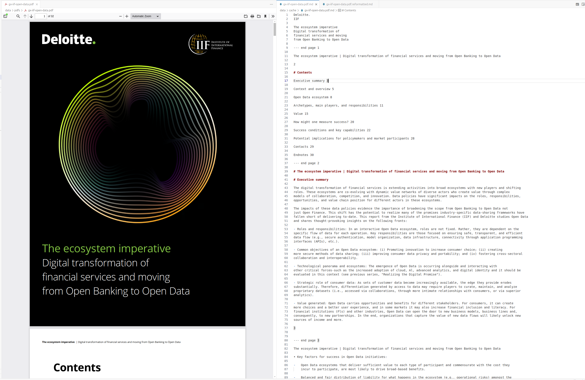
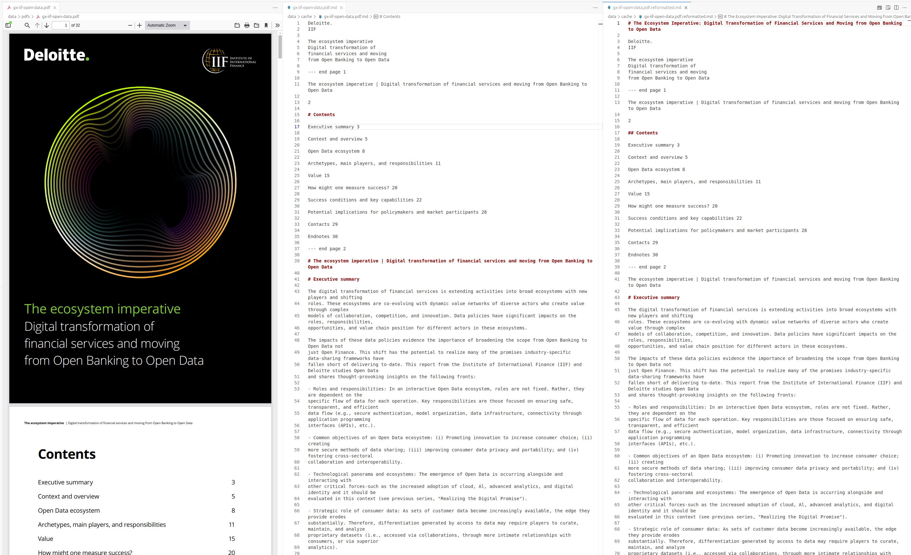
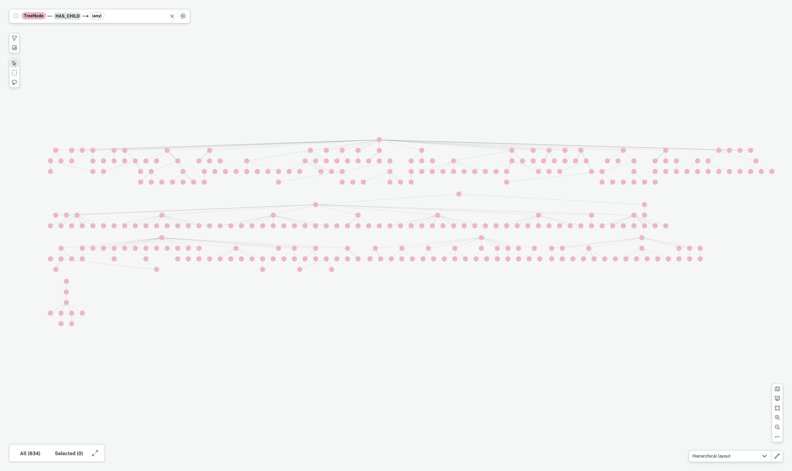
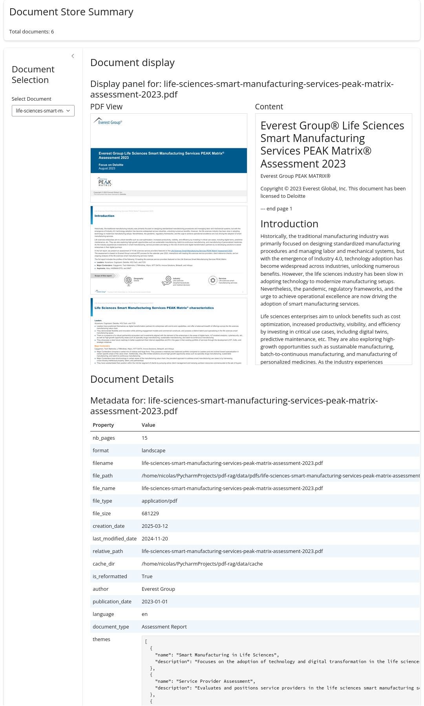

A PDF is parsed page by page, and that is where the trouble starts. Someone opening a two-hundred-page report looks at the table of contents first, forms a picture of how the document is organised, and only then jumps to the section that matters. A page-by-page parser never builds that picture. It returns a sequence of local views whose heading levels reflect the font sizes that happened to appear on each page rather than the hierarchy of the document, and the usual remedy — chunk the text, embed the chunks, retrieve by similarity — searches those fragments without ever knowing where they sit in the whole. The difficulty is that a machine has to be given, explicitly and at some cost, the overview a human gets for free from a contents page.

The code accompanying this post attacks that gap in two stages. @sec-metadata-structure converts PDFs to Markdown with a vision language model, reformats the result to restore a usable heading hierarchy, extracts metadata and a table of contents, and parses all of it into a document tree. @sec-pdf-rag then builds a question-answering system over the same corpus: one ReAct agent per document, and a top-level agent that routes questions to them. The two stages are, for now, independent. The tree index of @sec-tree-index is an unfinished draft that cannot be queried, so the retrieval side falls back on ordinary vector search.

Everything is built on [llama-index](https://docs.llamaindex.ai/en/stable/), which is versatile but moves fast and breaks often; the code is a snapshot of an API that has since changed.

Some resources for this post:

-   [pdf-rag GitHub repo](https://github.com/nbrosse/pdf-rag): the complete code for the metadata extraction and the RAG system described here
-   [HF space demo for PDF metadata](https://huggingface.co/spaces/nicolasb92/pdf-rag-metadata-demo): an interactive view of the extracted metadata and structure
-   [llama-index](https://docs.llamaindex.ai/en/stable/): the framework used throughout

All paths below are relative to the [pdf-rag repo](https://github.com/nbrosse/pdf-rag). The running corpus is the six PDFs shipped with it: three portrait reports of 2, 17 and 32 pages, and three landscape decks of 15, 17 and 62 slides.

# PDF metadata and structure extraction {#sec-metadata-structure}

Four steps run in sequence, orchestrated by the ingestion pipeline of @sec-ingestion-pipeline. The PDF is converted to Markdown by a vision language model (@sec-pdf-markdown); that raw Markdown is reformatted to restore a coherent heading hierarchy (@sec-pdf-reformatting); metadata is extracted from the reformatted text — author, date, language, table of contents (@sec-pdf-metadata); and the result is parsed into a tree that can be traversed (@sec-parsing-structure).

## From PDF to Markdown {#sec-pdf-markdown}

The companion post [PDF Parsing for LLM Input](https://nbrosse.github.io/posts/pdf-parsing/pdf-parsing.html) compares the available conversion methods. For RAG the choice here is a vision language model: more expensive than text extraction, but it describes figures and reads tables, and unlike a hosted service such as [LlamaParse](https://docs.cloud.llamaindex.ai/llamaparse/getting_started) it leaves the model, the provider and the prompt under your control.

`VLMPDFReader` (`src/pdf_rag/readers.py`) implements it. Each page is split off into a one-page PDF with `pypdf` and sent as raw PDF bytes to Gemini 2.0 Flash along with the transcription prompt below. Pages are transcribed concurrently, four at a time by default, and the results are joined with `--- end page N` markers; those markers are the only trace of pagination that survives into the Markdown, and most of what follows depends on them. The transcription is written to `<cache_dir>/<relative_path>.md`, so re-running the pipeline over a corpus already processed costs nothing.

Two details in the reader matter downstream. The first is the format flag: the reader compares the width and the height of the first page's media box and labels the document `landscape` or `portrait`. That single bit decides how the document will be reformatted, how its table of contents will be built, and how it will eventually be parsed into a tree. The second is the fallback to Mistral, which exists because of a specific Gemini failure mode.

When Gemini ends a response with the finish reason `RECITATION`, it has detected that what it was generating reproduces its training data too closely — a guard against emitting copyrighted material verbatim. Faithful transcription of a published report is, by construction, exactly that, so the error fires unpredictably and truncates the page mid-stream. On that finish reason the reader renders the page to a PNG and sends it to `pixtral-large-latest` instead, whose transcription replaces Gemini's; any other unexpected finish reason raises. Server errors from either API are retried by `tenacity`, ten attempts spaced five seconds apart.

``` python
reader = VLMPDFReader(
    cache_dir="./cache",
    api_key_gemini="your_gemini_key",  # or use env var GEMINI_API_KEY
    api_key_mistral="your_mistral_key"  # or use env var MISTRAL_API_KEY
)

# Single file
doc = reader.load_data("path/to/document.pdf")

# Multiple files
docs = reader.load_data(["doc1.pdf", "doc2.pdf"])
```

Here is the transcription prompt sent with every page.

<details>
<summary>Click to view template</summary>
<pre>
You are a specialized document transcription assistant converting PDF documents to Markdown format.
Your primary goal is to create an accurate, complete, and well-structured Markdown representation.

&ltinstructions>
1. Language and Content:
   - MAINTAIN the original document language throughout ALL content
   - ALL elements (headings, tables, descriptions) must use source language
   - Preserve language-specific formatting and punctuation
   - Do NOT translate any content

2. Text Content:
   - Convert all text to proper Markdown syntax
   - Use appropriate heading levels (# ## ###)
   - Preserve emphasis (bold, italic, underline)
   - Convert bullet points to Markdown lists (-, *, +)
   - Maintain original document structure and hierarchy

3. Visual Elements (CRITICAL):
   a. Tables:
      - MUST represent ALL data cells accurately in original language
      - Use proper Markdown table syntax |---|
      - Include header rows
      - Add caption above table: [Table X: Description] in document language

   b. Charts/Graphs:
      - Create detailed tabular representation of ALL data points
      - Include X/Y axis labels and units in original language
      - List ALL data series names as written
      - Add caption: [Graph X: Description] in document language

   c. Images/Figures:
      - Format as: 
      - Describe key visual elements in original language
      - Include measurements/scales if present
      - Note any text or labels within images

4. Quality Requirements:
   - NO content may be omitted
   - Verify all numerical values are preserved
   - Double-check table column/row counts match original
   - Ensure all labels and legends are included
   - Maintain document language consistently throughout

5. Structure Check:
   - Begin each section with clear heading
   - Use consistent list formatting
   - Add blank lines between elements
   - Preserve original content order
   - Verify language consistency across sections
&lt/instructions>
</pre>
</details>

@fig-pdf-raw-conversion shows what comes back.

{#fig-pdf-raw-conversion fig-alt="Raw conversion from PDF to Markdown using VLM"}

`PDFDirectoryReader`, in the same module, wraps the reader for whole directories. It walks a root directory for PDFs, refuses inputs that fall outside it, and attaches file metadata to each document — path, name, type, size, creation and modification dates, path relative to the root, and the cache directory. The last two are not bookkeeping: later stages read them off the node to locate their own cache files.

``` python
reader = PDFDirectoryReader(
    root_dir="./documents",
    cache_dir="./cache",
    num_workers=4,
    show_progress=True
)

# Process single PDF file
docs = reader.load_data("documents/sample.pdf")

# Process directory of PDFs
docs = reader.load_data("documents/reports/")

# Async processing
docs = await reader.aload_data("documents/reports/")
```

What the raw conversion does not give is structure. Every page is transcribed in isolation, so its heading levels are chosen from the appearance of that page alone, and the resulting Markdown hierarchy rarely matches the document's own. Headings land at the wrong depth, a running title becomes an `#` on every page it appears, and splitting the file on headings therefore produces sections that do not correspond to sections of the report.

## Reformatting the Markdown {#sec-pdf-reformatting}

`ReformatMarkdownComponent` (`src/pdf_rag/transforms.py`) sends the raw transcription back to Gemini, this time as an editing task: keep every word, fix the hierarchy. Despite the appearance of a chunked process, the document is never split. Each round re-sends the whole document together with everything reformatted so far and asks the model to carry on from there; the loop ends when the model emits `<end>` and gives up with a `RuntimeError` after `max_iters` rounds, fifty by default. The constraint being worked around is the output limit, not the context window, which is why a model with a large context makes this practical at all. As with the reader, the result is cached, in a `.reformatted.md` file beside the raw transcription, and the node is marked as reformatted so a second pass is a no-op.

``` python
component = ReformatMarkdownComponent(
    api_key="your_gemini_key",  # or use env var GEMINI_API_KEY
    num_workers=4,
    show_progress=True
)

# Process nodes
processed_nodes = component(nodes)

# Async processing
processed_nodes = await component.acall(nodes)
```

Slides and reports need different handling here. A deck is already page-structured — each slide is a self-contained unit, and the `--- end page N` markers are what preserves that — whereas a report's structure lives in its nested headings, where page breaks are noise. The prompt therefore carries a conditional:

```

- Preserve `--- end page N` markers

```

Whether the markers actually survive is worth checking, since the table of contents extraction and the landscape parser both depend on them. Across the six cached documents, the three landscape decks come back with exactly one marker per page: 15, 17 and 62. The portrait documents, where the prompt says nothing about markers, are erratic. The 17-page datasheet keeps all seventeen, the two-page report loses both, and the 32-page open-data report comes back with 84 — the model produced markers that were never in its input. Portrait documents are parsed by heading rather than by page, so none of this breaks the pipeline, but it is a useful reminder of how loosely an instruction like "preserve all original content" is honoured.

@fig-markdown-reformatted shows the effect on the heading structure, which is the point of the exercise.

{#fig-markdown-reformatted fig-alt="Markdown reformatting using LLM"}

<details>
<summary>Click to view template prompt for Gemini</summary>
<pre>
&ltdocument>
{{ document }}
&lt/document>


&ltprocessed>
{{ processed }}
&lt/processed>


You are a professional technical documentation editor specializing in markdown documents.
Your task is to transform the document into a well-structured markdown document with clear hierarchy and organization.

&ltinstructions>
1. Content Preservation (CRITICAL):
    - PRESERVE ALL original content without exception
    - Do not summarize or condense any information
    - Maintain all technical details, examples, and code snippets
    - Keep all original links, references, and citations
    - Preserve all numerical data and specifications
    
    - Preserve `--- end page N` markers
    

2. Document Structure:
    - Ensure exactly one H1 (#) title at the start
    - Use maximum 3 levels of headers (H1 -> H2 -> H3)
    - Avoid excessive nesting - prefer flatter structure
    - Group related sections under appropriate headers
    - If an existing TOC is present, maintain and update it
    - Only create new TOC if none exists

3. Formatting Standards:
    - Use consistent bullet points/numbering
    - Format code blocks with appropriate language tags
    - Properly format links and references
    - Use tables where data is tabular
    - Include blank lines between sections

4. Quality Checks:
    - Compare final document with original for completeness
    - Verify all technical information is preserved
    - Ensure all examples remain intact
    - Maintain all nuances and specific details

5. Metadata & Front Matter:
    - Include creation/update dates if present
    - Preserve author information
    - Maintain any existing tags/categories
&lt/instructions>


Please continue reformatting from where it was left off, maintaining consistency with the processed portion.
Ensure NO content is omitted - preserve everything from the original document.
All sections should seamlessly integrate with the existing structure.
End your response with &ltend>.

Provide the complete reformatted document following the above guidelines.
WARNING: Do not omit ANY content - preserve everything from the original document.
Ensure all sections are properly nested and formatted.
End your response with &ltend>.

</pre>
</details>

## Metadata extraction {#sec-pdf-metadata}

With a reformatted document in hand, the next step is to pull out what describes it: author, date and language, a table of contents, a page-by-page listing for decks, and finally a structure string that the parsers of @sec-parsing-structure turn into a tree. The extractors live in `src/pdf_rag/extractors.py` and share `GeminiBaseExtractor`, which validates the API key, holds the model name (`gemini-2.0-flash`) and a temperature of 0.1, and runs the per-document jobs concurrently. Each extractor writes its result into the node's metadata, and each one branches on the portrait/landscape flag set by the reader.

### `ContextExtractor`

The first extractor asks for one JSON object describing the document: author, publication date, language as an ISO 639-1 code, document type, themes, entities, time periods, keywords and a summary. The response is pulled out of its JSON code fence and parsed; anything else raises. On the two-page Deloitte report it returns `Deloitte`, `2023-01-01`, `en`, `Report`, nine keywords ("systemic risk", "banking", "BaaS", "stablecoins", "API"…) and a two-sentence summary of the risks the report covers — all of it surfaced later by the Shiny app of @sec-ingestion-pipeline.

<details>
<summary>Click to view template prompt for Gemini</summary>
<pre>
&ltdocument>
{{ document }}
&lt/document>

Please analyze the above document and provide output in the following JSON format:

{
    "author": "detected_author",
    "publication_date": "YYYY-MM-DD",
    "language": "detected_language in ISO 639-1 language code format",
    "document_type": "type_if_identifiable"
    "themes": [
        {
            "name": "Theme name",
            "description": "Brief explanation"
        }
    ],
    "entities": [
            {
                "name": "Entity name",
                "role": "Role/significance"
            }
    ],
    "time_periods": [
        {
            "start_date": "YYYY-MM-DD",
            "end_date": "YYYY-MM-DD",
            "period_description": "Description of events/developments in this timeframe",
            "is_approximate": boolean,
        }
    ],
    "keywords": [
        "keyword1",
        "keyword2"
    ],
    "summary": "Concise summary text focusing on main points"
}

Note: Keep descriptions concise and factual.
If an item is missing, answer with "".
Answer in the language of the document.
</pre>
</details>

### `TableOfContentsExtractor`

This one looks for a table of contents that already exists in the document. It truncates the text at the `--- end page N` marker for page `head_pages` (ten by default) and asks Gemini to return the contents page it finds there, or exactly `<none>`, which is normalised to an empty string. For a deck the prompt also asks which slide the table of contents was found on. The truncation inherits the marker fragility described above, so when the marker is absent it falls back to a line budget — `head_pages` times an assumed hundred lines per page — rather than silently sending the whole document.

<details>
<summary>Click to view template prompt for Gemini</summary>
<pre>
&ltdoc>
{{ doc }}
&lt/doc>


Extract the table of contents (TOC) from the document if present and specify the page number where the table of contents is located.
The table of contents, if it exists, is located on a single page.
Note that each page in the document ends with a marker '--- end page n' where n is the page number.

Output format:
- If a table of contents exists:
  First line: "Table of contents found on page X"
  Following lines: Complete TOC with its original structure and hierarchy
- If no table of contents exists: Respond with exactly "&ltnone>"

Extract the table of contents (TOC) from the document if it exists.
IMPORTANT: the table of contents must be contained in consecutive lines in the source document itself.

Output format:
- If a table of contents exists: complete TOC with its original structure and hierarchy
- If no table of contents exists: Respond with exactly "&ltnone>"

</pre>
</details>

### `TableOfContentsCreator`

When there is no contents page, one has to be built, and the two formats are handled by completely different mechanisms. For a portrait report no model is involved at all: a regular expression collects every Markdown heading with the line at which it occurs, producing entries such as `## Pushing through undercurrents [line 2]`, and prepends a root entry named after the file if the first heading is not at line 0. Headings inside fenced code blocks are skipped, and the extractor refuses to run on a document that has not been reformatted — the line numbers are only meaningful against the reformatted text. For a landscape deck, Gemini drafts a table of contents from the page markers and a second call re-emits it in a normalised form, rejecting duplicate titles and duplicate or non-ascending page numbers.

That second pass is a formatting check rather than a semantic one, and on real decks the draft is often too fine-grained to survive as a table of contents: on the 15-slide life sciences deck it returns fifteen entries, one per slide, each slide title promoted to a top-level section. What recovers the seven actual sections is the grouping step below.

<details>
<summary>Click to view draft template prompt for Gemini</summary>
<pre>
&ltdoc>
{{ doc }}
&lt/doc>

Generate a hierarchical table of contents for the slides deck above by:

1. IDENTIFY SECTION BREAKS
- Section breaks are marked by "--- end page {n}" where n is the page number

2. EXTRACT SECTION INFO
- Get the title text from each section break page
- Record the corresponding page number
- Validate that page numbers are unique and ascending

3. FORMAT OUTPUT
Format each entry as:
# {Section Title} (Page {n})

Example output:
# Introduction (Page 1)
# Key Concepts (Page 5)
# Implementation (Page 12)

Requirements:
- Page numbers must be unique and sequential
- Ignore any formatting in the section titles

The TOC should help readers quickly navigate the main sections of the deck.
</pre>
</details>

<details>
<summary>Click to view check template prompt for Gemini</summary>
<pre>
&lttoc>
{{ toc }}
&lt/toc>

Generate a standardized table of contents following these rules:

1. FORMAT REQUIREMENTS
- Each entry: "# {Title} (Page {n})"
- Page numbers must be integers in parentheses
- One entry per line, no blank lines
- Preserve original markdown formatting in titles
- Page numbers ascending order

2. VALIDATION
- Reject duplicate page numbers
- Reject duplicate titles
- Page numbers must exist and be > 0
- Title cannot be empty

Example valid output:
# Executive Summary (Page 1)
# Market Analysis (Page 3)
# Financial Projections (Page 7)
</pre>
</details>

### `LandscapePagesExtractor`

For decks only — it returns an empty string for portrait documents — this extractor lists every page as `Page N : title`, using the table of contents (the extracted one if there is one, the created one otherwise) as a reference and carrying the previous title forward for slides that have none of their own. Without a table of contents it raises rather than guessing.

<details>
<summary>Click to view template prompt for Gemini</summary>
<pre>
&ltdoc>
{{ doc }}
&lt/doc>

&lttoc>
{{ toc }}
&lt/toc>

Extract and list all pages from the slides deck in &ltdoc>, using the table of contents in &lttoc> as reference.

Rules:
1. Format each line exactly as: Page N : [title]
2. List pages in ascending numerical order (1, 2, 3...)
3. When a page has no title, use the title from its preceding page
4. Include all pages, even those without content

Example:
Page 1 : Introduction
Page 2 : Market Analysis
Page 3 : Market Analysis
Page 4 : Key Findings
</pre>
</details>

### `StructureExtractor`

The last extractor produces the `structure` string that the parsers consume. For a portrait report it is a pure pass-through: the created table of contents, headings with line numbers, is already the structure, and no model is called. A genuine contents page extracted from the document is kept in the metadata but plays no part here, even when it exists. For a landscape deck, Gemini is asked to group the page listing under the table of contents sections, which is where the one-entry-per-slide draft collapses back into real sections.

<details>
<summary>Click to view template prompt for Gemini</summary>
<pre>
&lttoc>
{{ toc }}
&lt/toc>

&ltpages>
{{ pages }}
&lt/pages>

Analyze the table of contents (TOC) in &lttoc> and the pages of the slides deck provided in &ltpages>.
Group the pages under their corresponding TOC sections using this format:

# [TOC Section]
- Page X : [Full Page Title]
- Page Y : [Full Page Title]

Rules:
- Each TOC section should have an appropriate level heading with #, ##, or ###.
- List all pages that belong under each section
- Maintain original page numbers and full titles
- Include pages even if their titles are slightly different from TOC entries
- Group subsections under their main section
- List pages in numerical order within each section
- Don't omit any pages
- If a page doesn't clearly fit under a TOC section, place it under "Other Pages"

Example:
# Introduction
- Page 1 : Welcome Slide
- Page 2 : Project Overview

# Key Findings
- Page 3 : Financial Results
- Page 4 : Market Analysis
</pre>
</details>

Every extractor is asynchronous and processes documents concurrently.

``` python
# Initialize extractor
extractor = TableOfContentsExtractor(
    api_key="your_gemini_key",  # or use env var GEMINI_API_KEY
    head_pages=10,
    temperature=0.1
)

# Process nodes
results = await extractor.aextract(nodes)
```

## Parsing the structure {#sec-parsing-structure}

The extractors leave a `structure` string on every document. This section turns it into a tree and describes the index built on top of it.

### From structure string to tree {#sec-parsing-structures-extracted-metadata}

The string comes in two shapes. A portrait report is a hierarchy of Markdown headings, each carrying the line at which it starts, which is what makes it possible to jump from a node back to the text it covers.

```{#lst-portrait-structure-ex .markdown lst-cap="Portrait structure example"}
# Deloitte. [line 0]
## Pushing through undercurrents [line 2]
### Technology's impact on systemic risk: A look at banking [line 3]
### Risk 1: Risk exposure from Banking as a Service offerings [line 15]
#### Table 1: Risk exposure from Banking as a Service offerings [line 29]
### Risk 2: Inadequate stability mechanisms for stablecoin arrangements [line 38]
#### Table 1: Information about forces that could amplify the risk and how the industry mitigate it? [line 52]
### Contacts [line 63]
```

A landscape deck is a flat list of sections, each followed by the pages that belong to it. The hierarchy is shallow — sections and pages, essentially — and the addressing is by page number rather than by line.

```{#lst-landscape-structure-ex .markdown lst-cap="Landscape structure example"}
# Everest Group® Life Sciences Smart Manufacturing Services PEAK Matrix® Assessment 2023
- Page 1 : Everest Group® Life Sciences Smart Manufacturing Services PEAK Matrix® Assessment 2023

# Introduction
- Page 2 : Introduction

# Life Sciences Smart Manufacturing Services PEAK Matrix® Assessment 2023
- Page 3 : Life Sciences Smart Manufacturing Services PEAK Matrix® Assessment 2023
- Page 4 : Life Sciences Smart Manufacturing Services PEAK Matrix® Assessment 2023
- Page 12 : Life Sciences Smart Manufacturing Services PEAK Matrix® Assessment 2023
- Page 13 : Life Sciences Smart Manufacturing Services PEAK Matrix® Assessment 2023

# Deloitte profile
- Page 5 : Deloitte profile (page 1 of 6)
- Page 6 : Deloitte profile (page 2 of 6)
- Page 7 : Deloitte profile (page 3 of 6)
- Page 8 : Deloitte profile (page 4 of 6)
- Page 9 : Deloitte profile (page 5 of 6)
- Page 10 : Deloitte profile (page 6 of 6)

# Appendix
- Page 11 : Appendix

# FAQs
- Page 14 : FAQs

# Everest Group®
- Page 15 : Everest Group®
```

The trade-off between the two is a trade-off between the documents themselves. A report gives fine-grained access to nested sections and, through line numbers, to the exact span of text under a heading; a deck gives direct access to a slide, which is the unit a reader of a deck actually wants.

`parse_portrait_structure` and `parse_landscape_structure` (`src/pdf_rag/structure_parsers.py`) turn either shape into a `TreeNode` tree, walking the lines with a stack of open sections and popping back whenever a heading of equal or higher level appears. Each node carries a number: a line number for reports, a page number for slides, and a negative number for the abstract nodes that represent section headings, with `-1` reserved for the document root.

The two parsers differ in how much they distrust their input. The portrait parser asserts that the first heading sits at line 0 and that line numbers never decrease — a cheap check that the created table of contents is consistent with the text it was derived from. The landscape parser has more to guard against, because its input was written by a model rather than by a regular expression: a page listed twice is skipped with a warning, a page number beyond the document's page count is skipped as well, and any page the model never mentioned is collected under an `Uncategorized` node so that no slide silently disappears from the tree.

```{#lst-landscape-structure-parsed lst-cap="Landscape structure parsed"}         
life-sciences-smart-manufacturing-services-peak-matrix-assessment-2023 [-1]
  Everest Group® Life Sciences Smart Manufacturing Services PEAK Matrix® Assessment 2023 [-2]
    Everest Group® Life Sciences Smart Manufacturing Services PEAK Matrix® Assessment 2023 [1]
  Introduction [-3]
    Introduction [2]
  Life Sciences Smart Manufacturing Services PEAK Matrix® Assessment 2023 [-4]
    Life Sciences Smart Manufacturing Services PEAK Matrix® Assessment 2023 [3]
    Life Sciences Smart Manufacturing Services PEAK Matrix® Assessment 2023 [4]
    Life Sciences Smart Manufacturing Services PEAK Matrix® Assessment 2023 [12]
    Life Sciences Smart Manufacturing Services PEAK Matrix® Assessment 2023 [13]
  Deloitte profile [-5]
    Deloitte profile (page 1 of 6) [5]
    Deloitte profile (page 2 of 6) [6]
    Deloitte profile (page 3 of 6) [7]
    Deloitte profile (page 4 of 6) [8]
    Deloitte profile (page 5 of 6) [9]
    Deloitte profile (page 6 of 6) [10]
  Appendix [-6]
    Appendix [11]
  FAQs [-7]
    FAQs [14]
  Everest Group® [-8]
    Everest Group® [15]
```

Indentation shows the parent/child relationships. For a deck, positive numbers are page numbers and negative numbers are the abstract nodes grouping related sections; for a report, positive numbers are line numbers. The same trees are browsable in the [HF space demo for PDF metadata](https://huggingface.co/spaces/nicolasb92/pdf-rag-metadata-demo).

```{#lst-portrait-structure-parsed lst-cap="Portrait structure parsed"}         
deloitte-tech-risk-sector-banking [-1]
  Deloitte. [0]
    Pushing through undercurrents [2]
      Technology's impact on systemic risk: A look at banking [3]
      Risk 1: Risk exposure from Banking as a Service offerings [15]
        Table 1: Risk exposure from Banking as a Service offerings [29]
      Risk 2: Inadequate stability mechanisms for stablecoin arrangements [38]
        Table 1: Information about forces that could amplify the risk and how the industry mitigate it? [52]
      Contacts [63]
```

### The tree index {#sec-tree-index}

To hang content on that skeleton, the document text has to be cut into nodes addressed the same way. Two parsers in `src/pdf_rag/markdown_parsers.py` do this. `MarkdownLineNodeParser` splits a report on its headings, recording for each node the path of enclosing headings and the line number where it starts, and ignores headings inside fenced code blocks. `MarkdownPageNodeParser` splits a deck on the `--- end page N` markers, recording the page number, and optionally cuts long pages further with a sentence splitter. One is header-addressed, the other page-addressed, matching the two structures above.

`TreeIndex` (`src/pdf_rag/tree_index.py`) assembles the two. For each document it builds a mapping from number to node — line numbers for reports, page numbers for decks, plus the document root — parses the structure into a tree, and creates a synthetic text node for every abstract node, since a section heading has a title but no text of its own. It then walks the tree, writes parent and child relationships onto the nodes, and records the same edges in an `IndexStructTree` that supports breadth-first and depth-first traversal. The whole thing can be exported to Neo4j, where each node becomes a `TreeNode` and each edge a `HAS_CHILD` relationship.

`TreeIndex.as_retriever` raises `NotImplementedError`. The index can be built, traversed, persisted and exported, but not queried, which is why the RAG system of @sec-pdf-rag does not use it. That is a decision rather than an oversight, and the reason is the honest limit of this whole approach.

Retrieving through the tree would mean selecting a section by its title: show the model the table of contents, ask which section answers the question, fetch the nodes underneath. That only works if the titles are stable enough to choose between, and across the six documents they are not. The tax report gives eight named sections that are exactly what one would want to route on — "Customizing Technology for Global Compliance", "Deciding How to Invest in Technology" — plus an "Other Pages" bucket for the leftovers. The life sciences deck gives seven sections that are not: two of them are the document's own title, one exactly and one with the vendor prefix stripped, and a third is the vendor's name on its own, so nothing in the list distinguishes one question from another. The granularity is unstable too. The same prompt returns eight entries for a 17-slide deck, but fifteen for a 15-slide deck and sixty-one for a 62-slide one — sometimes an outline, sometimes one entry per slide.

The portrait side is deterministic, a regular expression over the reformatted headings, so it is exactly as good as the reformatting: 139 headings for a 32-page report, in the same document that came back with 84 page markers for 32 pages.

None of this is broken, exactly. Every page of every document ends up placed somewhere in the tree, no page was dropped across the corpus, and the grouping step recovers genuine sections often enough to be useful. But a retriever built on it would stack a second layer of model judgement — choosing a section — on top of an artifact a model already wrote, at one extra call per document per query, and there is no labelled question set over these documents with which to check whether it retrieves better than embedding similarity does. It would be a bet, not a measurement. So the index stops at construction.

One practical note: `export_to_neo4j` wipes the target database only when called with `clear=True`, exposed as `neo4j_clear` in the configuration file.

``` python
# Create index with nodes
index = TreeIndex(
    nodes=document_nodes,
    show_progress=True
)

# Export to Neo4j
config = Neo4jConfig(
    uri="neo4j://localhost:7687",
    username="neo4j",
    password="password",
    database="neo4j"
)
index.export_to_neo4j(config=config)
```

@fig-neo4j-visualisation shows the exported tree for one document.

{#fig-neo4j-visualisation fig-alt="Neo4j visualisation of TreeIndex"}

## The ingestion pipeline {#sec-ingestion-pipeline}

`scripts/metadata_structure.py` runs everything above in order. It reads a YAML configuration file — `configs/metadata_structure_example.yaml` is a template — holding the data directory, the API keys, the worker count and, optionally, Neo4j credentials, which must be given all together or not at all. Its `pipeline_step` selects what to run: `ingest` for the ingestion pipeline, `tree` for the index, `all` for both.

Ingestion loads the PDFs with `PDFDirectoryReader` and pushes them through a llama-index `IngestionPipeline` whose transformations are exactly the components described above, in order:

1.  `ReformatMarkdownComponent`
2.  `ContextExtractor`
3.  `TableOfContentsExtractor`
4.  `TableOfContentsCreator`
5.  `LandscapePagesExtractor`
6.  `StructureExtractor`

The order is not arbitrary: the table of contents creator needs reformatted text, the page extractor needs a table of contents, and the structure extractor needs both. The enriched documents are persisted to a `SimpleDocumentStore` on disk, along with the pipeline's own cache, so an interrupted run picks up where it stopped and an unchanged document is never reprocessed.

The `tree` step reloads that docstore, re-parses each document into nodes — by heading for reports, by page for decks, with chunking switched off so that a node is a whole page — builds the `TreeIndex`, writes its structure to `tree_index_struct.json`, and exports it to Neo4j if the configuration provides it.

``` bash
uv run scripts/metadata_structure.py --config configs/metadata_structure.yaml
```

A Shiny app, `app/app-metadata.py`, is provided to inspect the results: it lists the processed documents, shows each PDF page beside its Markdown, displays the extracted metadata and tables of contents, and prints the parsed structure tree.

``` bash
uv run shiny run --reload --launch-browser app/app-metadata.py
```

A standalone copy of it, bundled with the six sample documents and their extracted metadata, runs as a live demo on the [HF space demo for PDF metadata](https://huggingface.co/spaces/nicolasb92/pdf-rag-metadata-demo), shown in @fig-hf-demo-metadata.

{#fig-hf-demo-metadata fig-alt="HF space demo for metadata and structure extraction from PDF"}

# Querying a corpus of PDFs {#sec-pdf-rag}

The second half of the code answers questions over several PDFs at once: comparisons between documents, retrieval that spans them, summaries, fact-checking against a set. It is adapted from the [multi-document agents notebook](https://docs.llamaindex.ai/en/stable/examples/agent/multi_document_agents-v1/) of llama-index and lives in `src/pdf_rag/react_agent_multi_pdfs.py`.

It uses none of the structure extracted in @sec-metadata-structure. The tree index that would connect the two halves cannot be queried yet, so retrieval here is the conventional kind: embeddings over page-sized chunks, with the document boundaries — rather than the document hierarchy — providing the only structure the agent exploits.

## How the agent is built {#sec-pdf-rag-description}

```python
class ReActAgentMultiPdfs:
    def __init__(
        self,
        api_key_gemini: str,
        api_key_mistral: str,
        root_dir: Path,
        pdfs_dir: Path,
        cache_dir: Path,
        storage_dir: Path,
        num_workers: int = 16,
        chunks_top_k: int = 5,
        nodes_top_k: int = 10,
        max_iterations: int = 20,
        verbose: bool = True,
    ) -> None:
        # ... initialization logic ...

```

`root_dir` and `pdfs_dir` locate the corpus, `cache_dir` holds the Markdown transcriptions and `storage_dir` the persisted indexes. Of the tuning parameters, `chunks_top_k` is how many chunks a document's vector engine retrieves, `nodes_top_k` how many document tools the top-level agent retrieves for a question, `max_iterations` bounds the top-level reasoning loop and `num_workers` the concurrency of the asynchronous build. The language model is Gemini 2.0 Flash and the embeddings are `text-embedding-004`, reached through a small wrapper in `src/pdf_rag/gemini_wrappers.py` that calls the current Google SDK directly rather than through the llama-index integration.

The system is built in two levels. At the bottom, `build_agent_per_doc` gives every PDF its own agent. The document is read, split into page-addressed nodes, and indexed twice: a `VectorStoreIndex` for retrieval by similarity and a `SummaryIndex` for questions about the document as a whole. Both are persisted, so the expensive part happens once. The vector query engine retrieves `chunks_top_k` chunks and then passes them through `FullPagePostprocessor` (`src/pdf_rag/node_postprocessors.py`), which replaces every retrieved chunk by the complete page it came from, deduplicating pages hit more than once — a retrieved fragment is rarely enough context, and a slide almost never is. The summary engine answers in `tree_summarize` mode, and is also used once, at build time, to produce a summary of the document that is cached next to the indexes. The two engines become two tools, `vector_tool_<name>` and `summary_tool_<name>`, wrapped in a ReAct agent whose system prompt forbids answering from prior knowledge. File names are sanitised on the way — spaces and parentheses become underscores — because tool names are parsed out of the model's output and punctuation there causes trouble.

At the top, `top_agent` wraps each per-document agent as a tool in turn, using that document's generated summary as the tool description. Those tools are placed in an `ObjectIndex` and retrieved by embedding similarity, `nodes_top_k` at a time, so that a question first selects the documents likely to answer it. This is the part that scales: with a large corpus the top-level agent never sees more than a handful of tool descriptions at once.

`CustomObjectRetriever` adds the piece that makes comparison work. Every time tools are retrieved, it builds a `SubQuestionQueryEngine` over them and appends it as an extra tool called `compare_tool`, whose description tells the agent to use it for any question involving more than one document. The sub-question engine decomposes such a question into per-document sub-questions, dispatches each to the right tool and recombines the answers — something a single ReAct loop does poorly on its own.

```python
        sub_question_engine = SubQuestionQueryEngine.from_defaults(
            query_engine_tools=tools,
            llm=self._llm,
            question_gen=LLMQuestionGenerator.from_defaults(llm=self._llm),
        )
        sub_question_description = f"""
        Useful for any queries that involve comparing multiple documents. ALWAYS use this tool for comparison queries - make sure to call this
        tool with the original query. Do NOT use the other tools for any queries involving multiple documents.
        """
        sub_question_tool = QueryEngineTool(
            query_engine=sub_question_engine,
            metadata=ToolMetadata(name="compare_tool", description=sub_question_description),
        )
        retrieved_tools = tools + [sub_question_tool]
        return retrieved_tools
```

Every stage exists in a synchronous and an asynchronous form; the asynchronous one builds the per-document agents concurrently, which is what makes a corpus of any size tractable. The top-level agent is a `cached_property`, so it is assembled once and reused across queries.

## An example query {#sec-pdf-rag-example}

The notebook `notebooks/query_multi_pdfs_example.ipynb` runs the system over the six-document corpus and a list of queries from the configuration file.

::: {.nb-scroll}

:::

Here is the trace for one of them: *What are the vulnerabilities introduced by relying on application programming interfaces (APIs) in Banking as a Service (BaaS)?*

```
> Running step 0dc45634-70c7-4656-9b12-fc2b086848ce. Step input: What are the vulnerabilities introduced by relying on application programming interfaces (APIs) in Banking as a Service (BaaS)?
Thought: The current language of the user is: English. I need to use a tool to help me answer the question.
Action: tool_deloitte-tech-risk-sector-banking
Action Input: {'input': 'vulnerabilities of APIs in Banking as a Service (BaaS)'}
> Running step b574597e-591e-42f5-b2fe-075603369f1c. Step input: vulnerabilities of APIs in Banking as a Service (BaaS)
Thought: The current language of the user is: English. I need to use a tool to help me answer the question.
Action: vector_tool_deloitte-tech-risk-sector-banking
Action Input: {'input': 'API vulnerabilities in Banking as a Service (BaaS)'}
Observation: BaaS increasingly relies on application programming interfaces, introducing vulnerabilities that can pose risks for banks, such as customers' sensitive data and funds being at risk from phishing and social engineering attacks, flawed APIs providing a back door for hackers to penetrate banks' systems and noncompliance with data privacy rules by BaaS providers exposing partner banks to reputational risks.

> Running step ab6397c0-d075-499f-8d74-ce5ef25de495. Step input: None
Thought: I can answer without using any more tools. I'll use the user's language to answer
Answer: Banking as a Service (BaaS) relies heavily on APIs, which introduces vulnerabilities. These vulnerabilities can lead to risks for banks, including customer data and funds being at risk from phishing and social engineering, flawed APIs providing a backdoor for hackers, and noncompliance with data privacy rules by BaaS providers exposing partner banks to reputational risks.
Observation: Banking as a Service (BaaS) relies heavily on APIs, which introduces vulnerabilities. These vulnerabilities can lead to risks for banks, including customer data and funds being at risk from phishing and social engineering, flawed APIs providing a backdoor for hackers, and noncompliance with data privacy rules by BaaS providers exposing partner banks to reputational risks.
> Running step 8b2c762a-4a21-47ad-81f9-5dba4bb5e0f3. Step input: None
Thought: I can answer without using any more tools. I'll use the user's language to answer
Answer: Relying on application programming interfaces (APIs) in Banking as a Service (BaaS) introduces vulnerabilities that can put customer data and funds at risk from phishing and social engineering. Flawed APIs can also provide a backdoor for hackers. Furthermore, noncompliance with data privacy rules by BaaS providers can expose partner banks to reputational risks.
```

Read from the top, the trace shows the two levels at work. The top-level agent first retrieves its tools — with six documents and `nodes_top_k` at ten, all of them — then picks `tool_deloitte-tech-risk-sector-banking`, the one whose summary description matches the question, and calls it with a reformulated query. That call enters the per-document agent, which runs its own ReAct loop, chooses the vector tool over the summary tool since the question is about a specific fact, and gets back a passage on API risks in BaaS. It answers from that passage, and its answer is returned to the top-level agent as an observation, which then produces the final answer.

That nesting explains the apparent repetition. The block that looks like the agent answering twice is in fact the inner agent's answer becoming the outer agent's observation, one level up; it is the price of the two-level architecture rather than a quirk of the reasoning loop.

Two other things are worth noting. The routing works because the tool descriptions at the top level are the generated document summaries, which carry enough signal to match a question to a document; inside a document, by contrast, the tool descriptions are generic ("useful for questions related to specific facts"), and the choice between vector and summary tool rests entirely on the agent's reading of the question. And `compare_tool` never fires here: the question concerns a single document, so the sub-question engine is not needed. It earns its place only on questions that genuinely span the corpus.

# Conclusion {#sec-conclusion}

The structure extraction half of this works. A vision language model transcribes pages faithfully enough, a second pass rebuilds a heading hierarchy that page-by-page conversion cannot produce, and reports and decks end up with the two different representations they need: headings and line numbers for one, sections and page numbers for the other. The parsers turn those into trees that can be traversed or exported to a graph database, and the pipeline caches enough at each step that reprocessing a corpus is cheap.

The retrieval half works too, but separately. A per-document agent with a vector tool and a summary tool, a top-level agent routing on document summaries, and a sub-question engine for comparisons is a reasonable architecture, and the trace above shows it selecting the right document and the right tool. The join between the two halves is what is missing: `TreeIndex` cannot be queried, so the extracted hierarchy never reaches retrieval, and a question that a reader would answer from the contents page is still answered by embedding similarity over chunks. @sec-tree-index gives the reason and the route forward is short — section labels stable enough to choose between, and a set of questions with known answers over these documents.

What the exercise settles, and what I would carry into the next system, is the format split. A report and a slide deck are not the same kind of object, and processing them alike throws away whichever structure each one has: a deck's meaning is page-shaped, a report's is heading-shaped. Deciding which is which costs one comparison on the first page's media box, and that single bit pays for itself at every subsequent stage — reformatting, table of contents, parsing, retrieval.

The other thing worth keeping is the measurements. That a model told to preserve page markers keeps 62 of 62 in one document and invents 52 in another, or that one prompt returns an eight-entry outline for one deck and one entry per slide for the next, is not a detail: it is what tells you which stages of a pipeline like this can be trusted with a downstream dependency and which need a deterministic fallback underneath them. None of it is visible from the code, and all of it is sitting in the cache directory once you go and look.
